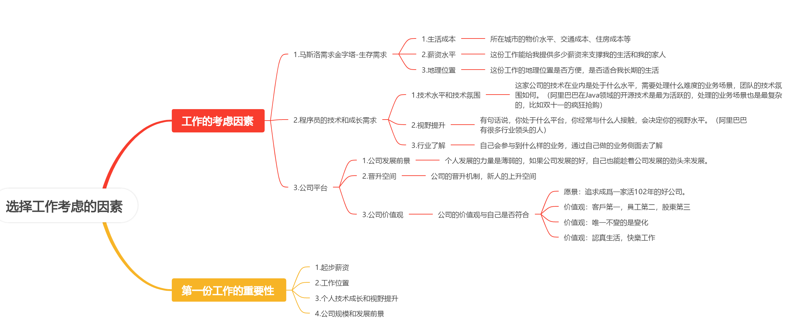

# HR面经

#### 1.自己的优缺点

##### 优点

判断你对自我的认知是否清晰、是否诚实、是否适合这个岗位

> **①自主学习能力强**
>
> ​	从高中到大学，其实一直有在自学各种各样的东西。
>
> ​	例如，高中的时候在自学大学的高数，因为我所在的学校比较普通，老师一般只讲基础知识，进阶的难题都是不会讲的，所以这些都是我自己去自学自己去研究的。
>
> ​	再例如，大学的时候基本上每门课也都是自学的，因为老师基本上就是给你方向，而需要自己去摸索去学习。比如说四六级、**各种编程语言**(如果是java转go，可以让hr觉得你可以胜任)等等。
>
> ​	再到现在，研一我在实习，但是学校还是有各种课程需要考试的，也是期末自学在参加的考试。然后实习过程中，遇到的技术上的问题，也都是考查阅相关的文档、博客来自学。
>
> **②自律，计划驱动**
>
> ​	我会规划自己每天要做什么，对各种任务进行排序。比如期末考试周，会安排自己今天学习哪几门课，第几章节，刷第几章的题目等等。实习的时候，每天有什么任务，也是都会在上班开始的时候都列好。
>
> ​	我个人是比较喜欢计划驱动的，就是一步一步来完成自己的任务，每次都会很有成就感，也有动力。所以我也习惯在ddl之前把任务都做完，而不是在最后一天在开始做
>
> **③总结反思能力强**
>
> ​	我喜欢对每件事情，比如考试，或者说最近的一些笔试和面试，进行复盘，发现自己答得不好的点，以及不熟悉、遗忘的知识点等等，总结之后在下一次考试或者笔试、面试中尽量去避免
>
> **④抗压能力强**
>
> ​	可以说自己刚到法院实习的时候，业务不熟、开发工具、开发方式、项目代码和文档都不熟悉，自己多问mentor或者其他的同事，并且挤出时间（下班后多留几个小时、周末加班）来熟悉
>
> **⑤有责任心**
>
> ​	从小学开始，一直到高中，每一年都是班干部，每次老师交代的事情，我都有尽自己的责任去完成。
>
> ​	大学各种组队作业，因为我也知道其实有很多划水的同学，所以基本上我都是主动来做组长。然后带大家一起完成作业，包括我会主动的约大家都有空的时间开会，讨论题目，分工等等，然后也会在群里积极询问大家的进度。我觉得这不仅关乎到我的成绩，我觉得这更是一个组长应该承当的责任
>
> ​	大一当人志愿者协会的领队

##### 缺点

注意不要暴露性格缺陷！

缺点一定要说出自己已经意识到了并且有在努力克服

> **①不擅长在公共场合发言**
>
> ​	大学期间有很多小组任务，包括开发一些项目、或者要答辩、pre等。一开始做组长的时候，上台发言总容易紧张，怕自己出错，或者是哪里做的不好。不过后面经过很多次pre之后，慢慢地去克服。因为我觉得让别人指出自己的问题，能解决问题才是最重要的。所以后来我也慢慢克服紧张，控制这种情绪，现在对于演讲、答辩我都可以调整自己的心态。
>
> **②有时候会太注重细节**
>
> ​	比如实习阶段有时候法院有一些比较急的新需求，但我还是会花时间去琢磨到底如何优化我刚刚写的这些代码，或者说我要怎么设计才能更好的去适应后续的需求变更。这样反而导致工作效率有点降低，所以后面我意识到这一点之后，就会先去完成整个任务，然后再开始去优化
>
> **③比较内向/或者说怕麻烦别人**
>
> ​	有时候遇到问题却不好意思请求别人帮助，自己在网上搜相关的博客摸索了半天。后面就是有主动的开口请教别人。包括实习的时候在办公室里面几个同学，我都是有问题就直接请教他们，大大提高了解决问题的效率。
>
> **④太在意别人的感受**

#### 2.生活/实习中遇到的最大的困难?如何解决

实习的困难

> 在刚开始实习的时候，困难主要是：
>
> 1. **对业务的理解不够深入**：我刚进团队时，对法院整体的业务流程还不熟悉，所以在法官反馈问题时，我甚至不知道他是如何触发的，在哪个页面做了什么行为。这些都是要问mentor或者其他团队成员来了解
> 2. **用户行为理解有限**：对法官的办公逻辑的了解
> 3. **代码阅读和开发环境适应**：每个人负责的项目比较多，代码不熟悉，也需要去熟悉这边的开发模式
> 4. **数据库的理解**：表很多，哪些数据存储在哪个表里面，表与表之间如何关联，都需要问清楚
>
> 为了解决这些困难，我一方面主动请教mentor和组内同事，另一方面通过阅读内部文档
>
> 慢慢地得心应手，改起代码来就比较顺手

> 大二的时候，暑假有一个大作业，就是小组完成一个项目的开发。但是我们只剩最后十天，并且我们都已经是各自回家了，但是就是每天都要开视频会议，一干就是一整天，包括需求的理解，系统的设计，分工等等。一直到最后的项目答辩，整个人的神经都是紧绷的状态。直到最后一天，调完所有bug，完成所有文档的编写，然后最后进行总结，以及项目交付。就开始准备第二天的项目答辩排练。

#### 3.自己未来的规划

> **目前来看**，我希望我能找到一个好的暑期实习，最好可以到大厂锻炼，提高自己的各方面的开发能力
>
> **短期来看**，我希望在研究生这两年能有所进步，顺利毕业。并找到一份满意的工作。<u>尽快适应从学校到职场的转变</u>，打好技术基础，熟悉业务流程，并在实际项目中不断积累经验，提高自己的编码能力、问题分析能力和团队协作能力。
>
> **长期来看**，我希望能在我的工作中，摸清我到底喜欢什么方向，逐渐深入

#### 4.目前有没有其他的offer/目前有没有其他公司在进展中

ps：一定要表达自己对本公司的意向！可以适当地说自己有一两个offer，或者表达有流程已经推到hr面了

如果表达自己有0个offer，可能hr也会质疑自己的实力

> 我目前的话之前是有一个oc，但是好像那边有了更好的候选人所以就落选了
>
> 然后现在还有pdd和携程是还在流程中，都是到三面这里
>
> **不过我个人的意向还是XX**(当前面的公司)，因为base地我比较的满意，还有业务是XXXX相关的我也很感兴趣。如果说能收到贵公司的offer，我会毫不犹豫接受，并且推掉其他的流程。

#### 5.能否接受加班？

> 可以，我本科和研究生都很努力。本科的时候经常在图书馆泡一整天，一直到十一点闭馆才回宿舍。特别是考试周，可能一泡就是一整天，从早上8点开馆就去抢座位，然后一直学到闭馆。回宿舍后再学一个小时。后面还因为嫌图书馆11点闭馆，就去了24小时自习室。
>
> 实习的时候，初始阶段也经常加班，为了能更快地适应整个新的环境，也想让自己能更快地上手。

#### 6.为什么本科没有实习经历？

> 首先，因为南京的实习资源缺失，再加上我们学校不大允许日常实习，因为基本上每门课都得签到。
>
> 其次，我大三那会是由尝试找暑期实习的，不过找一半之后，跟我们小学期的期末考试冲突了，然后大三也是保研最关键的最后一学期了，所以当时就把时间都花在准备这些课程的考试上了
>
> 大一大二的暑期因为我们学校有暑期课程的，并且大一大二的暑假去准备考驾照，社会实践等等活动

#### 7.你父母对你的成长有什么影响？

> 我父母都是教师，小时候他们更多的是以身作则，他们会花时间陪伴我一起做作业，就是他们可能会有备课、批改作业等等，我就会坐在一旁写我的作业。
>
> 从小他们也一直教导我要诚实、要用于承担责任、谦虚、感恩所有帮助过我的人
>
> 他们也很看重礼仪，尊重长辈。他们也是特别孝顺的人，他们很多行为都在潜移默化地影响着我
>
> 他们也很尊重我的想法，高考选报志愿他们也很支持我选择出省读大学
>
> 他们很少会帮我，更多的是支持鼓励我自己去探索去克服，所以我现在才可以如此独立

#### 8.第一份工作/选工作考虑的因素

> 我觉得首先最起码应该得满足马斯洛需求金字塔的底层需求——城市的生活成本（物价、交通、住房）
>
> 接着就base地
>
> 然后就是这份工作对我的成长有多大的帮助：技术成长、视野提升、行业了解
>
> 公司的发展前景、提供的平台和资源、晋升空间

#### 9.从小到大遇到的最大的挫折

> **中考失利**：我初中的时候一直都是排名全校前十，当时想很有希望冲刺我们市最好的高中
>
> 但是中考出分的时候自己排到了全校六十多名，压线去了市里排名第四的高中（在生源、教育资源都比较差）
>
> 我感觉中考失利，对我来说是一个巨大的打击。我丢失了初中那股自信，到了高中我就一直告诉自己我要把我失去的东西拿回来。所以整个高中可以说我把我的全部精力都投入到学习中。从高一全校排四五十名，一直慢慢的爬到高三第一次取得第一名。到最后高考，也考出了全校很多年来都为达到的最高分

#### 10.最适合自己的三个词

> 说优点

#### 11.谈谈你对跳槽的看法

> 跳槽是一种职业选择，需要辩证的去看待。、
>
> **合理地跳槽**对于个人和公司都有利。合理的跳槽指，有目标、有规划、有沉淀，不能只是情绪化地离开。
>
> 对于初次步入职场的人来说，找到一份合适、自己感兴趣的工作并非一蹴而就。需要不断的尝试。
>
> 合理的跳槽还能促进人才的合理流动，有助于个人对自己目标的明确，也有助于公司去淘汰掉不合适的人选
>
> **但是**，**频繁的、情绪化地跳槽**对单位和个人都不利，应该反对。对于公司而言，招聘和培训新员工需要耗费大量的时间和成本，频繁的人员流动可能会影响团队的稳定性和项目的正常进行。对于个人来说，频繁跳槽会给个人履历带来不良影响。

#### 12.平时是如何学习的？

> 本科的时候除了按时完成每门课的作业，还有及时的整理和复习每次学到的知识点。（我个人属于那种喜欢做笔记的类型的，我也很佩服一些同学就是每次听完课就能一直记住这些知识点，而我需要整理＋复习）
>
> 其次就是老师或者学长学姐都会推荐一些好书（《Java核心技术》、《深入理解Java虚拟机》等等），我有时间都会去看
>
> 还会在网上找各种教学视频，比如说一些编程语言等，都是看着视频来学习的
>
> 遇到问题一般也会主动找老师、或者室友一起讨论，比如之前微积分课，每次上课前都会准备好自己想问的问题，下课后就跑去问老师。
>
> 平时也会看各种技术博客，了解一些新的技术

#### 13.说一下自己以后的发展发向，倾向技术还是业务？

> 技术和业务其实我都不排斥，都可以接受
>
> 如果要选的话我偏向于**业务**，我觉得相比技术、业务会更有意思，它的可变性、灵活性也更好，我们需要去挖掘用户的具体需求已经如何将用户需求转换为技术上的需求。并且，要实现不同的业务，需要去比较不同的技术，选择合适的技术来完成。
>
> 就举mysql的深度分页为例，在技术上，解决深度分页有很多方法，而在业务上，其实用户每次并不会翻到几万页去，所以直接在数据上进行处理就行了，并且限制用户只能点下一页，不能跳页

#### 14.工作中当你与领导意见不一致时，该如何处理？

> 首先，我们肯定需要尊重领带的意见，表达对领导意见的赞同，毕竟领导相比我肯定有更多的经验和考量。
>
> 接着，尝试从领导的角度去思考领导的意见和我的意见到底哪个是最合适的。
>
> 如果我还是觉得自己的意见合适，我会寻找合适的时机，向领导委婉表达我自己的观点。
>
> ​	例如如果当前是公开场合，不能直接否定领导，可以私下再找领导进行沟通，并且**一起评估**哪种做法更好
>
> 在表达自己的观点时，不要用太多的技术语言，而是通过更清晰的业务语言去和领导做沟通，搞清楚我们的共同诉求
>
> 最后，表示自己的感谢，希望领导采纳

#### 15.领导交给你一个很重要但又很艰难的工作，你怎么去处理？

> 1.与领导进行详细的沟通，确保我完全理解任务的目标、优先级和期望的成果，以及截止日期，细分任务，风险评估
>
> 2.我会考虑最坏的情况，并预先规划解决方案，并及时启动
>
> 3.我会保持向领导同步工作进展，遇到无法独立解决的障碍也会主动汇报、寻求支持，确保方向不偏、效率不低
>
> 4.作为实习生，我会多请教mentor或者身边的其他成员，确保我工作完成的质量

#### 16.你朋友对你的评价

> ①他们认为我是一个可以**信赖**的人，因为我一旦答应别人的事情，就一定会做到。如果我做不到，我就不会轻易许诺。
>
> ②我是一个比较**随和**的人，与不同的人都可以友好相处。在我与人相处时，我总是能站在别人的角度考虑问题。
>
> ③我是一个比较**乐于助人**的人，我的朋友们向我寻求帮助时，我都会尽力去完成
>
> ④我是一个很**完美的旅游搭子**，就是每次一起出去旅游，都是我在做旅游攻略，全程就是我领着他们玩，帮他们拍照，因为我本身比较喜欢摄影

#### 17.你和别人发生过争执吗？你是怎么解决的？

> ①表达自己很少跟别人发生争执，会尽量避免争执，并且主动地沟通
>
> ②在团队合作中难免会有意见不一致的时候，我有一次和同事在项目中对某个技术实现方案产生了分歧。最开始各自坚持自己的看法，但我意识到如果继续僵持对项目进度没有帮助，所以我主动约他沟通，详细说明我的思路，同时也认真听取了他的考虑
>
> 我们后来一起对比了两种方案的优劣，用数据和实际需求做判断，最终选了一个更合适的折中方案。通过这次经历我也意识到，有分歧其实是好事，关键是用沟通和合作的方式去解决问题，而不是谁对谁错

#### 18.你的工作出现问题/失误怎么办？

> 不要逃避责任，是自己的问题要主动承认；
>
> 遇到问题要冷静，理性分析问题出现的原因并解决；
>
> 积极复盘，总结经验，避免下次再出现类似的问题。

