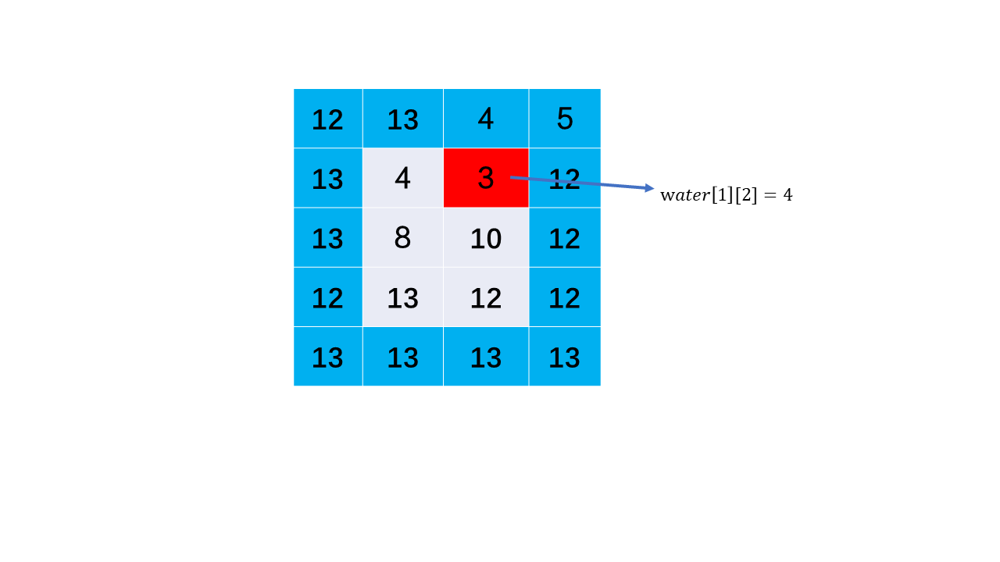
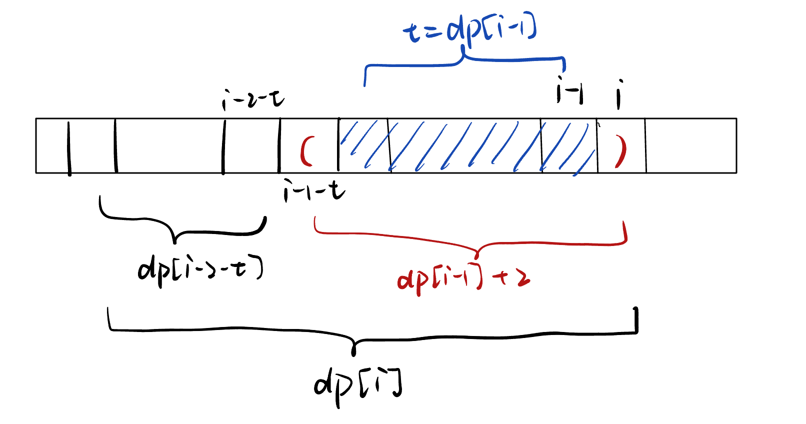
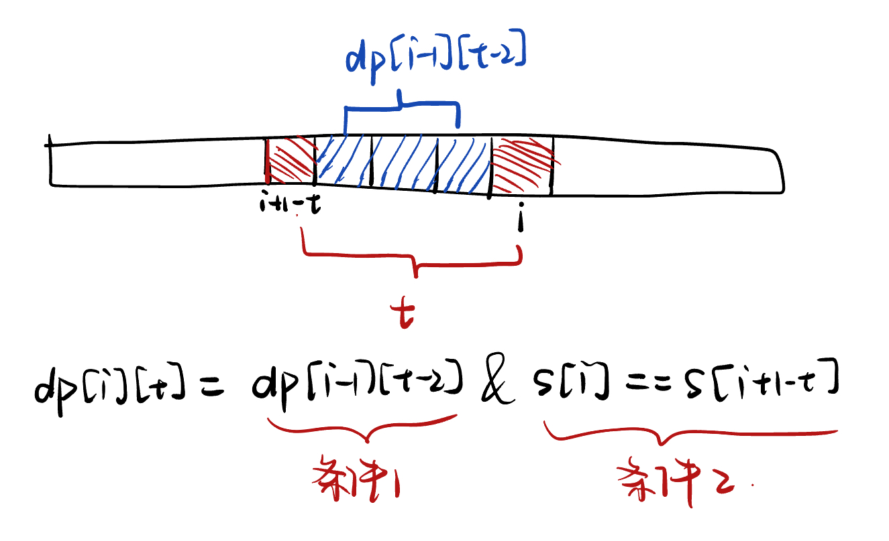
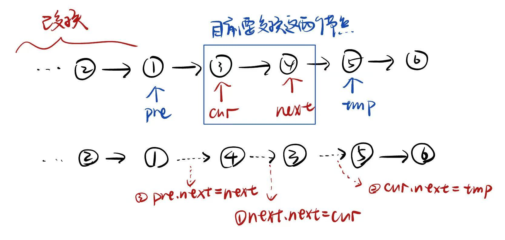
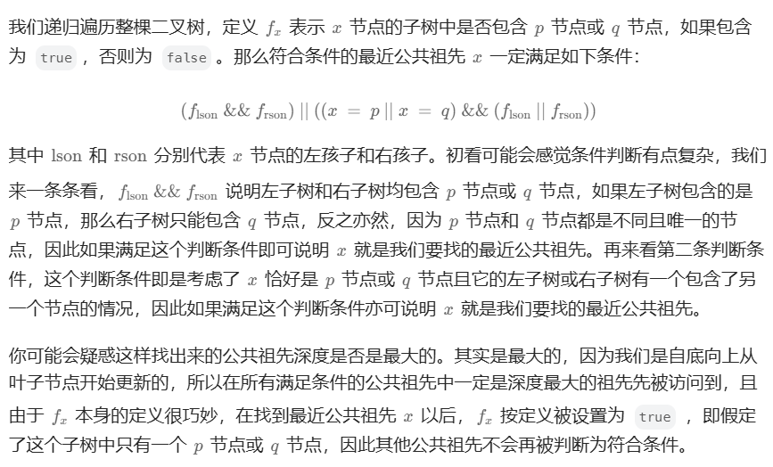
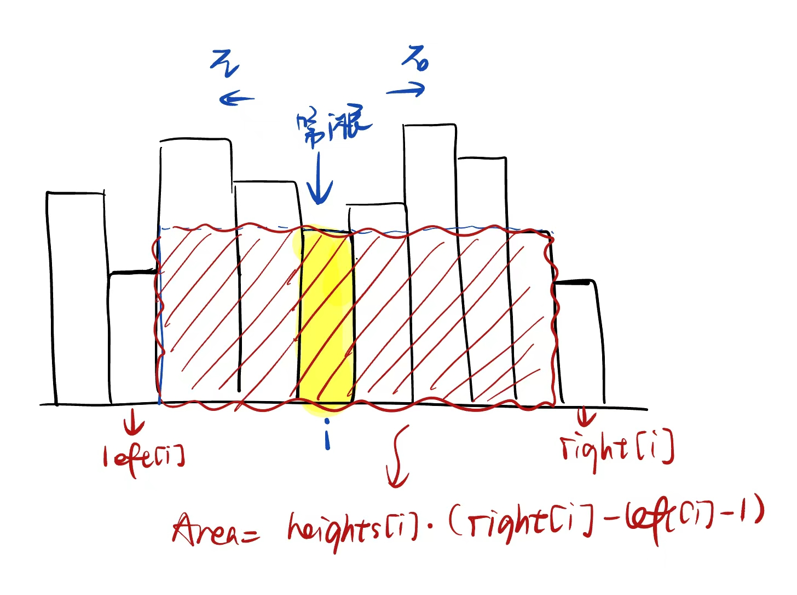
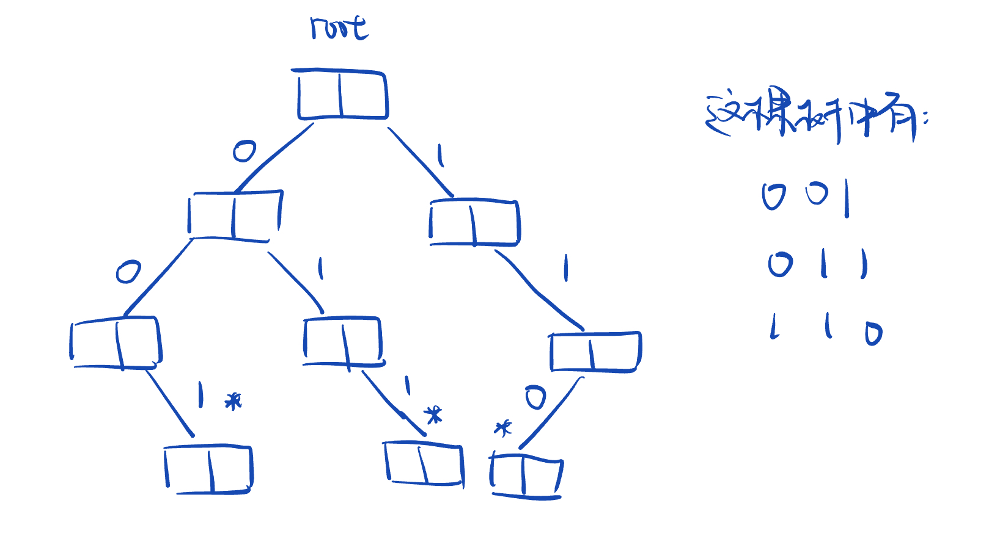
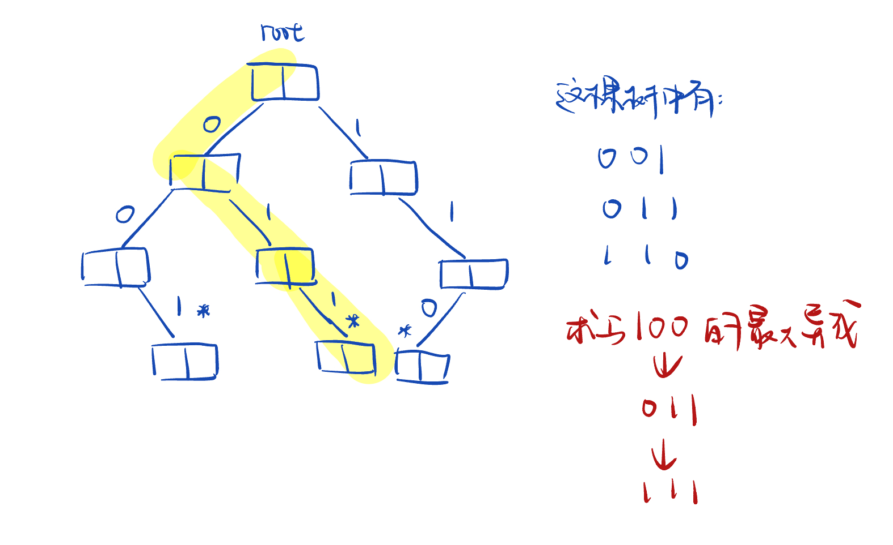
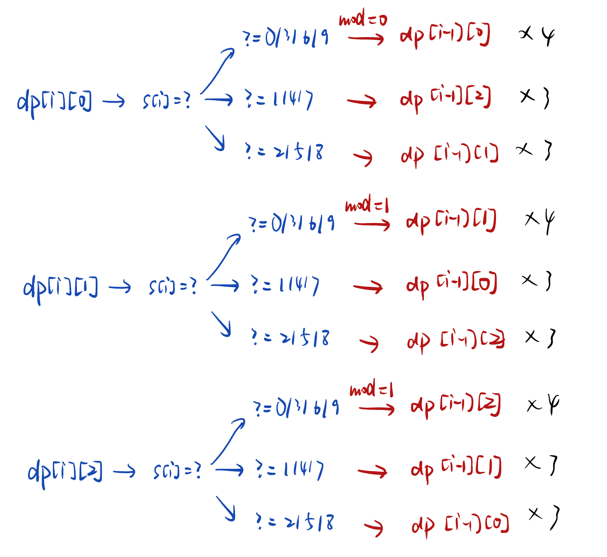
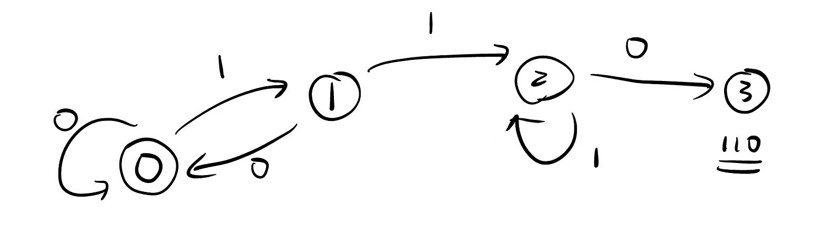

# HOT100 分类

## 一、普通数组

### [53. 最大子数组和](https://leetcode.cn/problems/maximum-subarray/)

给你一个整数数组 `nums` ，请你找出一个具有最大和的连续子数组（子数组最少包含一个元素），返回其最大和。

**子数组**是数组中的一个连续部分。

**示例 1：**

```
输入：nums = [-2,1,-3,4,-1,2,1,-5,4]
输出：6
解释：连续子数组 [4,-1,2,1] 的和最大，为 6 。
```


#### 思路

思路1：**动态规划**

用dp[i]表示以nums[i]j结束的最大和

状态转移：dp[i+1] = max(dp[i] + nums[i + 1],  nums[i + 1])   看看加上前一个子数组的最大和后，是否比自己大

```java
public int maxSubArray(int[] nums) {
    // 动态规划
    int n = nums.length;
    int[] dp = new int[n];
    // 初始化
    dp[0] = nums[0];
    int max = dp[0];
    // 状态转换
    for (int i = 1; i < nums.length; i++) {
        dp[i] = Math.max(dp[i-1] + nums[i], nums[i]);
        max = Math.max(max, dp[i]);
    }
    return max;
}
```

思路2：**双指针**/**滑动窗口**

每次dp在状态转换的时候只用到了上一个结果，所以可以直接改为一个变量来存储

双指针指向当前最大和的区间

```java
public int maxSubArray(int[] nums) {
    int maxSum = Integer.MIN_VALUE;
    int sum = 0; // 窗口的和
    int left = 0; // 窗口
    int right = 0;

    while (right < nums.length) {
        // 如果sum + nums[right] >= nums[right]，那么窗口可以扩大
        if(sum >= 0) {
            // 扩大窗口
            sum += nums[right];
        } else {
            // 否则缩小区间，left移动到right处
            sum = nums[right];
            left = right;
        }
        maxSum = Math.max(maxSum, sum);
        right++;
    }

    return maxSum;
}
```


### [==56.合并区间==](https://leetcode.cn/problems/merge-intervals/)

中等

以数组 `intervals` 表示若干个区间的集合，其中单个区间为 `intervals[i] = [starti, endi]` 。请你合并所有重叠的区间，并返回 *一个不重叠的区间数组，该数组需恰好覆盖输入中的所有区间* 。

 

**示例 1：**

```
输入：intervals = [[1,3],[2,6],[8,10],[15,18]]
输出：[[1,6],[8,10],[15,18]]
解释：区间 [1,3] 和 [2,6] 重叠, 将它们合并为 [1,6].
```

**示例 2：**

```
输入：intervals = [[1,4],[4,5]]
输出：[[1,5]]
解释：区间 [1,4] 和 [4,5] 可被视为重叠区间。
```

 

#### 思路：

思路1：根据区间合并的条件

注意：先将区间进行**升序排序**，下面假设a在b的左边 

两个区间**可以合并的条件**是：两个区间相交

相交：3种形式：

​	a完全包含b: a.left <= b.left < b.right <= a.right

​	b完全包含a：b.left <= a.left < a.right <= b.right

​	a和b部分重叠：a.left <= b.left <= a.right <= b.right


:star:思路2：利用**排序**后的特性，维护一个合并后的区间列表merged

遍历所有区间，在加入一个新区间时，判断他是否可以和merged中最后一个区间合并，可以的话直接合并，如果不可以那么作为一个新区间加入merged中

```java
public int[][] merge(int[][] intervals) {
   // 先将区间从左到右排序
    Arrays.sort(intervals, ((o1, o2) -> {return o1[0] - o2[0];}));
    // 维护一个合并区间的列表
    Stack<int[]> merged = new Stack<>();
    // 加入第一个区间
    merged.push(intervals[0]);
    for(int i = 1; i < intervals.length; i++) {
        int left = intervals[i][0];
        int right = intervals[i][1];
        if(left <= merged.peek()[1]) {
            // 可以合并
            int[] last = merged.pop();
            int[] tmp = new int[2];
            tmp[0] = Math.min(left, last[0]);
            tmp[1] = Math.max(right, last[1]);
            merged.push(tmp);
        } else {
            // 不可合并，作为新区间插入
            merged.push(intervals[i]);
        }
    }
    return merged.toArray(new int[merged.size()][]);
}
```


### [==189. 轮转数组==](https://leetcode.cn/problems/rotate-array/)

中等

给定一个整数数组 `nums`，将数组中的元素向右轮转 `k` 个位置，其中 `k` 是非负数。

**示例 1:**

```
输入: nums = [1,2,3,4,5,6,7], k = 3
输出: [5,6,7,1,2,3,4]
解释:
向右轮转 1 步: [7,1,2,3,4,5,6]
向右轮转 2 步: [6,7,1,2,3,4,5]
向右轮转 3 步: [5,6,7,1,2,3,4]
```

**示例 2:**

```
输入：nums = [-1,-100,3,99], k = 2
输出：[3,99,-1,-100]
解释: 
向右轮转 1 步: [99,-1,-100,3]
向右轮转 2 步: [3,99,-1,-100]
```


#### 思路

:star:思路1：空间O(1)原地翻转


记得先对k取模，减少重复操作

```java
public void rotate(int[] nums, int k) {
    int n = nums.length;
    k = k % n;
    swap(nums, 0, n);
    swap(nums, 0, k);
    swap(nums, k, n);
}

private void swap(int[] nums, int start, int end) {
    int left = start;
    int right = end - 1;
    while(left < right) {
        int tmp = nums[left];
        nums[left] = nums[right];
        nums[right] = tmp;
        left++;
        right--;
    }
}
```


思路2：环形替换

基本思路：


我们从位置0开始，最初令temp=nums[0]。根据规则，位置0的元素会放至(0+k)%n的位置，令x=(0+k)%n，此时交换temp和nums[x]，完成位置x的更新。然后，我们考察位置x，并交换temp和nums[(x+k)%n]，从而完成下一个位置的更新。不断进行上述过程，直至回到初始位置0。

问题：当**回到初始位置0时，有些数字可能还没有遍历到**，此时我们应该从下一个数字开始重复的过程

解决：我们不妨先考虑这样一个问题：从0开始不断遍历，最终回到起点0的过程中，我们遍历了多少个元素？

由于最终回到了起点，故该过程恰好走了整数数量的圈，不妨设为a圈；再设该过程总共遍历了b个元素。

因此，我们有**an=bk**，即an一定为n,k的公倍数

又因为我们在第一次回到起点时就结束，因此a要尽可能小，故an就是n,k的最小公倍数lcm(n,k)，因此**b就为lcm(n,k)/k**

所以我们要遍历的次数为**gcd(n, k)**
$$
t = \frac{n}{b} = \frac{n}{\frac{lcm(n,k)}{k}} = \frac{nk}{lcm(n,k)} = gcd(n, k)
$$

```java
public void rotate(int[] nums, int k) {
    int n = nums.length;
    k = k % n;
    int count = gcd(k, n);
    for (int start = 0; start < count; ++start) {
        int current = start;
        int prev = nums[start];
        do {
            int next = (current + k) % n;
            int temp = nums[next];
            nums[next] = prev;
            prev = temp;
            current = next;
        } while (start != current);
    }
}
public int gcd(int x, int y) {
    return y > 0 ? gcd(y, x % y) : x;
}
```


### [238. 除自身以外数组的乘积](https://leetcode.cn/problems/product-of-array-except-self/)

中等

给你一个整数数组 `nums`，返回 数组 `answer` ，其中 `answer[i]` 等于 `nums` 中除 `nums[i]` 之外其余各元素的乘积 。

题目数据 **保证** 数组 `nums`之中任意元素的全部前缀元素和后缀的乘积都在 **32 位** 整数范围内。

请 **不要使用除法，**且在 `O(n)` 时间复杂度内完成此题。

 

**示例 1:**

```
输入: nums = [1,2,3,4]
输出: [24,12,8,6]
```


#### 思路

思路1：**前缀积+后缀积** 空间O(N)

pre[i]表示从[0, i - 1]的乘积

post[i]表示从[i + 1, n]的乘积

那么res[i] = pre[i] * post[i] 

```java
public int[] productExceptSelf(int[] nums) {
    int n = nums.length;
    long[] pre = new long[n];
    long[] post = new long[n];
    pre[0] = 1;
    post[n - 1] = 1;
    for(int i = 1; i < n; i++) {
        pre[i] = pre[i - 1] * nums[i - 1];
    }
    for(int i = n - 2; i >= 0; i--) {
        post[i] = post[i + 1] * nums[i + 1];
    }
    int[] res = new int[n];
    for (int i = 0; i < n; i++) {
        res[i] = (int) (pre[i] * post[i]);
    }
    return res;
}
```


思路2：优化 空间O(1)

直接将pre作为res数组，post直接用一个变量替代（因为res数组不再空间复杂度考虑范围内）

```java
public int[] productExceptSelf(int[] nums) {
    int n = nums.length;
    int[] res = new int[n];
    res[0] = 1;
    // 先算前缀并存到res中
    for(int i = 1; i < n; i++) {
        res[i] = res[i - 1] * nums[i - 1];
    }
    // 再算后缀
    long post = 1;
    for (int i = n - 2; i <= 0; i++) {
        post = post * nums[i + 1];
        res[i] = (int) (res[i] * post); // 前缀*后缀
    }
    return res;
}
```


### ==[41. 缺失的第一个正数](https://leetcode.cn/problems/first-missing-positive/)==

困难

给你一个未排序的整数数组 `nums` ，请你找出其中没有出现的最小的正整数。

请你实现时间复杂度为 `O(n)` 并且只使用常数级别额外空间的解决方案。

**示例 1：**

```
输入：nums = [1,2,0]
输出：3
解释：范围 [1,2] 中的数字都在数组中。
```

**示例 2：**

```
输入：nums = [3,4,-1,1]
输出：2
解释：1 在数组中，但 2 没有。
```

**示例 3：**

```
输入：nums = [7,8,9,11,12]
输出：1
解释：最小的正数 1 没有出现。
```


#### 思路

时间要求O(N)，所以不能给数组排序了

我们要知道数组中**非正数、大于N的数、重复的数**都是没用的

其次是：缺失的数的范围一定是**[1, N+1]**


引入：用一个额外的数组作为nums的反数组

​	将nums[i]反过来作为新数组的下标

​	最后遍历新数组，没有被填上数字的下标就是原nums数组中缺失的第一个正数

```java
public int firstMissingPositive(int[] nums) {
    int n = nums.length;
    int[] indexes = new int[n+1];
    Arrays.fill(indexes, -1);

    for(int i = 0; i < n; i++){
        if(nums[i] >= 0 && nums[i] <= n)
        // 忽略负数和比数组长度还要大的数
            indexes[nums[i]] = 1;
    }

    for(int i = 1; i < n+1; i++){
        if(indexes[i] == -1)
            return i;
    }
    return n+1;
}
```

问题：这个额外的数组能不能直接用原数组代替？

题解：==原地哈希==

将数组视为哈希表

因为要找的数一定在[1, N + 1]左闭右闭（这里N是数组的长度）这个区间里。因此我们可以就把原始的数组当做哈希表来使用。把1这个数放到下标为0的位置，2这个数放到下标为1的位置，按照这种思路整理一遍数组。然后我们再遍历一次数组，**第1个遇到的它的值不等于下标**的那个数，就是我们要找的缺失的第一个正数。
这个思想就相当于我们自己编写哈希函数，这个哈希函数的规则特别简单，那就是数值为i的数映射到下标为i - 1的位置。

```java
public int firstMissingPositive(int[] nums) {
    int n = nums.length;
    // 缺失的数的范围[1, N + 1]
    for (int i = 0; i < n; i++) {
        // 如果nums[i]在[1, N]之间，那么把它放到nums[nums[i] - 1]处
        // 重复出现的数我们只处理一次
        while(nums[i] > 0 && nums[i] <= n  // 在1~n-1之间
              && nums[nums[i] - 1] != nums[i]) {
            int tmp = nums[nums[i] - 1];
            nums[nums[i] - 1] = nums[i];
            nums[i] = tmp;
        }
    }
    // nums: [1, -1, 2 , 3]
    for (int i = 0; i < n;  i++) {
        // 第一个未出现的数
        if(nums[i] != i + 1) return i + 1;
    }
    return n+1; // 1到N都有，返回N+1
}
```


#### MEX：数组中第一个缺失的非负整数

###### [OPPO笔试]求一个数组中，每次删除第i个数后，剩余数组的MEX

先求出整个数组的MEX，根据上面的思路，bucket存放每个数出现的次数

我们知道对于一个长度为n的数组，0 <= MEX <= n

重新遍历nums，对于每一个nums[i]

​	如果nums[i] < 0 或者 nums[i] > n 或者 bucket[nums[i]] > 1或者 nums[i] > 原数组MEX，那么删除nums[i]后剩余数组的MEX仍然是整个数组的MEX

​	如果bucket[nums[i]] <= 1，那么删除nums[i]后剩余数组的MEX就为nums[i]


###### [蚂蚁笔试]求一个只含0和1数组中，所有连续子数组的MEX的和

对于只含0，1的数组，MEX只可能为0，1，2

如果子数组sub[i, j]全为0，那么MEX = 1

如果子数组sub[i, j]全为1，那么MEX = 0

如果子数组sub[i, j]既有0又有1，那么MEX = 2

所以转化为求**全为0的子数组**的个数 和 **全为1的子数组**的个数

对于每一个长度为l的全0/全1子序列，它可以排列得到 [l * (l + 1)] / 2 个子序列 


------

### 代码随想录 —— 数组

#### [977. 有序数组的平方](https://leetcode.cn/problems/squares-of-a-sorted-array/)

简单

给你一个按 **非递减顺序** 排序的整数数组 `nums`，返回 **每个数字的平方** 组成的新数组，要求也按 **非递减顺序** 排序。

**示例 1：**

```
输入：nums = [-4,-1,0,3,10]
输出：[0,1,9,16,100]
解释：平方后，数组变为 [16,1,0,9,100]
排序后，数组变为 [0,1,9,16,100]
```

#### 思路：

1.暴露排序：直接先平方每个元素，再排序结果

2.**双指针**：

因为数组是升序的，所以我们可以找到第一个非负数的位置pos，[0, pos - 1]的平方结果为降序，[pos, n)的平方结果为升序，因此可以得到两个有序的数组，再通过归并来合并这两个数组

```java
public int[] sortedSquares(int[] nums) {
    int n = nums.length;
    // 找到第一个非负数的位置
    int pos = -1; 
    for (int i = 0; i < n; ++i) {
        if (nums[i] >= 0) {
            pos = i;
            break;
        }
    }
	// 可以再一次遍历中同时完成平方和归并
    int[] ans = new int[n];
    // index为ans数组的下标，每次选择负数平方和正数平方中的小者放入ans[index]中
    int index = 0, i = pos - 1, j = pos + 1;
    while (i >= 0 || j < n) {
        if (i < 0) {
            ans[index] = nums[j] * nums[j];
            ++j;
        } else if (j == n) {
            ans[index] = nums[i] * nums[i];
            --i;
        } else if (nums[i] * nums[i] < nums[j] * nums[j]) {
            ans[index] = nums[i] * nums[i];
            --i;
        } else {
            ans[index] = nums[j] * nums[j];
            ++j;
        }
        ++index;
    }

    return ans;
}
```


## 二、矩阵

### [73. 矩阵置零](https://leetcode.cn/problems/set-matrix-zeroes/)

中等

给定一个 m x n 的矩阵，如果一个元素为 **0** ，则将其所在行和列的所有元素都设为 **0** 。请使用 **[原地](http://baike.baidu.com/item/原地算法)** 算法**。**

**示例 1：**


```
输入：matrix = [[1,1,1],[1,0,1],[1,1,1]]
输出：[[1,0,1],[0,0,0],[1,0,1]]
```


#### 思路

**思路1**：

暴力思路：遍历矩阵，如果[i, j]为0，那么将横坐标为i的元素和纵坐标为j的元素都修改为0 **O(m^2 n^2)**

问题：暴力算法会存在很多**重复的遍历**

解决：第一次遍历，记录**0所在的横坐标和纵坐标**（不重复），再将这些横坐标和纵坐标上的元素都改为0

```java
public void setZeroes(int[][] matrix) {
    Set<Integer> x = new HashSet<>(); // 存放为0的横坐标
    Set<Integer> y = new HashSet<>(); // 存放为0的纵坐标
    for (int i = 0; i < matrix.length; i++) {
        for (int j = 0; j < matrix[i].length; j++) {
            if(matrix[i][j] == 0) {
                x.add(i);
                y.add(j);
            }
        }
    }
    // 将横纵坐标上的元素改为0
    for(int i: x) {
        Arrays.fill(matrix[i], 0);
    }
    for(int j: y) {
        for(int i = 0; i < matrix.length; i++) {
            matrix[i][j] = 0;
        }
    }
}
```

时间O(NM) 空间O(N+M)


**思路2**：

思路1中使用了两个Set来记录含有0的横、纵坐标，如何优化？

可以使用矩阵原本的第一列来代替Set x，第一行来代替Set y，用第一列来记录每一行是否含有0，有得话标记为0；用第一行来记录每一列是否有0，有的话标记为0

问题：这样第一行和第一列就会丢失原有的元素信息，因此需要用两个遍历flagRow和flagCol分别来记录第一行和第一列**是否原本含有0**

```java
public void setZeroes(int[][] matrix) {
    int m = matrix.length, n = matrix[0].length;
    // 标记第一行和第一列原本是否含有0
    boolean flagCol0 = false, flagRow0 = false;
    for (int i = 0; i < m; i++) {
        if (matrix[i][0] == 0) {
            flagCol0 = true;
        }
    }
    for (int j = 0; j < n; j++) {
        if (matrix[0][j] == 0) {
            flagRow0 = true;
        }
    }
    // 开始遍历数组，记录每个0的横纵坐标
    for (int i = 1; i < m; i++) {
        for (int j = 1; j < n; j++) {
            if (matrix[i][j] == 0) {
                // 用原矩阵标记
                matrix[i][0] = matrix[0][j] = 0;
            }
        }
    }
    // 根据标记结果，将对应的元素修改为0
    for (int i = 1; i < m; i++) {
        for (int j = 1; j < n; j++) {
            if (matrix[i][0] == 0 || matrix[0][j] == 0) {
                matrix[i][j] = 0;
            }
        }
    }
    // 最后处理第一行和第一列
    // 如果原本就有0，那么第一列应该也为0
    if (flagCol0) {
        for (int i = 0; i < m; i++) {
            matrix[i][0] = 0;
        }
    }
    // 如果原本就有0，那么第一行应该也为0
    if (flagRow0) {
        for (int j = 0; j < n; j++) {
            matrix[0][j] = 0;
        }
    }
}
```


**思路3**：

思路二的空间复杂度已经达到O(1)，但可以进一步优化，只使用一个变量：

使用一个标记变量**记录第一列是否原本存在0**

这样，**第一列的第一个元素[0, 0]**即可以标记第一行是否出现0。但为了防止每一列的第一个元素被提前更新，我们需要从最后一行开始，倒序地处理矩阵元素。


### [54. 螺旋矩阵](https://leetcode.cn/problems/spiral-matrix/)

中等

给你一个 `m` 行 `n` 列的矩阵 `matrix` ，请按照 **顺时针螺旋顺序** ，返回矩阵中的所有元素。

 

**示例 1：**


```
输入：matrix = [[1,2,3],[4,5,6],[7,8,9]]
输出：[1,2,3,6,9,8,7,4,5]
```

**示例 2：**


```
输入：matrix = [[1,2,3,4],[5,6,7,8],[9,10,11,12]]
输出：[1,2,3,4,8,12,11,10,9,5,6,7]
```


#### 思路

模拟指针遍历矩阵，循环可以分解成**每一圈**进行：向右、向下、向左、向上

每一圈的起点为(i, i) i -> [0, n/2]

注意点：每次往一个方向走，注意区间是要定义成左闭右开还是左闭右闭

* 因为我们会漏掉正中间的元素，所以第一步向右的时候，区间为**左闭右闭**；第二步向下的时候，区间为**左开右开**；剩下两部都是**左闭右开**
* 因为我们可能会重复遍历到已经遍历的元素，所以每个循环都应该**判断res是否已经包含所有数**

```java
public List<Integer> spiralOrder(int[][] matrix) {
    int n = matrix.length;
    int m = matrix[0].length;
    int total = n * m;
    List<Integer> res = new ArrayList<>();
    // 特殊处理n = 1 或者 m = 1 的情况
    if(n == 1) {
        for(int j = 0; j < m; j++) {
            res.add(matrix[0][j]);
        }
        return res;
    }
    if(m == 1) {
        for (int i = 0; i < n; i++) {
            res.add(matrix[i][0]);
        }
        return res;
    }
    for(int i = 0; i <= n/2; i++) {
        // 从起点(i, i)开始
        // 向右：[ (i, i) 到 (i, m - i - 1)] 左闭右闭
        int pos = i;
        while(pos <= m - i - 1 && res.size() <= total) {
            res.add(matrix[i][pos++]);
        }
        // 向下：( (i. m - i - 1) 到 (n - i - 1, m - i - 1) )左开右开
        pos = i + 1;
        while(pos < n - i - 1 && res.size() <= total) {
            res.add(matrix[pos++][m - i -1]);
        }
        // 向左：[ (n - i - 1, m - i - 1) 到 (n - i - 1, i)  )左闭右开
        pos = m - i - 1;
        while(pos > i && res.size() <= total) {
            res.add(matrix[n - i -1][pos--]);
        }
        // 向上：[ (n - i - 1, i) 到 (i, i) ) 左闭右开
        pos = n - i - 1;
        while(pos > i && res.size() <= total) {
            res.add(matrix[pos--][i]);
        }
    }
    return res;
}
```

时间打败100% ！！！


### [==59. 螺旋矩阵 II==](https://leetcode.cn/problems/spiral-matrix-ii/) （面试高频）

中等

给你一个正整数 `n` ，生成一个包含 `1` 到 `n2` 所有元素，且元素按顺时针顺序螺旋排列的 `n x n` 正方形矩阵 `matrix` 

**示例 1：**


```
输入：n = 3
输出：[[1,2,3],[8,9,4],[7,6,5]]
```


#### 思路

这道题的**重难点**在于如何**模拟指针**顺时针移动，在每个**拐角**处应该怎么处理

同样可以分解为每一圈进行：右、下、左、上

每一圈的起点为：(i, i)  i -> [0, n/2) 

对于n为奇数的，最后一圈其实就是位于[n/2,n/2]处的一个元素，可以直接填入n^2^

```java
public int[][] generateMatrix(int n) {
    int[][] res = new int[n][n];
    int num = 1;
    // 按圈来，一共有n/2圈
    for(int i = 0; i < n / 2; i++) {
        // (i,i)为第i圈的起点
        // 第i圈的四个点为(i, i) (i, n-i-1) (n-i-1, n-i-1) (n-i-1, i)
        int pos = i;
        // 往右
        while(pos < n - i - 1) {
            res[i][pos++] = num++;
        }
        // 往下
        pos = i;
        while(pos < n - i - 1) {
            res[pos++][n - i - 1] = num++;
        }
        // 往左
        pos = n - i - 1;
        while(pos > i) {
            res[n - i - 1][pos--] = num++;
        }
        // 往上
        pos = n - i - 1;
        while(pos > i) {
            res[pos--][i] = num++;
        }
    }
    // 如果n是奇数 [n/2,n/2]处得补一下 上面的最后一层循环会漏掉
    if(n % 2 == 1) res[n/2][n/2] = n * n;
    return res;
}
```


### [48. 旋转图像](https://leetcode.cn/problems/rotate-image/)

中等

给定一个 *n* × *n* 的二维矩阵 `matrix` 表示一个图像。请你将图像顺时针旋转 90 度。

你必须在**[ 原地](https://baike.baidu.com/item/原地算法)** 旋转图像，这意味着你需要直接修改输入的二维矩阵。**请不要** 使用另一个矩阵来旋转图像。

**示例 1：**


```
输入：matrix = [[1,2,3],[4,5,6],[7,8,9]]
输出：[[7,4,1],[8,5,2],[9,6,3]]
```


#### 思路：观察

第0行变为第2列

第1行变为第1列

第2行变为第0列

第i行变为第n - 1 - i列

每一行中元素的相对位置不变，也就是元素的纵坐标会变为横坐标

直接得出[i, j] 旋转后应该到[ j,  n - 1 - i]

接着，为了满足原地旋转，可以用**挖空法**

```java
public void rotate(int[][] matrix) {
    int n = matrix.length;
    int m = matrix[0].length;
    for(int i = 0; i <= n/2; i++) {
        for(int j = i; j < n - 1 - i; j++) {
            // (i, j)
            int x = i;
            int y = j;
            // 向保留[x,y]处的值，然后不断的插空
            int tmp = matrix[x][y];
            for(int t = 0; t < 3; t++) {
                // (y, n - 1 - x) = >  (x, y)
                matrix[x][y] = matrix[n-1-y][x];
                // ！！坑：之前这里直接x=n-i-y;y=x; 导致出错，因为x被修改导致y出错
                int new_x = n-1-y;
                int new_y = x;
                x = new_x;
                y = new_y;
            }
            matrix[x][y] = tmp;
        }
    }
}
```

时间击败100%！！！


### [240. 搜索二维矩阵 II](https://leetcode.cn/problems/search-a-2d-matrix-ii/)

中等

编写一个高效的算法来搜索 `m x n` 矩阵 `matrix` 中的一个目标值 `target` 。该矩阵具有以下特性：

- 每行的元素从左到右升序排列
- 每列的元素从上到下升序排列


**示例 1：**


```
输入：matrix = [[1,4,7,11,15],[2,5,8,12,19],[3,6,9,16,22],[10,13,14,17,24],[18,21,23,26,30]], target = 5
输出：true
```


#### 思路

先看第一题：[74. 搜索二维矩阵](https://leetcode.cn/problems/search-a-2d-matrix/)【中等】

给你一个满足下述两条属性的 `m x n` 整数矩阵：

- 每行中的整数从左到右按非严格递增顺序排列。
- **每行的第一个整数大于前一行的最后一个整数。**

给你一个整数 `target` ，如果 `target` 在矩阵中，返回 `true` ；否则，返回 `false` 。

**示例 1：**


```
输入：matrix = [[1,3,5,7],[10,11,16,20],[23,30,34,60]], target = 3
输出：true
```

不同点在于第一题保证了**每一行第一个数大于上一行最后一个数**，也就是正常遍历是完全有序的

==方法1==：先顺序/二分遍历定位横坐标（范围），再二分定位纵坐标（精确定位）

```java
public boolean searchMatrix(int[][] matrix, int target) {
    int n = matrix.length;
    int m = matrix[0].length;
    // target的横坐标
    int x_index = -1;
    // 第一列
    int[] first_row = new int[n];
    for (int i = 0; i < n; i++) {
        first_row[i] = matrix[i][0];
    }
    // 寻找target的横坐标 first_row[i] < target < first_row[i+1] 则target的横坐标为i
    for(int i = 0; i < n; i++) {
        if(target < first_row[i]) {
            x_index = i - 1;
            break;
        } else if(target == first_row[i]) {
            return true; // 直接找到
        } else if(target > first_row[i]) {
            if(i == n - 1) {
                // 最后一行
                x_index = i;
            }
        }
    }
    if(x_index == -1) return false;
    // 寻找target纵坐标 普通二分
    int left = 0;
    int right = m - 1;
    while(left <= right) {
        int mid = left + (right - left) / 2;
        if(matrix[x_index][mid] == target) {
            // 找到
            return true;
        } else if (matrix[x_index][mid] > target) {
            right = mid - 1;
        } else if(matrix[x_index][mid] < target) {
            left = mid + 1;
        }
    }

    return false;
}
```

==方法二==：因为矩阵顺序遍历是一个有序一维数组，所以可以通过一次二分查询来找，我们只需要做的是index从一维到二维的转换

[i, j] => i * n + j

index => [index/n, index %n]

```java
public boolean searchMatrix(int[][] matrix, int target) {
    int m = matrix.length, n = matrix[0].length;
    int low = 0, high = m * n - 1;
    while (low <= high) {
        int mid = (high - low) / 2 + low;
        int x = matrix[mid / n][mid % n];
        if (x < target) {
            low = mid + 1;
        } else if (x > target) {
            high = mid - 1;
        } else {
            return true;
        }
    }
    return false;
}
```


解决第一题后，再看第二题：[搜索二维矩阵 II](https://leetcode.cn/problems/search-a-2d-matrix-ii/)

缺少了条件：每行的第一个整数大于前一行的最后一个整数，所以没办法先通过第一列来定位横坐标。矩阵的顺序遍历也不是一个有序数组


- 每行的元素从左到右升序排列
- 每列的元素从上到下升序排列

我们可以用二叉搜索树的思维看矩阵，以右上角[0, m-1]为根节点(如图中的15)，向左元素变小，向下元素变大，那么我们就可以通过不断地跟当前元素比较大小来判断应该向左还是向下走

```java
public boolean searchMatrix2(int[][] matrix, int target) {
    int n = matrix.length;
    int m = matrix[0].length;
    int x = 0;
    int y = m - 1;
    // 一直找到边界 还是没有就说明不存在
    while(x < n && y >= 0) {
        if(matrix[x][y] == target) {
            return true;
        } else if(matrix[x][y] < target) {
            // 小了，向下走
            x++;
        } else if(matrix[x][y] > target) {
            // 大了，向左走
            y--;
        }
    }
    return false;
}
```


## 三、双指针/滑动窗口

滑动窗口的框架和思路：

​	窗口变大的条件：窗口中的某一特性还不满足条件，如元素和小于target；未包含所有目标字符

​	窗口变小的条件：窗口已经满足条件，但是left的移动得根据具体题目来变


### [283. 移动零](https://leetcode.cn/problems/move-zeroes/)

给定一个数组 `nums`，编写一个函数将所有 `0` 移动到数组的末尾，同时保持非零元素的相对顺序。

**请注意** ，必须在不复制数组的情况下原地对数组进行操作。

**示例 1:**

```
输入: nums = [0,1,0,3,12]
输出: [1,3,12,0,0]
```

**示例 2:**

```
输入: nums = [0]
输出: [0]
```

**提示**:

- `1 <= nums.length <= 104`
- `-2^31 <= nums[i] <= 2^31 - 1`

**进阶：**你能尽量减少完成的操作次数吗？


#### 思路

保证原数组中非0元素的顺序，第一个0应该填第一个非0元素，第二个0应该填第二个非零元素

从头开始遍历数组，将非零的数左移。使用双指针来完成，left为新数组的index，right为原数组的index

```java
public void moveZeroes(int[] nums) {
    if(nums.length == 0) return;

    int left = 0;
    int right = 0;

    while(right < nums.length) {
        if(nums[right] != 0) {
            //左移非0数
            nums[left] = nums[right];
            left++;
        }
        right++;
    }

    // 从left指针后开始补0
    while (left < nums.length) {
        nums[left] = 0;
    }
}
```


#### 相似题：[27. 移除元素](https://leetcode.cn/problems/remove-element/)

给你一个数组 `nums` 和一个值 `val`，你需要 **[原地](https://baike.baidu.com/item/原地算法)** 移除所有数值等于 `val` 的元素。元素的顺序可能发生改变。然后返回 `nums` 中与 `val` 不同的元素的数量。

假设 `nums` 中不等于 `val` 的元素数量为 `k`，要通过此题，您需要执行以下操作：

- 更改 `nums` 数组，使 `nums` 的前 `k` 个元素包含不等于 `val` 的元素。`nums` 的其余元素和 `nums` 的大小并不重要。
- 返回 `k`。

```java
public int removeElement(int[] nums, int val) {
    int left = 0;
    int right = 0;
    while(right < nums.length) {
        if(nums[right] != val) {
            nums[left] = nums[right];
            left++;
        }
        right++;
    }
    return left;
}
```


### [11. 盛最多水的容器](https://leetcode.cn/problems/container-with-most-water/)

中等

给定一个长度为 `n` 的整数数组 `height` 。有 `n` 条垂线，第 `i` 条线的两个端点是 `(i, 0)` 和 `(i, height[i])` 。

找出其中的两条线，使得它们与 `x` 轴共同构成的容器可以容纳最多的水。

返回容器可以储存的最大水量。

**说明：**你不能倾斜容器。


输入：[1,8,6,2,5,4,8,3,7]
输出：49 
解释：图中垂直线代表输入数组 [1,8,6,2,5,4,8,3,7]。在此情况下，容器能够容纳水（表示为蓝色部分）的最大值为 49。


#### 思路：

​	双指针left、right，计算left right围成的面积

​	==每次移动height小的指针==，重新计算一遍面积，一直到 left >= right

​    返回最大面积max

```java
public int maxArea(int[] height) {
        // 双指针法

        int left = 0;
        int right = height.length - 1;
        int max = 0;

        while(left < right){
            max = Math.max(max, Math.min(height[left], height[right]) * (right-left));
            // 移动指针
            if(height[left] <= height[right]){
                left++;
            }else{
                right--;
            }
        }

        return max;
    }
```


**相似题**：接雨水

### [==42.接雨水==](https://leetcode.cn/problems/trapping-rain-water/?favorite=2cktkvj)

困难

给定 `n` 个非负整数表示每个宽度为 `1` 的柱子的高度图，计算按此排列的柱子，下雨之后能接多少雨水

**示例 1：**


```
输入：height = [0,1,0,2,1,0,1,3,2,1,2,1]
输出：6
解释：上面是由数组 [0,1,0,2,1,0,1,3,2,1,2,1] 表示的高度图，在这种情况下，可以接 6 个单位的雨水（蓝色部分表示雨水）
```


#### 思路：

> 能够接雨水应该满足做左边的柱子高度是递减的，右边的柱子高度是递增的
>
> 下标i处的水位最高可以到达其左边的最高值和右边的最高值之间的小者
>
> 下标i处可以接的雨水量则等于这个最高值减去下标i处的高度
>
> 所以我们需要维护leftMax和rightMax来计算i的接水量
>
> 对于维护leftMax和rightMax，可以用双指针，也可以用动态规划

##### 1.动态规划

```java
public int trap_dp(int[] height) {
    // 使用动态规划来记录下标i处的maxLeft和maxRight
    int n = height.length;
    int[] maxLeft = new int[n];
    int[] maxRight = new int[n];
    // base
    maxLeft[0] = height[0];
    maxRight[n - 1] = height[n - 1];
    // 状态转化
    for(int i = 1; i < n; i++) {
        maxLeft[i] = Math.max(maxLeft[i-1], height[i]);
        maxRight[n - i - 1] = Math.max(maxRight[n - i], height[n - i - 1]);
    }
    int sum = 0;
    // 计算每个i处能接的雨水量
    for(int i = 0; i < n; i++) {
        sum += Math.min(maxLeft[i], maxRight[i]) - height[i];
    }
    return sum;
}
```


##### 2.双指针

maxLeft和maxRight数组其实可以换成两个变量

因为我们只需要知道的是 **i处的maxLeft和maxRight的小者，而不需要这两个值都知道**

当两个指针没有相遇时，进行如下操作：

* 使用 height[left] 和 height[right] 的值更新 leftMax 和 rightMax 的值；
* 如果 height[left]<height[right]，则必有 leftMax<rightMax，下标 left 处能接的雨水量等于 leftMax−height[left]，将下标 left 处能接的雨水量加到能接的雨水总量，然后将 left 加 1（即向右移动一位）；
* 如果 height[left]≥height[right]，则必有 leftMax≥rightMax，下标 right 处能接的雨水量等于 rightMax−height[right]，将下标 right 处能接的雨水量加到能接的雨水总量，然后将 right 减 1（即向左移动一位）。

```java
public int trap(int[] height) {
    int sum = 0;
    int max_left = 0;
    int max_right = 0;
    int left = 1;
    int right = height.length - 2; // 加右指针进去
    for (int i = 1; i < height.length - 1; i++) {
        //从左到右更
        if (height[left - 1] < height[right + 1]) {
            max_left = Math.max(max_left, height[left - 1]);
            int min = max_left;
            if (min > height[left]) {
                sum = sum + (min - height[left]);
            }
            left++;
        //从右到左更
        } else {
            max_right = Math.max(max_right, height[right + 1]);
            int min = max_right;
            if (min > height[right]) {
                sum = sum + (min - height[right]);
            }
            right--;
        }    }
    return sum;
}

```


#### 进阶

##### [407. 接雨水 II](https://leetcode.cn/problems/trapping-rain-water-ii/)

给你一个 `m x n` 的矩阵，其中的值均为非负整数，代表二维高度图每个单元的高度，请计算图中形状最多能接多少体积的雨水。

**示例 1:**


```
输入: heightMap = [[1,4,3,1,3,2],[3,2,1,3,2,4],[2,3,3,2,3,1]]
输出: 4
解释: 下雨后，雨水将会被上图蓝色的方块中。总的接雨水量为1+2+1=4。
```

**示例 2:**


```
输入: heightMap = [[3,3,3,3,3],[3,2,2,2,3],[3,2,1,2,3],[3,2,2,2,3],[3,3,3,3,3]]
输出: 10
```


###### 思路

参考上一题的做法：可以计算出每个位置的上下左右的最大高度，就可以计算出每个位置的接水量

但是这样需要四个额外的数组

- 最外围的方块是接不了雨水的
- 木桶原理：一个方块的最高水位取决于它四周的最小高度
- 以水流注入的顺序来看，会从最小的方块开始填满，填满后我们可以把它看成一个实心方块，所以我们可以使用**最小堆**

使用一个最小堆来遍历所有的格子，先把最外层的方块都加进去，记录下标i，j和高度height

每次取出堆顶，即最外层最低的方块，访问其四周**未访问过的**方块，如果高度比当前高度低，可以累计积水量，同时更新其高度为积水后的高度，加入堆中中。如果高度比当前的高，那么无法积水，直接加入堆中




```java
public int trapRainWater(int[][] heightMap) {
        int n = heightMap.length;
        int m = heightMap[0].length;
        PriorityQueue<int[]> pq = new PriorityQueue<>(((o1, o2) -> o1[2] - o2[2]));
        boolean[][] isVisited = new boolean[n][m];

        // 先将最外层的方块加入队列
        for(int i = 0; i < n; i++) {
            for(int j = 0; j < m; j++) {
                if(i == 0 || i == n - 1 || j == 0 || j == m - 1) {
                    pq.offer(new int[]{i, j, heightMap[i][j]});
                    isVisited[i][j] = true;
                }
            }
        }
        // 开始计算积水量
        int sum = 0;
        int[][] deltas = new int[][] {{0, 1}, {0, -1}, {1, 0}, {-1, 0}};
        while(!pq.isEmpty()) {
            int[] cur = pq.poll();
            int x = cur[0];
            int y = cur[1];
            int h = cur[2];
            for(int[] delta: deltas) {
                int nx = x + delta[0];
                int ny = y + delta[1];
                // 找出四周未访问的方块
                if(nx >= 0 && nx < n 
                    && ny >= 0 && ny < m
                    && !isVisited[nx][ny]) {
                    if(heightMap[nx][ny] < h) { // 小于当前高度 可以积水
                        sum += h - heightMap[nx][ny];
                        heightMap[nx][ny] = h;
                    }
                    // 加入队列
                    pq.offer(new int[]{nx, ny, heightMap[nx][ny]});
                    isVisited[nx][ny] = true;
                }
            }
        }
        return sum;
    }
```


### [3.无重复字符的最长子串](https://leetcode.cn/problems/longest-substring-without-repeating-characters/description/?envType=study-plan-v2&envId=top-100-liked)

给定一个字符串 s ，请你找出其中不含有重复字符的 最长子串 的长度。

示例 1:

```
输入: s = "abcabcbb"
输出: 3 
解释: 因为无重复字符的最长子串是 "abc"，所以其长度为 3
```


#### 思路：

用滑动窗口＋哈希表

=>   ==搜索就用**哈希表**来降低时间复杂度==

```java
public int lengthOfLongestSubstring(String s) {
    // 思路：
    // 用滑动窗口 + 哈希表记录字母是否存在并记录其下标
    // 窗口不断变大 每次扩大时先判断哈希表中是否有该字母 取出其下标 判断是否在窗口内
    // 如果在窗口内 那么表示冲突了 将窗口的头指针移到该字母下标的下一位
    // 如果不在 那么窗口可以扩大
    Map<Character, Integer> window = new HashMap<>();
    int maxLen = 0;
    int left = 0;
    int right = 0;

    for (; right < s.length(); right++) {
        char c = s.charAt(right);
        int index = window.getOrDefault(c, -1);
        if(index >= left) {
            // 该字符在当前窗口中,截断,记录最大值，并缩小窗口
            maxLen = Math.max(maxLen, right - left);
            left = index + 1;
        }
        window.put(c, right);
    }
    // in case 整个字符串都是无重复的
    maxLen = Math.max(maxLen, right - left);

    return maxLen;
}
```


### [438. 找到字符串中所有字母异位词](https://leetcode.cn/problems/find-all-anagrams-in-a-string/)

给定两个字符串 `s` 和 `p`，找到 `s` 中所有 `p` 的 **异位词**的子串，返回这些子串的起始索引。不考虑答案输出的顺序。

**示例 1:**

```
输入: s = "cbaebabacd", p = "abc"
输出: [0,6]
解释:
起始索引等于 0 的子串是 "cba", 它是 "abc" 的异位词。
起始索引等于 6 的子串是 "bac", 它是 "abc" 的异位词。
```

 **示例 2:**

```
输入: s = "abab", p = "ab"
输出: [0,1,2]
解释:
起始索引等于 0 的子串是 "ab", 它是 "ab" 的异位词。
起始索引等于 1 的子串是 "ba", 它是 "ab" 的异位词。
起始索引等于 2 的子串是 "ab", 它是 "ab" 的异位词。
```

**提示:**

- `1 <= s.length, p.length <= 3 * 104`
- `s` 和 `p` 仅包含小写字母


#### 思路

==定长滑动窗口==，如何判断窗口中的单词是异位词，可以使用cnt[26]数组来统计，再使用Arrays.equal()来比较

```java
public List<Integer> findAnagrams(String s, String p) {
    if(s.length() < p.length()) return new ArrayList<>();
    // 固定窗口大小为p.length
    // 使用map来记录每个字符及其出现的次数，用来比较是否异位
    int n = p.length();
    int[] scnt = new int[26];
    int[] pcnt = new int[26];
    // 统计p中的字符频次
    for(char c : p.toCharArray()) {
        pcnt[c - 'a']++;
    }
    // 先取s的前n-1个字符到窗口中；
    for(int i = 0; i < n-1; i++) {
        scnt[s.charAt(i) - 'a']++;
    }
    // 开始左移窗口
    List<Integer> res = new ArrayList<>();
    int left = 0;
    int right = n - 1;
    while (right < s.length()){
        scnt[s.charAt(right) - 'a']++; // 加入窗口最后一个字符
        if(Arrays.equals(scnt, pcnt)) {
            res.add(left); // 添加起始下标
        }
        // 右移窗口1格
        scnt[s.charAt(left) - 'a']--; 
        left++;
        right++;
    }
    return res;
}
```


### [560. 和为 K 的子数组](https://leetcode.cn/problems/subarray-sum-equals-k/)

给你一个整数数组 `nums` 和一个整数 `k` ，请你统计并返回 *该数组中和为 `k` 的子数组的个数* 。

子数组是数组中元素的**连续**非空序列。

**示例 1：**

```
输入：nums = [1,1,1], k = 2
输出：2
```

**示例 2：**

```
输入：nums = [1,2,3], k = 3
输出：2
```

**提示：**

- `1 <= nums.length <= 2 * 104`
- `-1000 <= nums[i] <= 1000`
- `-107 <= k <= 107`


#### 思路

思路1：

==前缀和==：因为子数组要求连续，对于以下标i结尾的子数组，每个子数组的和可以通过前缀和数组快速算出

sub[i, j]的和等于 preSum[j] - preSum[i]

```java
public int subarraySum(int[] nums, int k) {
        // 子数组要求连续
        // 前缀和
        int n = nums.length;
        int[] preSum = new int[n];
        preSum[0] = nums[0];
        for(int i = 1; i < n; i++) {
            preSum[i] = preSum[i - 1] + nums[i];
        }

        int res = 0;
        // 遍历每个元素
        for(int i = 0; i < n; i++) {
            if(preSum[i] == k) {
                res++;
            }
            // 遍历以i为结尾的子序列 是否和为k
            for(int j = 0; j < i; j++) {
                if(preSum[i] - preSum[j] == k) {
                    res++;
                }
            }
        }
        return res;
    }
```

思路2：滑动窗口 **:x: 这个思路行不通**

用sum来维持窗口中所有数字的和

窗口变大：sum < k

窗口变小：sum >= k

:triangular_flag_on_post:如果数组是单调的，才可以考虑用滑动窗口


思路3：使用**哈希**来优化前缀和

思路1使用前缀和，需要再次遍历来计算**前缀和之差==k**来得到子数组，所以我们可以在计算前缀和的同时，通过哈希表快速查询是否存在**k-preSum[i]**及其次数，这就是利用了两数之和的算法思想

因此这样也不需要用数组来存放前缀和，一个变量搞定

```java
public int subarraySum(int[] nums, int k) {
    int n = nums.length;
    // 记录前缀和及其出现的次数
    Map<Integer, Integer> map = new HashMap<>();
    // 计算前缀和 同时记录k-preSUm[i]的次数
    int sum = 0;
    int res = 0;
    map.put(0, 1); // sum = 0单独统计
    for (int num : nums) {
        sum = sum + num;
        // 在map中找前缀和=sum-k的个数，加到结果中
        res += map.getOrDefault(sum - k, 0);
        // 累加sum出现的次数
        map.merge(sum, 1, Integer::sum);
    }
    return res;
}
```


### [239.滑动窗口最大值](https://leetcode.cn/problems/sliding-window-maximum/description/?envType=study-plan-v2&envId=top-100-liked)

困难

给你一个整数数组 `nums`，有一个大小为 `k` 的滑动窗口从数组的最左侧移动到数组的最右侧。你只可以看到在滑动窗口内的 `k` 个数字。滑动窗口每次只向右移动一位。

返回 *滑动窗口中的最大值* 。

**示例 1：**

```
输入：nums = [1,3,-1,-3,5,3,6,7], k = 3
输出：[3,3,5,5,6,7]
解释：
滑动窗口的位置                最大值
---------------               -----
[1  3  -1] -3  5  3  6  7       3
 1 [3  -1  -3] 5  3  6  7       3
 1  3 [-1  -3  5] 3  6  7       5
 1  3  -1 [-3  5  3] 6  7       5
 1  3  -1  -3 [5  3  6] 7       6
 1  3  -1  -3  5 [3  6  7]      7
```

**示例 2：**

```
输入：nums = [1], k = 1
输出：[1]
```


#### 思路1

用一个变量max_index记录每个窗口中最大值的下标，这样在窗口完后移动时可以判断上一个最大值是否已经不在窗口内。看新的数是否大于当前最大值，如果不是，那么当前窗口的最大值同上一个。如果是，那么该新的数就是当前窗口的最大值。

```java
public int[] maxSlidingWindow(int[] nums, int k) {
        // 记录每次窗口中的最大值
        // 每次窗口滑动，看出去的数和进来的数，如果出去的数小于最大值，进来的数小于最大值，那么最大值不变
        // 如果出去的数小于最大值，进来的数大于最大值，那么最大值更新
        // 如果出去的数为最大值，那么需要重新找出窗口中的最大值
        // 优化：重新找窗口最大值会很费时，应该使用哈希表来记录最大值的下标
        int n = nums.length;
        int[] maxes = new int[n - k + 1];
        int left = 0;
        int right = k - 1;
        int max = nums[0];
        int max_index = 0;
        for(int i = 0; i < k; i++) {
            if(nums[i] >= max) {
                max = nums[i];
                max_index = i;
            }
        }
        maxes[left] = max;

        while(right < n - 1) {
            // 窗口移动
            left++;
            right++;
            // 判断移除的数是不是最大值
            if(left-1 == max_index) { // 是
                max = nums[left];
                max_index = left;
                for(int i = left; i <= right; i++) {
                    if(nums[i] >= max) {
                        max = nums[i];
                        max_index = i;
                    }
                }
                maxes[left] = max;
            } else {
                if(nums[right] >= maxes[left - 1]) {
                    // 更新窗口最大值
                    maxes[left] = nums[right];
                    max_index = right;
                } else {
                    // 窗口最大值不变
                    maxes[left] = maxes[left - 1];
                }
            }
        }

        return maxes;
    }
```

但是当上一个最大值不再当前窗口中时，就需要重新从left到right遍历找出最大值，这里需要花费O(K)

总时间为O(kN)


#### 思路2

优化：使用**优先队列**

对于「最大值」，我们可以想到一种非常合适的数据结构，那就是优先队列（堆），其中的大根堆可以帮助我们实时维护一系列元素中的最大值。

对于本题而言，初始时，我们将数组 nums 的前 k 个元素放入优先队列中。每当我们向右移动窗口时，我们就可以把一个**新的元素放入优先队列**中，此时**堆顶的元素就是堆中所有元素的最大值**。然而**这个最大值可能并不在滑动窗口**中，在这种情况下，这个值在数组 nums 中的位置出现在滑动窗口左边界的左侧。因此，当我们后续继续向右移动窗口时，这个值就永远不可能出现在滑动窗口中了，我们可以将其永久地从优先队列中移除。

我们**不断地移除堆顶的元素，直到其确实出现在滑动窗口中**。此时，堆顶元素就是滑动窗口中的最大值。为了方便判断堆顶元素与滑动窗口的位置关系，我们可以在优先队列中存储二元组 **(num,index)**，表示元素 num在数组中的下标为 index

```java
public int[] maxSlidingWindow_pq(int[] nums, int k) {
    // 用一个堆来记录窗口中的数字，方便直接获得最大值
    int n = nums.length;
    int[] res = new int[n - k + 1];
    PriorityQueue<Integer> pq = new PriorityQueue<>(((o1, o2) -> nums[o2] - nums[o1]));
    // 先将前k - 1个数加入堆中
    for(int i = 0; i < k - 1; i++) {
        pq.offer(i);
    }
    for(int i = 0; i <= n - k; i++) {
        pq.offer(i + k - 1);
        // 移除不再窗口中的数
        while(pq.peek() < i) {
            pq.poll();
        }
        // 获取当前窗口的最大值
        int max = nums[pq.peek()];
        res[i] = max;
    }
    return res;
}
```


#### 思路三

**单调栈**，类似每日温度

这道题可以转换为：<u>求每个数左边第一个大于自己的数</u>

那么我们需要知道**每个窗口中最后一个数**（即nums[k,n)）的**左边第一个大于自己的数**:

​	如果nums[i]左边第一个大于自己数为nums[j]，那么我们要看j是否落在窗口内（即j + k < i ?）

​		如果不，那么当前窗口最大值就为nums[i]本身 

​		如果是，那么当前窗口最大值为nums[j] :x: 这里有问题，当前窗口最大值应该递归的去看nums[j]左边比自己大的数

​	如果nums[i]左边没有大于自己的数，那么nums[i]就是当前窗口的最大值


##### 思路四

参看最小栈：无论如何入栈和出占，都可以在O(1)时间内获得栈内最小值

而这道题变成了一个双端队列，出栈的动作变成了删除队列头部元素

窗口对应的数据结构为 **双端队列** 。遍历数组时，每轮保证单调队列 deque ：

- deque 内仅包含窗口内的元素 ⇒ 每轮窗口滑动移除了元素 nums[i−1] ，需将 deque 内的对应元素一起删除。
- deque 内的元素 **非严格递减** ⇒ 每轮窗口滑动添加了元素 nums[j+1] ，需将 deque 内所有小于 nums[j+1] 的元素删除。

```java
public int[] maxSlidingWindow(int[] nums, int k) {
        int n = nums.length;
        int[] res = new int[n - k + 1];
        
        // 先把前k-1个数加入deque中，保证deque递减
        Deque<Integer> deque = new ArrayDeque<>();
        for(int i = 0; i < k - 1; i++) {
            while(!deque.isEmpty() && deque.peekLast() < nums[i]) {
                deque.removeLast();
            }
            deque.addLast(nums[i]);
        }
        
        // 开始遍历窗口[left, right]，初始状态为[0, k-1]
        int left = 0, right = k - 1;
        while(right < n) {
            // 1. 将nums[right]加入deque中，注意维持其递减性
            while(!deque.isEmpty() && deque.peekLast() < nums[right]) {
                deque.removeLast();
            }
            deque.addLast(nums[right]);
            
            // 2. 此时deque的头元素就是当前窗口的最大值
            res[left] = deque.peekFirst();
            
            // 3. 左移窗口，如果deque的头元素是nums[left] 记得移除
            if(deque.peekFirst() == nums[left]) {
                deque.removeFirst();
            }
            left++;
            right++;
        }
        return res;
    }
}
```


### [76. 最小覆盖子串](https://leetcode.cn/problems/minimum-window-substring/)

给你一个字符串 `s` 、一个字符串 `t` 。返回 `s` 中涵盖 `t` 所有字符的最小子串。如果 `s` 中不存在涵盖 `t` 所有字符的子串，则返回空字符串 `""` 。

**注意：**

- 对于 `t` 中重复字符，我们寻找的子字符串中该字符数量必须不少于 `t` 中该字符数量。
- 如果 `s` 中存在这样的子串，我们保证它是唯一的答案。

**示例 1：**

```
输入：s = "ADOBECODEBANC", t = "ABC"
输出："BANC"
解释：最小覆盖子串 "BANC" 包含来自字符串 t 的 'A'、'B' 和 'C'。
```

**示例 2：**

```
输入：s = "a", t = "a"
输出："a"
解释：整个字符串 s 是最小覆盖子串。
```

**示例 3:**

```
输入: s = "a", t = "aa"
输出: ""
解释: t 中两个字符 'a' 均应包含在 s 的子串中，
因此没有符合条件的子字符串，返回空字符串。
```

 

#### 思路

**滑动窗口**或者**双指针**

窗口变大：窗口中的字符串还不包含所有目标字符

窗口变小：窗口中的字符串满足条件（那么可以一直缩小直到不满足，即为最小长度）

即：右指针一直往前走，直到窗口之间包含了全部字符，然后左指针开始完前走，直到窗口中不包含全部字符，那么就可以得到一个最短的包含全部字符的子串。接着右指针继续往前走直到窗口中包含全部字符，重复这个行为

**问题**：如何判断窗口中包含了全部字符，而且字符还可能有多个。可以使用hashmap来记录目标子串中每个字符的个数，再用一个hashmap来记录窗口中目标字符的个数，比较每个字符的个数是否相等。【见**check**方法】

```java
public String minWindow(String s, String t) {
    // 特判
    if(s.length() < t.length()) return "";

    // 滑动窗口+双指针
    int left = 0;
    int right = 0;
    HashMap<Character, Integer> windows = new HashMap<>(); // 统计窗口中字符的个数
    // 目标字符串字符个数统计
    HashMap<Character, Integer> t_cnt = new HashMap<>();
    for(char c: t.toCharArray()) {
        int cnt = t_cnt.getOrDefault(c, 0);
        t_cnt.put(c, cnt + 1);
    }
    // 结果字符串及其长度
    String res = "";

    // 窗口滑动
    while (right < s.length()) {
        // right一直往前直到窗口中包含所有字符
        while(right < s.length() && !check(t_cnt, windows)) {
            char c = s.charAt(right);
            int cnt = windows.getOrDefault(c, 0);
            windows.put(c, cnt + 1);
            right++;
        }
        if(right == s.length() && !check(t_cnt, windows)) {
            // right遍历到结尾仍然不存在，直接结束
            break;
        }
        // left一直往前直到窗口中不包含所有字符
        while(left <= right && check(t_cnt, windows)) {
            char c = s.charAt(left);
            int cnt = windows.get(c);
            windows.put(c, cnt-1);
            left++;
        }
        // 记录这个结果
        if(res.equals("") || (right - left + 1) < res.length()) {
            res = s.substring(left - 1, right);
        }
    }

    return res;
}

private boolean check(HashMap<Character, Integer> ori, HashMap<Character, Integer> window) {
    for(Map.Entry<Character, Integer> entry: ori.entrySet()) {
        // 窗口中没有包含全部字符
        if(window.getOrDefault(entry.getKey(), 0) < entry.getValue()) return false; 
    }
    return true;
}
```

**优化空间**：每次调用check去判断各字符数量是否达到t的要求，时间O(M)

可以先优化为用一个变量`less`在记录当前子串中出现次数少于字符串t中出现次数的**字母的个数**，当less=0时说明匹配

- 初始化 *less* 为 *t* 中的不同字母个数
- 如果 *cntS*[*c*]=*cntT*[*c*]，说明 *c* 的出现次数满足要求，把 *less* 减一
- 当 *less*=0，说明 *cntS* 中的每个字母及其出现次数都大于等于 *cntT* 中的字母出现次数


------

### 代码随想录

#### [209. 长度最小的子数组](https://leetcode.cn/problems/minimum-size-subarray-sum/)

中等

给定一个含有 `n` 个正整数的数组和一个正整数 `target` 

找出该数组中满足其总和大于等于 `target` 的长度最小的 **子数组** `[nums[l], nums[l+1], ..., nums[r-1], nums[r]` ，并返回其长度**。**如果不存在符合条件的子数组，返回 `0` 。

**示例 1：**

```
输入：target = 7, nums = [2,3,1,2,4,3]
输出：2
解释：子数组 [4,3] 是该条件下的长度最小的子数组。
```

##### 思路

**滑动窗口**：

窗口扩大的条件：窗口中元素之和 < s

窗口缩小的条件：窗口中元素之和 >= s


```java
public int minSubArrayLen(int s, int[] nums) {
    int n = nums.length;
    // 窗口
    int left = 0;
    int right = 0;
    int sum = 0;
    // 结果
    int min_len = Integer.MAX_VALUE;

    while(right < n) {
        // 窗口扩大
        while(sum < s && right < n) {
            sum += nums[right];
            right++;
        }
        // 窗口缩小
        while(sum >= s && left < right) {
            min_len = Math.min(min_len, right - left);
            sum -= nums[left];
            left++;
        }
    }
    return min_len == Integer.MAX_VALUE ? 0 : min_len;
}
```


## 四、动态规划

关键：dp数组的设计、找出状态转换方程


### [70. 爬楼梯](https://leetcode.cn/problems/climbing-stairs/)

简单

假设你正在爬楼梯。需要 `n` 阶你才能到达楼顶。

每次你可以爬 `1` 或 `2` 个台阶。你有多少种不同的方法可以爬到楼顶呢？

**示例 1：**

```
输入：n = 2
输出：2
解释：有两种方法可以爬到楼顶。
1. 1 阶 + 1 阶
2. 2 阶
```


#### 思路：

dp数组：dp[i]表示爬到第i个台阶有dp[i]种方法

​			   初始：dp[0] = 1 dp[1] = 1 

​			   状态转换方程：dp[i] = dp[i - 1] + dp[i - 2] 

​				(分别对应从i-1层爬1个台阶和从i-2层爬2个台阶可以到达i层)

```java
public int climbStairs(int n) {
    int[] dp = new int[n + 1];
    // 初始
    dp[0] = 1;
    dp[1] = 1;
    // 状态转换
    for (int i = 2; i <= n; i++) {
        dp[i] = dp[i - 1] + dp[i - 2];
    }
    return dp[n];
}
```


### [118. 杨辉三角](https://leetcode.cn/problems/pascals-triangle/)

简单

给定一个非负整数 *`numRows`，*生成「杨辉三角」的前 *`numRows`* 行。

在「杨辉三角」中，每个数是它左上方和右上方的数的和。


 

**示例 1:**

```
输入: numRows = 5
输出: [[1],[1,1],[1,2,1],[1,3,3,1],[1,4,6,4,1]]
```

**示例 2:**

```
输入: numRows = 1
输出: [[1]]
```


#### 思路：

这道题的dp[]的定义很明确，就是杨辉三角，这里用List来存储

初始化：`dp[0][0] = 1`  

状态转换：如果j == 0 || j == i ： `dp[i][j] = 1` （每行第一个和最后一个元素为1）

​				否则：`dp[i][j] = dp[i-1][j-1] + dp[i-1][j]`

```java
public List<List<Integer>> generate(int numRows) {
    List<List<Integer>> triangle = new ArrayList<>();
    List<Integer> row0 = new ArrayList<>();
    row0.add(1);
    triangle.add(row0);
    // 状态转换
    for (int i = 1; i < numRows; i++) {
        List<Integer> row = new ArrayList<>(i);
        for(int j = 0; j <= i; j++) {
            if(j == 0 || j == i) { // 每行第一个和最后一个元素为1
                row.add(1);
            } else { // 中间元素由上一层两个树相加得到
                int tmp = triangle.get(i - 1).get(j - 1) 
                        + triangle.get(i - 1).get(j);
                row.add(tmp);
            }
        }
        triangle.add(row);
    }
    return triangle;
}
```


### [198. 打家劫舍](https://leetcode.cn/problems/house-robber/)

中等

你是一个专业的小偷，计划偷窃沿街的房屋。每间房内都藏有一定的现金，影响你偷窃的唯一制约因素就是相邻的房屋装有相互连通的防盗系统，**如果两间相邻的房屋在同一晚上被小偷闯入，系统会自动报警**。

给定一个代表每个房屋存放金额的非负整数数组，计算你 **不触动警报装置的情况下** ，一夜之内能够偷窃到的最高金额。

**示例 1：**

```
输入：[1,2,3,1]
输出：4
解释：偷窃 1 号房屋 (金额 = 1) ，然后偷窃 3 号房屋 (金额 = 3)。
     偷窃到的最高金额 = 1 + 3 = 4 。
```

**示例 2：**

```
输入：[2,7,9,3,1]
输出：12
解释：偷窃 1 号房屋 (金额 = 2), 偷窃 3 号房屋 (金额 = 9)，接着偷窃 5 号房屋 (金额 = 1)。
     偷窃到的最高金额 = 2 + 9 + 1 = 12 。
```


#### 思路：

`dp[i][2]`的含义：从[0, i]房间中能够偷的最高金额，其中第二个维度表示是否盗窃第i个房间		

`dp[i][0]`表示不盗窃第i个房间的最高金额、`dp[i][1]`表示盗窃第i个房间的最高金额

初始化：`dp[0][0] = 0`  `dp[0][1] = nums[0]`

状态转换：条件 — 相邻两个房间不能同一晚上盗窃

​			`dp[i][0] = max( dp[i-1][0], dp[i-1][1] )  `  //  不盗窃第i个房间，第i-1个房间可盗可不盗

​			`dp[i][1] = dp[i-1][0] + nums[i]`   //  盗窃第i个房间，第i-1个房间不可盗

```java
public int rob(int[] nums) {
    int n = nums.length;
    int[][] dp = new int[n][2];
    dp[0][0] = 0;
    dp[0][1] = nums[0];
    // 状态转换
    for(int i = 1; i < n; i++) {
        // 不盗窃第i个房间，那就可以盗窃第i-1个房间，当然也可以不盗窃它，看哪个大
        dp[i][0] = Math.max(dp[i-1][0], dp[i-1][1]); 
        // 盗窃第i个房间，那一定不能盗窃第i-1个房间
        dp[i][1] = dp[i-1][0] + nums[i]; 
    }
    return Math.max(dp[n-1][0], dp[n-1][1]);
}
```


#### 优化：

上一个思路的状态转换方程搞复杂了，其实不需要标记要不要盗窃第i间房间的，我们只需要最大值！

用`dp[i]`表示前i间房屋能偷窃到的最高总金额，那么就有如下的状态转移方程：`dp[i]=max(dp[i−2]+nums[i],dp[i−1])`

```java
public int rob(int[] nums) {
    if (nums == null || nums.length == 0) {
        return 0;
    }
    int length = nums.length;
    if (length == 1) {
        return nums[0];
    }
    int[] dp = new int[length];
    dp[0] = nums[0];
    dp[1] = Math.max(nums[0], nums[1]);
    for (int i = 2; i < length; i++) {
        dp[i] = Math.max(dp[i - 2] + nums[i], dp[i - 1]);
    }
    return dp[length - 1];
}
```


### [279. 完全平方数](https://leetcode.cn/problems/perfect-squares/)

中等

给你一个整数 `n` ，返回 和为 `n` 的完全平方数的最少数量 。

**完全平方数** 是一个整数，其值等于另一个整数的平方；换句话说，其值等于一个整数自乘的积。例如，`1`、`4`、`9` 和 `16` 都是完全平方数，而 `3` 和 `11` 不是。

**示例 1：**

```
输入：n = 12
输出：3 
解释：12 = 4 + 4 + 4
```

**示例 2：**

```
输入：n = 13
输出：2
解释：13 = 4 + 9
```

**提示：**

- `1 <= n <= 104`


#### 思路

一个数n，他肯定可以由n个1相加得到，这个是要求的值的最大值

如果n>4， 那么就可以用1个4来代替4个1，从而得到更小的值

...

`dp[n] = min(dp[n-1] + 1, dp[n-4] +1, dp[n-9] + 1, dp[n-16] + 1, ... dp[n-k^2]+1 )`，其中**k是小于n的最大完全平方数**，即`k = (int) sqrt(n)`

举n=17为例子：

dp[17-1] + 1 = dp[16] + 1 = 2

dp[17-4] + 1 = dp[13] + 1 =3

dp[17-9] + 1 = dp[8] + 1 = 3

dp[17-16] + 1 = dp[1] + 1= 2

所以dp[17] = min = 2

```java
public int numSquares(int n) {
    int[] dp = new int[n+1];
    dp[0] = 0;
    dp[1] = 1;

    for (int i = 2; i <= n; i++) {
        dp[i] = i;
        int k = (int) Math.sqrt(i);
        for(int j = 1; j <= k; j++) {
            dp[i] = Math.min(dp[i], dp[i - j * j] + 1);
        }
    }

    return dp[n];
}
```


#### 数学：四平方和定理

**任意一个正整数都可以被表示为至多四个正整数的平方和**，这给出了本题的答案的上界为4


### [322. 零钱兑换](https://leetcode.cn/problems/coin-change/)

中等

给你一个整数数组 `coins` ，表示不同面额的硬币；以及一个整数 `amount` ，表示总金额。

计算并返回可以凑成总金额所需的 **最少的硬币个数** 。如果没有任何一种硬币组合能组成总金额，返回 `-1` 。

你可以认为每种硬币的数量是无限的。

**示例 1：**

```
输入：coins = [1, 2, 5], amount = 11
输出：3 
解释：11 = 5 + 5 + 1
```

**示例 2：**

```
输入：coins = [2], amount = 3
输出：-1
```

**示例 3：**

```
输入：coins = [1], amount = 0
输出：0
```

 

#### 思路：

这道题跟上一题完全平方数其实是一样的，只不过这道题是由硬币加起来，上一题是由完全平方数加起来

dp[i]表示整数i需要的最少的硬币数

初始化：dp[0] = 0

状态转换： `dp[i] = min( dp[i - coins[j]] ) + 1`

```java
public int coinChange(int[] coins, int amount) {
    int[] dp = new int[amount + 1];
    dp[0] = 0;
    for (int i = 1; i <= amount; i++) {
        dp[i] = Integer.MAX_VALUE;
        for(int coin: coins) {
            if(i >= coin && dp[i - coin] != -1) {
                dp[i] = Math.min(dp[i], dp[i - coin] + 1);
            }
        }
        if(dp[i] == Integer.MAX_VALUE) {
            // 无法组成
            dp[i] = -1;
        }
    }
    return dp[amount];
}
```


### [==139. 单词拆分==](https://leetcode.cn/problems/word-break/)

中等

给你一个字符串 `s` 和一个字符串列表 `wordDict` 作为字典。如果可以利用字典中出现的一个或多个单词拼接出 `s` 则返回 `true`。

**注意：**不要求字典中出现的单词全部都使用，并且字典中的单词可以重复使用。

**示例 1：**

```
输入: s = "leetcode", wordDict = ["leet", "code"]
输出: true
解释: 返回 true 因为 "leetcode" 可以由 "leet" 和 "code" 拼接成。
```

**示例 2：**

```
输入: s = "applepenapple", wordDict = ["apple", "pen"]
输出: true
解释: 返回 true 因为 "applepenapple" 可以由 "apple" "pen" "apple" 拼接成。
     注意，你可以重复使用字典中的单词。
```

**示例 3：**

```
输入: s = "catsandog", wordDict = ["cats", "dog", "sand", "and", "cat"]
输出: false
```


dp[i]表示子串[0, i]是否可以由词典中的单词组成

dp[i] = true：1.词典中包含子串s[0: i]

​						2.存在下标j, dp[j] = true 并且 s[j+1: i]存在词典中

即：`dp[i] = (dp[j] && 词典中包含s[j..i−1])`

```java
public boolean wordBreak(String s, List<String> wordDict) {
    int n  = s.length();
    // 表示s[0, i)是否可以拆分
    boolean[] dp = new boolean[n + 1];
    // 初始化 s[0,0)应该为true
    dp[0] = true;  
    for(int i = 0; i < n; i++) {
        for(int j = 0; j <= i; j++) {
            // s[0, j)可以拆分 并且s[j, i]存在wordDict中 
            if(dp[j] && wordDict.contains(s.substring(j, i + 1))) {
                dp[i + 1] = true;
                break;
            }
        }
    }
    return dp[n];
}
```

时间：O(N^2)

空间：O(N)


#### 优化：记忆化回溯

减少重复的计算，可以使用记忆化回溯

遍历i => 0 ~ n 

如果s[0, i]存在字典中，那么递归调用backtrack(s[i, n])

res = backtrack(s[i, n]) | res

```java
public boolean wordBreak(String s, List<String> wordDict) {
    return backtrack(s, wordDict);
}

private boolean backtrack(String s, List<String> wordDict) {
    if(s == null || s.length() == 0) return true;
    boolean res = false;
    for(int i = 0; i < s.length(); i++) {
        if(wordDict.contains(s.substring(0, i + 1))) {
            res = backtrack(s.substring(i + 1), wordDict) | res;
        }
    }
    return res;
}
```


### [300. 最长递增子序列](https://leetcode.cn/problems/longest-increasing-subsequence/)

中等

给你一个整数数组 `nums` ，找到其中最长**严格**递增子序列的长度。

**子序列** 是由数组派生而来的序列，删除（或不删除）数组中的元素而不改变其余元素的顺序。例如，`[3,6,2,7]` 是数组 `[0,3,1,6,2,2,7]` 的子序列。

**示例 1：**

```
输入：nums = [10,9,2,5,3,7,101,18]
输出：4
解释：最长递增子序列是 [2,3,7,101]，因此长度为 4 。
```

**示例 2：**

```
输入：nums = [0,1,0,3,2,3]
输出：4
```


#### 思路：

dp[i]表示以nums[i]结尾的最长严格递增子序列的长度

初始化：dp[0] = 1  // 本身

状态转换：dp[i] = max(dp[j] + 1)  其中j为[0, i - 1]中所有的满足nums[j] < nums[i]的下标

​					即找到下标j，满足nums[j] < nums[i]，这样以nums[i]结尾的最长严格递增子序列的长度dp[i]等于dp[j] + 1

最后返回max(dp[i])

```java
public int lengthOfLIS(int[] nums) {
    int n = nums.length;
    int[] dp = new int[n];
    // 初始条件
    dp[0] = 1;
    int max = dp[0];
    // 状态转换
    for (int i = 1; i < n; i++) {
        dp[i] = 1; // 最短为自身
        for (int j = i - 1; j >= 0; j--) {
            if(nums[j] < nums[i]) {
                dp[i] = Math.max(dp[i], dp[j] + 1);
            }
        }
        max = Math.max(max, dp[i]);
    }
    return max;
}
```


**优化**：贪心 + 二分查找

贪心：如果我们要使上升子序列尽可能的长，则我们需要让序列**上升得尽可能慢**，因此我们希望每次在上升子序列最后加上的那个数尽可能的小

维护一个数组 d[i] ，表示**长度为 i** 的**最长上升子序列**的末尾元素的最小值 【d[i] 是递增的】

用 len 记录目前最长上升子序列的长度，起始时 len 为 1，d[1]=nums[0]

遍历数组 nums 中的每个元素，并更新数组 d 和 len 的值

- 如果 nums[i]>d[len] 则更新 len=len+1
- 否则在 d[1…len] 中找满足 **d[i−1]<nums[j]<d[i]** 的下标 i，并更新 d[i]=nums[j]  ==**【二分】**==

以输入序列 [0,8,4,12,2] 为例：

- 第一步插入 0，d=[0]；

- 第二步插入 8，d=[0,8]；

- 第三步插入 4，d=[0,4]；

- 第四步插入 12，d=[0,4,12]；

- 第五步插入 2，d=[0,2,12]。

最终得到最大递增子序列长度为 3。

```java
public int lengthOfLIS(int[] nums) {
    int len = 1, n = nums.length;
    if (n == 0) {
        return 0;
    }
    int[] d = new int[n + 1];
    d[len] = nums[0];
    for (int i = 1; i < n; ++i) {
        if (nums[i] > d[len]) {
            d[++len] = nums[i];
        } else {
            int l = 1, r = len, pos = 0; // 如果找不到说明所有的数都比 nums[i] 大，此时要更新 d[1]，所以这里将 pos 设为 0
            while (l <= r) {
                int mid = (l + r) >> 1;
                if (d[mid] < nums[i]) {
                    pos = mid;
                    l = mid + 1;
                } else {
                    r = mid - 1;
                }
            }
            d[pos + 1] = nums[i];
        }
    }
    return len;
}
```


### [152. 乘积最大子数组](https://leetcode.cn/problems/maximum-product-subarray/)

中等

给你一个整数数组 `nums` ，请你找出数组中乘积最大的非空连续 子数组（该子数组中至少包含一个数字），并返回该子数组所对应的乘积。

测试用例的答案是一个 **32-位** 整数。

**示例 1:**

```
输入: nums = [2,3,-2,4]
输出: 6
解释: 子数组 [2,3] 有最大乘积 6。
```

**示例 2:**

```
输入: nums = [-2,0,-1]
输出: 0
解释: 结果不能为 2, 因为 [-2,-1] 不是子数组。
```


#### 思路

注意到有的元素为负数，所以可能存在**负负得正**的情况，结果就会更大

所以应该记录每个下标i结尾的**最大正乘积**和**最小负乘积**

`dp[i][0]`：表示以nums[i]结尾的最大**正的**子数组乘积

`dp[i][1]`：表示以nums[i]结尾的最小**负的**子数组乘积

初始化：

​	`dp[0][0] = nums[0] >= 0 ? nums[0] : 1`

​	`dp[0][-1] = nums[0] < 0 ? nums[0] : -1 `

状态转换：

​	`dp[i][0]`正：如果nums[i] 为正，那么应该乘上`dp[i-1][0]`

​							 如果nums[i]为负，那么应该乘上`dp[i-1][1]`

​	`dp[i][1]`负：如果nums[i] 为正，那么应该乘上`dp[i-1][1]`

​							  如果nums[i]为负，那么应该乘上`dp[i-1][0]`

```java
public int maxProduct(int[] nums) {
    int n = nums.length;
    int[][] dp = new int[n][2];
    dp[0][0] = Math.max(nums[0], 0);
    dp[0][1] = Math.min(nums[0], 0);
    int max = nums[0];
    // 状态转换
    for (int i = 1; i < n; i++) {
        if(nums[i] >= 0) {
            dp[i][0] = Math.max(nums[i], nums[i] * dp[i - 1][0]); // 正 * 正
            dp[i][1] = Math.min(nums[i], nums[i] * dp[i - 1][1]); // 正 * 负
        } else {
            dp[i][0] = Math.max(nums[i], nums[i] * dp[i - 1][1]); // 负 * 负
            dp[i][1] = Math.min(nums[i], nums[i] * dp[i - 1][0]); // 负 * 正
        }
        max = Math.max(max, dp[i][0]);
    }
    return max;
}
```


### [==416. 分割等和子集==](https://leetcode.cn/problems/partition-equal-subset-sum/)

中等

给你一个 **只包含正整数** 的 **非空** 数组 `nums` 。请你判断是否可以将这个数组分割成两个子集，使得两个子集的元素和相等。

**示例 1：**

```
输入：nums = [1,5,11,5]
输出：true
解释：数组可以分割成 [1, 5, 5] 和 [11] 。
```

**示例 2：**

```
输入：nums = [1,2,3,5]
输出：false
解释：数组不能分割成两个元素和相等的子集。
```


#### 思路

将数组分为两个子集，和相等，那么每个子集的和为sum/2

也就是我们要寻找数组中是否存在一个**非连续序列**，它的**和为sum/2**

方法1：==回溯== 寻找和为sum/2的序列

肯定会超时：需要记忆化搜索来减少重复的尝试

```java
public boolean canPartition(int[] nums) {
    int sum = 0;
    for (int num : nums) {
        sum += num;
    }

    // 如果总和是奇数，不可能分成两个和相等的子集
    if (sum % 2 != 0) {
        return false;
    }

    int target = sum / 2;
    // 记忆化数组，memo[i][j]表示从索引i开始，能否找到和为j的子集
    Boolean[][] memo = new Boolean[nums.length][target + 1];

    return backtrack(nums, 0, 0, target, memo);
}

private boolean backtrack(int[] nums, int index, int currentSum, int target, Boolean[][] memo) {
    // 如果当前和等于目标，返回true
    if (currentSum == target) {
        return true;
    }

    // 如果当前和超过目标，或者已经遍历完所有元素，返回false
    if (currentSum > target || index == nums.length) {
        return false;
    }

    // 如果已经计算过这个状态，直接返回结果
    if (memo[index][currentSum] != null) {
        return memo[index][currentSum];
    }

    // 两种选择：包含当前元素或不包含当前元素
    // 包含当前元素
    boolean include = backtrack(nums, index + 1, currentSum + nums[index], target, memo);
    // 不包含当前元素
    boolean exclude = backtrack(nums, index + 1, currentSum, target, memo);

    // 记忆化结果
    memo[index][currentSum] = include || exclude;

    return memo[index][currentSum];
}
```


:star:方法2：==0-1背包问题==，把sum/2看成背包容量，nums看成每个物品的**重量**，而物品的价值一样，那么这就是一个0-1背包问题

数组设计：`dp[i][w]` = x：对于子数组[0, i) ，背包容量为w时，x为true表示恰好装满背包，x为false表示不能恰好装满背包

最终答案：`dp[n][sum/2]`

初始状态：`dp[0][...] =  false`  没物品肯定没法装满书包

​			  	`dp[...][0] = true `  书包没空间就相当于装满了

状态转化：

```java
for (int i = 1; i <= n; i++) {
    for (int j = 1; j <= sum/2; j++) {
        if (j - nums[i - 1] < 0) {
            // 背包容量不足，不能装入第 i 个物品
            dp[i][j] = dp[i - 1][j]; 
        } else {
            // 装入或不装入背包
            dp[i][j] = dp[i - 1][j] | dp[i - 1][j-nums[i-1]];
        }
    }
}
return dp[n][sum/2]
```

完整代码：

```java
public boolean canPartition(int[] nums) {
    int n = nums.length;
    int sum = 0;
    for(int num: nums) sum += num;
    // 剪枝
    if(sum % 2 == 1) return false;  // 奇数和一定不可能
    // 寻找和为sum/2的序列
    sum = sum  / 2;
    boolean[][] dp = new boolean[n + 1][sum + 1];
    // 初始化
    for(int i = 0; i <= n; i++) dp[i][0] = true;
    for(int w = 0; w <= sum; w++) dp[0][w] = false;
    // 状态转换
    for (int i = 1; i <= n ; i++) {
        for (int w = 1; w <= sum; w++) {
            if(w - nums[i - 1] < 0) {
                // 装不下
                dp[i][w] = dp[i-1][w];
            } else {
                // 装的下：看装还是不装
                dp[i][w] = dp[i-1][w] || dp[i-1][w-nums[i-1]];
            }
        }
    }
    return dp[n][sum];
}
```

==状态压缩==：从状态转化方程中可以看出，每次计算`dp[i][j]`只需要用到`dp[i-1][...]`，而不需要`dp[i-2][...]`及之前的数据，所以可以将dp数组改为一维的`dp[j]`

```java
bool canPartition(int[] nums) {
    int sum = 0, n = nums.size();
    for (int num : nums) sum += num;
    // 剪枝 奇数和肯定不存在平均
    if (sum % 2 != 0) return false;
    sum = sum / 2;
    boolean[] dp = new boolean[sum + 1];
    // 初始化：书包容量为0表示装满
    dp[0] = true;
	// 状态转换
    for (int i = 0; i < n; i++) {
        for (int j = sum; j >= 0; j--) { // 注意：需要从后往前遍历
            if (j - nums[i] >= 0) { // 装得下
                dp[j] = dp[j] || dp[j - nums[i]];
            }
        }
    }
    return dp[sum];
}
```


### [==32. 最长有效括号==](https://leetcode.cn/problems/longest-valid-parentheses/)

困难

给你一个只包含 `'('` 和 `')'` 的字符串，找出最长有效（格式正确且连续）括号子串的长度。

**示例 1：**

```
输入：s = "(()"
输出：2
解释：最长有效括号子串是 "()"
```

**示例 2：**

```
输入：s = ")()())"
输出：4
解释：最长有效括号子串是 "()()"
```

**示例 3：**

```
输入：s = ""
输出：0
```


#### 思路

##### 思路1：动态规划

数组设计：dp[i]表示以下标i结尾的最长有效括号子串的长度

初始化：dp[0] = 0 

状态转换：

分情况，s[i]为'(' 和 s[i]为')' 两种情况

如果s[i] = '('，那么以s[i]结尾的子串肯定不是有效括号子串，所以dp[i] = 0

如果s[i] = ')' , dp[i-1]是以s[i-1]为结尾的最长有效子串长度，记为t，那么我们看这条有效子串的再往前一个字符s[i - 1 - t]是否为'('，如果是，那么可以和s[i]配对，那么dp[i] = dp[i-1] + 2 + **dp[i - 2- t]** , dp[i-2-t]是以s[i-2-t]结尾的最长有效括号子串，可以跟dp[i]拼起来，得到最长子串



```java
public int longestValidParentheses(String s) {
    int n = s.length();
    if(n == 0) return 0;
    // 数组设计
    int[] dp = new int[n];
    dp[0] = 0;
    int max_len = 0;
    // 状态转换
    for (int i = 1; i < n; i++) {
        if(s.charAt(i) == '(') {
            dp[i] = 0;
        } else {
            int start = i - 1 - dp[i-1];
            if(start >= 0 && s.charAt(start) == '(') {
                // s[start]和s[i]配对
                dp[i] = dp[i-1] + 2;
                // 再加上dp[start - 1]
                if (start - 1 >= 0) {
                    dp[i] += dp[start - 1];
                }
            }
        }
        max_len = Math.max(max_len, dp[i]);
    }
    return max_len;
}
```


##### 思路2：贪心 [官方题解]

我们利用两个计数器 **left 和 right** 。首先，我们从左到右遍历字符串，对于**遇到的每个 ‘(’，我们增加 left 计数器**，对于**遇到的每个 ‘)’ ，我们增加 right 计数器**。每当 **left 计数器与 right 计数器相等**时，我们计算当前有效字符串的长度

当**right>left**，我们清空left和right计数器，继续遍历

这样的做法贪心地考虑了以当前字符下标结尾的有效括号长度，每次当右括号数量多于左括号数量的时候之前的字符我们都扔掉不再考虑，重新从下一个字符开始计算。

但这样会漏掉一种情况，就是遍历的时候**左括号的数量始终大于右括号**的数量，即 (() ，这种时候最长有效括号是求不出来的。解决方法：从右往左遍历用类似的方法计算即可，只是这个时候判断条件反了过来：

​	当 left 计数器比 right 计数器大时，我们将 left 和 right 计数器同时变回 0

​	当 left 计数器与 right 计数器相等时，我们计算当前有效字符串的长度，并且记录目前为止找到的最长子字符串

```java
class Solution {
    public int longestValidParentheses(String s) {
        int left = 0, right = 0, maxlength = 0;
        // 从左往右遍历
        for (int i = 0; i < s.length(); i++) {
            if (s.charAt(i) == '(') {
                left++;
            } else {
                right++;
            }
            // 计数器相等，记录当前长度
            if (left == right) {
                maxlength = Math.max(maxlength, 2 * right);
            } else if (right > left) {
                // 清空计数器
                left = right = 0;
            }
        }
        left = right = 0;
        // 从右往左遍历
        for (int i = s.length() - 1; i >= 0; i--) {
            if (s.charAt(i) == '(') {
                left++;
            } else {
                right++;
            }
            if (left == right) {
                maxlength = Math.max(maxlength, 2 * left);
            } else if (left > right) {
                left = right = 0;
            }
        }
        return maxlength;
    }
}
```


### [62. 不同路径](https://leetcode.cn/problems/unique-paths/)

中等

一个机器人位于一个 `m x n` 网格的左上角 （起始点在下图中标记为 “Start” ）。

机器人每次只能向下或者向右移动一步。机器人试图达到网格的右下角（在下图中标记为 “Finish” ）

问总共有多少条不同的路径？

**示例 1：**


```
输入：m = 3, n = 7
输出：28
```

**示例 2：**

```
输入：m = 3, n = 2
输出：3
解释：
从左上角开始，总共有 3 条路径可以到达右下角。
1. 向右 -> 向下 -> 向下
2. 向下 -> 向下 -> 向右
3. 向下 -> 向右 -> 向下
```


#### 思路

数组设计：`dp[i][j]`表示从起点到[i, j]的不同路径数

初始化：两边界上的点只有一条路径

`dp[0][0] = 0` `dp[0][j] = 1 (只能一直往右走)` `dp[i][0] = 1 (只能一直往下走)`

状态转换：`dp[i][j] = dp[i][j-1] + dp[i-1][j] `

​				要到达[i, j] 可以从[i, j-1]往右走一步，也可以从[i-1, j]往下走一步

```java
public int uniquePaths(int m, int n) {
    int[][] dp = new int[m][n];
    // 初始化
    for(int i = 0; i < m; i++) {
        dp[i][0] = 1;
    }
    for(int j = 0; j < n; j++) {
        dp[0][j] = 1;
    }
    // 状态转换
    for(int i = 1; i < m; i++) {
        for(int j = 1; j < n; j++) {
            dp[i][j] = dp[i - 1][j] + dp[i][j - 1];
        }
    }
    return dp[m-1][n-1];
}
```

### 进阶：[63. 不同路径 II](https://leetcode.cn/problems/unique-paths-ii/)

中等

给定一个 `m x n` 的整数数组 `grid`。一个机器人初始位于 **左上角**（即 `grid[0][0]`）。机器人尝试移动到 **右下角**（即 `grid[m - 1][n - 1]`）。机器人每次只能向下或者向右移动一步。

网格中的障碍物和空位置分别用 `1` 和 `0` 来表示。机器人的移动路径中不能包含 **任何** 有障碍物的方格。

返回机器人能够到达右下角的不同路径数量。

测试用例保证答案小于等于 `2 * 109`。

**示例 1：**


```
输入：obstacleGrid = [[0,0,0],[0,1,0],[0,0,0]]
输出：2
解释：3x3 网格的正中间有一个障碍物。
从左上角到右下角一共有 2 条不同的路径：
1. 向右 -> 向右 -> 向下 -> 向下
2. 向下 -> 向下 -> 向右 -> 向右
```

**示例 2：**


```
输入：obstacleGrid = [[0,1],[0,0]]
输出：1
```


#### 思路

相比上一题，多了障碍物，结果应该减掉包含障碍物的路径

如果[i, j]是障碍物，那么`dp[i][j] = 0`，即[i, j]不可达

初始化：对于边界上的点，如果[0, i]是障碍物，那么它以及他右边的点都不可达

​			如果[i, 0]是障碍物，那么它以及它下边的点都不可达

```java
public int uniquePathsWithObstacles(int[][] obstacleGrid) {
    int m = obstacleGrid.length;
    int n = obstacleGrid[0].length;
    int[][] dp = new int[m][n];
    // 初始化
    dp[0][0] = 0;
    for(int i = 0; i < m; i++) {
        if(obstacleGrid[i][0] == 0){
            dp[i][0] = 1;
        } else {
            // 遇到第一个障碍物后，所有的点都不可达
            while(i < m) {
                dp[i++][0] = 0;
            }
        }
    }
    for(int j = 0; j < n; j++) {
        if(obstacleGrid[0][j] == 0) {
            dp[0][j] = 1;
        } else {
            // 遇到第一个障碍物后，所有的点都不可达
            while(j < n) {
                dp[0][j++] = 0;
            }
        }
    }
    // 状态转换
    for(int i = 1; i < m; i++) {
        for(int j = 1; j < n; j++) {
            if(obstacleGrid[i][j] == 1)
                dp[i][j] = 0;
            else
                dp[i][j] = dp[i - 1][j] + dp[i][j - 1];
        }
    }
    return dp[m-1][n-1];
}
```

### 进阶：[64. 最小路径和](https://leetcode.cn/problems/minimum-path-sum/)

中等

给定一个包含非负整数的 `m x n` 网格 `grid` ，请找出一条从左上角到右下角的路径，使得路径上的数字总和为最小。

**说明：**每次只能向下或者向右移动一步。

 

**示例 1：**


```
输入：grid = [[1,3,1],[1,5,1],[4,2,1]]
输出：7
解释：因为路径 1→3→1→1→1 的总和最小。
```

**示例 2：**

```
输入：grid = [[1,2,3],[4,5,6]]
输出：12
```


#### 思路

不同于上一题，这道题要记录的是最小路径和，需要修改dp数组的含义

`dp[i][j]`表示从[0, 0]到[i, j]的最小路径和

状态转换：`dp[i][j] = Math.min(dp[i-1][j], dp[i][j-1]) + grid[i][j]`

初始化：`dp[0][0] = grid[0][0]`

```java
public int minPathSum(int[][] grid) {
    int m = grid.length;
    int n = grid[0].length;
    int[][] dp = new int[m][n];
    // 初始化
    dp[0][0] = grid[0][0];
    for(int i = 1; i < m; i++) {
        dp[i][0] = dp[i-1][0] + grid[i][0];
    }
    for(int j = 1; j < n; j++) {
        dp[0][j] = dp[0][j-1] + grid[0][j];
    }
    // 状态转换
    for(int i = 1; i < m; i++) {
        for(int j = 1; j < n; j++) {
                dp[i][j] = Math.min(dp[i - 1][j], dp[i][j - 1]) + grid[i][j];
        }
    }
    return dp[m-1][n-1];
}
```


### [==5. 最长回文子串==](https://leetcode.cn/problems/longest-palindromic-substring/)

中等

给你一个字符串 `s`，找到 `s` 中最长的 回文 子串。 

**示例 1：**

```
输入：s = "babad"
输出："bab"
解释："aba" 同样是符合题意的答案。
```

**示例 2：**

```
输入：s = "cbbd"
输出："bb"
```


#### 思路

1.动态规划

dp[i]表示以s[i]为结尾的最长回文子串

那么状态转换如下：

​	假设s[i, j]是以s[j]结尾的最长回文串，那么如果s[i-1] == s[j+1]，则dp[j+1] = dp[j] + 2，否则，dp[j+1] = 1

初始化：dp[0] = 1  自己本身就是一个回文串

==> 这么设计数组会漏掉**长度为偶数**的回文串的情况

以s[i]结尾的最长回文串，只跟以s[i-1]有关，但是<u>不只跟s[i-1]的最长回文串有关</u>

所以我们需要知道以s[i-1]结尾的所有回文串

所以设计`dp[i][t]`表示以s[i]结尾的，长度为t的子串**是否为**回文子串

初始化：

```java
dp[i][1] = true;  // 长度为1即自己 
dp[i][0] = true;  // 没有字符 ""也是一个回文子串
```

状态转换：

```java
for t in [2, i + 1]:
	dp[i][t] = dp[i-1][t-2] && (s[i] == s[i+1-t])
```



代码：

```java
public String longestPalindrome(String s) {
    int n = s.length();
    boolean[][] dp = new boolean[n][n+1];
    // 初始化
    for(int i = 0; i < n; i++) {
        dp[i][0] = true;
        dp[i][1] = true;
    }
    // 记录最大值
    int maxLen = 1;
    int start = 0;
    int end = 0;
    // 状态转换
    for(int i = 1; i < n; i++) {
        // 枚举子串长度
        for(int t = 2; t <= i + 1; t++) {
            dp[i][t] = dp[i-1][t-2] && (s.charAt(i) == s.charAt(i+1-t));
            if(dp[i][t] && t > maxLen) {
                // 更新最大回文子串
                maxLen = t;
                start = i - t + 1;
                end = i;
            }
        }
    }
    return s.substring(start, end + 1);
}
```

 

2.中心扩散法  【题解】

从每个边界条件出发，先两边扩散，直到不满足s[left] == s[right]，停止扩散

边界条件：每个s[i]都可以作为边界条件去扩散 ==> 得到奇数回文串

​		   	每个回文子串s[i, i+1]也可以作为边界条件去扩散 ==> 得到偶数回文串

```java
public String longestPalindrome(String s) {
    if (s == null || s.length() < 1) {
        return "";
    }
    int start = 0, end = 0;
    for (int i = 0; i < s.length(); i++) {
        // 以s[i]为中心扩散
        int len1 = expandAroundCenter(s, i, i);
        // 以s[i, i+1]为中心扩散
        int len2 = expandAroundCenter(s, i, i + 1);
        // 更新最大回文子串长度
        int len = Math.max(len1, len2);
        if (len > end - start) {
            start = i - (len - 1) / 2;
            end = i + len / 2;
        }
    }
    return s.substring(start, end + 1);
}

public int expandAroundCenter(String s, int left, int right) {
    // 循环每次left--,right++
    while (left >= 0 && right < s.length() && s.charAt(left) == s.charAt(right)) {
        --left;
        ++right;
    }
    return right - left - 1;
}

```


### [==1143. 最长公共子序列==](https://leetcode.cn/problems/longest-common-subsequence/)

中等

给定两个字符串 `text1` 和 `text2`，返回这两个字符串的最长 **公共子序列** 的长度。如果不存在 **公共子序列** ，返回 `0` 。

一个字符串的 **子序列** 是指这样一个新的字符串：它是由原字符串在不改变字符的相对顺序的情况下删除某些字符（也可以不删除任何字符）后组成的新字符串。

- 例如，`"ace"` 是 `"abcde"` 的子序列，但 `"aec"` 不是 `"abcde"` 的子序列。

两个字符串的 **公共子序列** 是这两个字符串所共同拥有的子序列。

**示例 1：**

```
输入：text1 = "abcde", text2 = "ace" 
输出：3  
解释：最长公共子序列是 "ace" ，它的长度为 3 。
```

**示例 2：**

```
输入：text1 = "abc", text2 = "abc"
输出：3
解释：最长公共子序列是 "abc" ，它的长度为 3 。
```

**示例 3：**

```
输入：text1 = "abc", text2 = "def"
输出：0
解释：两个字符串没有公共子序列，返回 0 。
```


#### 思路

思路1：**动态规划**（关键点是想出这个dp数组怎么定义...）

数组`dp[i][j]`表示s1[0，i]和s2[0, j]的最长公共子序列的长度

状态转换：

如果s1[i] == s2[j]，那么`dp[i][j] = dp[i-1][j-1] + 1`

如果s1[i] != s2[j]，那么`dp[i][j] = Math.max(dp[i-1][j], dp[i][j-1])`

初始化：

​	对于`dp[0][j] = 1`当且仅当s2[0, j]中存在s1[0]

​	对于`dp[i][0] = 1`当且仅当s1[0, i]中存在s2[0]

 

```java
public int longestCommonSubsequence(String text1, String text2) {
    int n = text1.length();
    int m = text2.length();
    int[][] dp = new int[n][m];
    // 初始化
    dp[0][0] = text1.charAt(0) == text2.charAt(0)? 1 : 0;
    for(int j = 1; j < m; j++) {
        if(text2.charAt(j) == text1.charAt(0)) {
            dp[0][j] = 1;
        } else {
            dp[0][j] = dp[0][j-1];
        }
    }
    for(int i = 1; i < n; i++) {
        if(text1.charAt(i) == text2.charAt(0)) {
            dp[i][0] = 1;
        } else {
            dp[i][0] = dp[i-1][0];
        }
    }
    // 状态转换
    for (int i = 1; i < n; i++) {
        for (int j = 1; j < m; j++) {
            if(text1.charAt(i) == text2.charAt(j)) {
                dp[i][j] = dp[i-1][j-1] + 1;
            } else {
                dp[i][j] = Math.max(dp[i-1][j], dp[i][j-1]);
            }
        }
    }
    return dp[n-1][m-1];
}
```


### [72. 编辑距离](https://leetcode.cn/problems/edit-distance/)

中等

给你两个单词 `word1` 和 `word2`， *请返回将 `word1` 转换成 `word2` 所使用的最少操作数* 。

你可以对一个单词进行如下三种操作：

- 插入一个字符
- 删除一个字符
- 替换一个字符

**示例 1：**

```
输入：word1 = "horse", word2 = "ros"
输出：3
解释：
horse -> rorse (将 'h' 替换为 'r')
rorse -> rose (删除 'r')
rose -> ros (删除 'e')
```

**示例 2：**

```
输入：word1 = "intention", word2 = "execution"
输出：5
解释：
intention -> inention (删除 't')
inention -> enention (将 'i' 替换为 'e')
enention -> exention (将 'n' 替换为 'x')
exention -> exection (将 'n' 替换为 'c')
exection -> execution (插入 'u')
```

 

#### 思路

需要一个二维dp数组，参考上一题

`dp[i][j]`表示`word1[0, i]`变成`word2[0, j]`所需要的最短编辑距离

状态转换：

要将`word1[0, i]`转换成`word2[0, j]`

​	如果`word1[i] == word[j]`，那么`dp[i][j] = dp[i-1][j-1]`，因为字母word1[i]不需要转换

​	如果`word1[i] != word[j]`，那么可以通过如下转换：

​		先word1[0, i-1]转换成word2[0, j]，再把word1[i]删除，所以`dp[i][j] = dp[i-1][j] + 1(1次删除)`

​		先word1[0, i]转换为 word2[0, j-1]，再插入一个word2[j]，所以`dp[i][j] = dp[i][j-1]+ 1(1次插入) `

​		先word1[0, i-1]转换为word2[0, j-1]，再把word1[i]替换为word2[j]，所以`dp[i][j] = dp[i-1][j-1]+ 1(1次替换)`

​	所以`dp[i][j] = min(dp[i-1][j], dp[i][j-1], dp[i-1][j-1]) + 1`

初始化：

为了考虑""情况，我们将下标0代表长度为0的子串

`dp[0][0] = 0` 

`dp[i][0] = i - 1` 前i-1个字符都删掉 

`dp[0][j] = j - 1` 插入j-1个字符

```java
public int minDistance(String word1, String word2) {
        int n = word1.length();
        int m = word2.length();
        int[][] dp = new int[n+1][m+1];
        // 初始化
        dp[0][0] = 0;
        for(int i = 1; i <= n; i++) {
            dp[i][0] = dp[i-1][0] + 1;
        }
        for(int j = 1; j <= m; j++) {
            dp[0][j] = dp[0][j-1] + 1;
        }

        // 状态转换
        for(int i = 1; i <= n; i++) {
            for(int j = 1; j <= m; j++) {
                if(word1.charAt(i-1) == word2.charAt(j-1)) {
                    dp[i][j] = dp[i-1][j-1];
                } else {
                    dp[i][j] = Math.min(dp[i-1][j], Math.min(dp[i][j-1], dp[i-1][j-1])) + 1;
                }
            }
        }

        return dp[n][m];
    }
```


## 五、链表

链表的题基本上用到==双指针==、==快慢指针==

快慢指针：用于找链表中点、链表倒数第k个点


### [160. 相交链表](https://leetcode.cn/problems/intersection-of-two-linked-lists/)

给你两个单链表的头节点 `headA` 和 `headB` ，请你找出并返回两个单链表相交的起始节点。如果两个链表不存在相交节点，返回 `null` 。

图示两个链表在节点 `c1` 开始相交**：**

[](https://assets.leetcode-cn.com/aliyun-lc-upload/uploads/2018/12/14/160_statement.png)

题目数据 **保证** 整个链式结构中不存在环。

**注意**，函数返回结果后，链表必须 **保持其原始结构** 。

**自定义评测：**

**评测系统** 的输入如下（你设计的程序 **不适用** 此输入）：

- `intersectVal` - 相交的起始节点的值。如果不存在相交节点，这一值为 `0`
- `listA` - 第一个链表
- `listB` - 第二个链表
- `skipA` - 在 `listA` 中（从头节点开始）跳到交叉节点的节点数
- `skipB` - 在 `listB` 中（从头节点开始）跳到交叉节点的节点数

评测系统将根据这些输入创建链式数据结构，并将两个头节点 `headA` 和 `headB` 传递给你的程序。如果程序能够正确返回相交节点，那么你的解决方案将被 **视作正确答案** 。

 

**示例 1：**

[](https://assets.leetcode.com/uploads/2018/12/13/160_example_1.png)

```
输入：intersectVal = 8, listA = [4,1,8,4,5], listB = [5,6,1,8,4,5], skipA = 2, skipB = 3
输出：Intersected at '8'
解释：相交节点的值为 8 （注意，如果两个链表相交则不能为 0）。
从各自的表头开始算起，链表 A 为 [4,1,8,4,5]，链表 B 为 [5,6,1,8,4,5]。
在 A 中，相交节点前有 2 个节点；在 B 中，相交节点前有 3 个节点。
— 请注意相交节点的值不为 1，因为在链表 A 和链表 B 之中值为 1 的节点 (A 中第二个节点和 B 中第三个节点) 是不同的节点。换句话说，它们在内存中指向两个不同的位置，而链表 A 和链表 B 中值为 8 的节点 (A 中第三个节点，B 中第四个节点) 在内存中指向相同的位置。
```

 

**示例 2：**

[](https://assets.leetcode.com/uploads/2018/12/13/160_example_2.png)

```
输入：intersectVal = 2, listA = [1,9,1,2,4], listB = [3,2,4], skipA = 3, skipB = 1
输出：Intersected at '2'
解释：相交节点的值为 2 （注意，如果两个链表相交则不能为 0）。
从各自的表头开始算起，链表 A 为 [1,9,1,2,4]，链表 B 为 [3,2,4]。
在 A 中，相交节点前有 3 个节点；在 B 中，相交节点前有 1 个节点。
```

**示例 3：**

[](https://assets.leetcode.com/uploads/2018/12/13/160_example_3.png)

```
输入：intersectVal = 0, listA = [2,6,4], listB = [1,5], skipA = 3, skipB = 2
输出：No intersection
解释：从各自的表头开始算起，链表 A 为 [2,6,4]，链表 B 为 [1,5]。
由于这两个链表不相交，所以 intersectVal 必须为 0，而 skipA 和 skipB 可以是任意值。
这两个链表不相交，因此返回 null 。
```

 

**提示：**

- `listA` 中节点数目为 `m`
- `listB` 中节点数目为 `n`
- `1 <= m, n <= 3 * 104`
- `1 <= Node.val <= 105`
- `0 <= skipA <= m`
- `0 <= skipB <= n`
- 如果 `listA` 和 `listB` 没有交点，`intersectVal` 为 `0`
- 如果 `listA` 和 `listB` 有交点，`intersectVal == listA[skipA] == listB[skipB]`

 

**进阶：**你能否设计一个时间复杂度 `O(m + n)` 、仅用 `O(1)` 内存的解决方案？


#### 思路

:star:**思路1**：==双指针==同时开始遍历链表，A指针遍历完链表A后移动到B链表开始遍历，B指针遍历完链表B后移动到A链表开始遍历，这样两个指针一定会在相交点相遇。如果遍历完A+B后仍然没有相遇，那么说明没有相交点。

时间复杂度O(m+n) 空间O(1)

```java
public ListNode getIntersectionNode(ListNode headA, ListNode headB) {
    ListNode pa = headA;
    ListNode pb = headB;

    // 循环直到pa和pb指向同一个节点 或者 pa和pb都走完了链表A和B扔没有相遇
    while(pa != pb) {
        if (pa.next == null && pb.next == null) {
            return null;
        }
        pa = pa.next == null ? headB : pa.next;
        pb = pb.next == null? headA : pb.next;
    }
    
    return pa;
}
```

**思路2**：用哈希表存储链表A的节点，再遍历链表B的每个节点，如果发现某个节点已经存在，那么它就是相交点；否则不存在相交点。

但是这个算法的空间复杂度是O(m)


### [206. 反转链表](https://leetcode.cn/problems/reverse-linked-list/)

给你单链表的头节点 `head` ，请你反转链表，并返回反转后的链表。

 

**示例 1：**


```
输入：head = [1,2,3,4,5]
输出：[5,4,3,2,1]
```


#### 思路

使用==双指针==，一步一步向后翻转，再翻转之前记得先暂存next指针，免得翻转后丢失

```java
public ListNode reverseList(ListNode head) {
    ListNode pre = null;
    ListNode cur = head;
    while(cur != null) {
        // 原结构 pre -> cur -> next
        // 翻转为 pre <- cur  next
        ListNode next = cur.next; // 暂存下一个节点 因为下面要修改cur的next指针
        cur.next = pre;
        // 移动指针
        pre = cur;
        cur = next;
    }

    return pre;
}
```


### [234. 回文链表](https://leetcode.cn/problems/palindrome-linked-list/)

给你一个单链表的头节点 `head` ，请你判断该链表是否为回文链表。如果是，返回 `true` ；否则，返回 `false` 。

**示例 1：**


```
输入：head = [1,2,2,1]
输出：true
```

**示例 2：**


```
输入：head = [1,2]
输出：false
```

 

**提示：**

- 链表中节点数目在范围`[1, 105]` 内
- `0 <= Node.val <= 9`

:star2:**进阶：**你能否用 `O(n)` 时间复杂度和 `O(1)` 空间复杂度解决此题


#### 思路

**思路1：**比较暴力，遍历链表把值都拷贝到数组中，然后再判断回文数组...


**思路2：双指针 + 栈**

==快慢指针==可以先找到链表的**中点**，如何分别从中点向前和向后遍历链表(用**栈**来解决这个问题)。

可以在第一次遍历的时候，先用Stack记录前半截的数值，到达中点后，继续先后遍历，每次pop栈顶的数据进行比较。

注意：链表为奇数和偶数的区别，slow指针是否指向正中间

时间O(n) **空间O(n)**

```java
public boolean isPalindrome(ListNode head) {
    // 快慢指针找链表中点
    ListNode slow = head;
    ListNode fast = head;
    // Stack
    Stack<Integer> stack = new Stack<>();
    while(fast != null && fast.next != null) {
        stack.push(slow.val);
        slow = slow.next;     // 1 step
        fast = fast.next.next; // 2 steps
    }
    // 如果fast == null 那么链表有偶数个节点 此时slow在后半截第一个节点上
    // 如果fast.next == null 那么链表有奇数个节点 此时slow正好在正中间节点上 所以slow再前进一步到后半截起点
    if(fast != null && fast.next == null) {
        slow = slow.next;
    }
    while(slow != null) {
        Integer i = stack.pop();
        if(i != slow.val) return false;
        slow = slow.next;
    }
    return true;
}
```

**思路3**：翻转后半部分链表 

这样就可以同时遍历前半部分和后半部链表来判断是否回文，空间复杂度O(1)


### [141. 环形链表](https://leetcode.cn/problems/linked-list-cycle/)

给你一个链表的头节点 `head` ，判断链表中是否有环。

如果链表中有某个节点，可以通过连续跟踪 `next` 指针再次到达，则链表中存在环。 为了表示给定链表中的环，评测系统内部使用整数 `pos` 来表示链表尾连接到链表中的位置（索引从 0 开始）。**注意：`pos` 不作为参数进行传递** 。仅仅是为了标识链表的实际情况。

*如果链表中存在环* ，则返回 `true` 。 否则，返回 `false` 。

 

**示例 1：**


```
输入：head = [3,2,0,-4], pos = 1
输出：true
解释：链表中有一个环，其尾部连接到第二个节点。
```


#### 思路

:star:**思路1**：快慢指针

快慢指针肯定会在环中**某个点（不一定是环起点）相遇**，因为快指针比慢指针多走了一圈

如果没环，那fast会先走到链表尾部(null)

```java
public boolean hasCycle(ListNode head) {
    if(head == null || head.next == null) return false;
    // 快慢指针
    ListNode slow = head.next;
    ListNode fast = head.next.next;
    while(slow != fast) {
        if(slow == null || fast == null || fast.next == null) return false; // 有尾节点肯定无环
        slow = slow.next;
        fast = fast.next.next;
    }
    return true;
}
```


**思路2**：哈希

类似[160.相交链表]，为了找到相同的节点，可以在遍历的过程中将节点存储到Hashmap中，如果重新回到起点，那么可以发现这个节点已经在hashmap中存在。用这个方法还可以找到**环的起点**[如下题]


### [142. 环形链表 II](https://leetcode.cn/problems/linked-list-cycle-ii/)

给定一个链表的头节点  `head` ，返回链表开始入环的第一个节点。 *如果链表无环，则返回 `null`。*

如果链表中有某个节点，可以通过连续跟踪 `next` 指针再次到达，则链表中存在环。 为了表示给定链表中的环，评测系统内部使用整数 `pos` 来表示链表尾连接到链表中的位置（**索引从 0 开始**）。如果 `pos` 是 `-1`，则在该链表中没有环。**注意：`pos` 不作为参数进行传递**，仅仅是为了标识链表的实际情况。

**不允许修改** 链表。


#### 思路

**思路1**：参考上一题的哈希思路，可以得到环起点。空间O(N)

:star2:**思路2**：上一题的快慢指针，slow走了k步，fast走了2k步，因为fast比slow多走了一个环，所以环的长度为k


所以此时，如果slow回到起点，fast仍在相遇点，那么他们同时走到第一个相遇点就是环起点


空间O(1)

```java
public ListNode detectCycle(ListNode head) {
    if(head == null || head.next == null) return null; // 无环
    
    ListNode slow = head.next;
    ListNode fast = head.next.next;
    while(slow != fast) {
        if(slow == null || fast == null || fast.next == null) return null; // 有尾节点肯定无环
        slow = slow.next;
        fast = fast.next.next;
    }
    // 此时slow和fast就在相遇点
    // 重置slow指针回起点
    slow = head;
    while(slow != fast) {
        slow = slow.next;
        fast = fast.next;
    }
    // 此时slow和fast的相遇点就是环起点了
    return slow;
}
```


### [21. 合并两个有序链表](https://leetcode.cn/problems/merge-two-sorted-lists/)

将两个升序链表合并为一个新的 **升序** 链表并返回。新链表是通过拼接给定的两个链表的所有节点组成的。


#### 思路

:star:**双指针**：每次比较指针a和指针b所处节点，将小的插入到结果链表中，并向前移动

```java
public ListNode mergeTwoLists(ListNode list1, ListNode list2) {
    if(list1 == null) return list2;
    if(list2 == null) return list1;

    
    ListNode p1 = list1.next;
    ListNode p2 = list2.next;
    ListNode head = new ListNode(0);// 头节点
    ListNode p = head;

    // 遍历直到其中一个链表结束
    while(p1 != null && p2 != null) 
    {
        if(p1.val <= p2.val) {
            p.next = p1;
            p1 = p1.next;
        } else {
            p.next = p2;
            p2 = p2.next;
        }
         p = p.next;
    }

    // 拼接上另一个还没遍历完的链表
    if(p1 != null) {
        p.next = p1;
    } else {
        p.next = p2;
    }
    return head.next;
}
```


#### 扩展题：[23.合并K个升序链表](https://leetcode.cn/problems/merge-k-sorted-lists/description/?favorite=2cktkvj)[困难]

给你一个链表数组，每个链表都已经按升序排列。

请你将所有链表合并到一个升序链表中，返回合并后的链表。

**示例 1：**

```
输入：lists = [[1,4,5],[1,3,4],[2,6]]
输出：[1,1,2,3,4,4,5,6]
解释：链表数组如下：
[
  1->4->5,
  1->3->4,
  2->6
]
将它们合并到一个有序链表中得到。
1->1->2->3->4->4->5->6
```


#### 思路：

思路1：根据上一题的思路：**K指针**

每次花O(K)时间来寻找最小的节点就可以

```java
public ListNode mergeKLists(ListNode[] lists) {
        // 思路：
        // 全部连接再排序？ 有点慢
        // k=2时可以用双指针 是否可以用k指针？
        int k = lists.length;
        ListNode[] ptr = new ListNode[k];
        for(int i = 0; i < k; i++){
            ptr[i] = lists[i];
        }
        ListNode resHead = new ListNode(0);
        ListNode res = resHead;

    	// 判断是否结束：所有的指针ptr都是null，即每一条链表都遍历完
        while(!isDone(ptr)){
            // 找出ptr中最小的
            ListNode min = ptr[0];
            int index = 0;
            for(int i = 1; i < k; i++){
                if((min == null) || (min != null &&ptr[i] != null && ptr[i].val < min.val)){
                    min = ptr[i];
                    index = i;
                }
            }
            // 将min拼接到res
            res.next = min;
            res = res.next;
            // ptr[index]移动
            ptr[index] = ptr[index].next;
        }

        return resHead.next;
    }
	// 判断是否结束
    private boolean isDone(ListNode[] ptr){
        for(int i = 0; i < ptr.length; i++){
            if(ptr[i] != null){
                return false;
            }
        }
        return true;
    }
```


思路2：**分而治之**：对K个链表进行两两合并


:star:思路3：每次需要用O(k)时间来找出最小值 ==> 用**优先队列**，先将K个链表的头节点都加入pq中，每次pop取出最小的节点，连接到结果链表中，然后将这个节点的next节点插入到pq中。继续下一轮循环。

```java
public ListNode mergeKLists(ListNode[] lists) {
    // 使用优先队列存放节点
    PriorityQueue<ListNode> pq = new PriorityQueue<>(new Comparator<ListNode>() {
        @Override
        public int compare(ListNode o1, ListNode o2) {
            return o1.val - o2.val;
        }
    });
    // 初始化优先队列
    for(ListNode node: lists) {
        if(node != null) pq.add(node);
    }
    ListNode head = new ListNode(0);
    ListNode p = head;
    // 循环每次从优先队列中获取最小的节点
    while(!pq.isEmpty()) {
        ListNode min = pq.poll();
        p.next = min;
        p = p.next;
        if(min.next != null) {
            pq.offer(min.next); // 将min的下一个节点插入队列
        }
    }
    return head.next;
}
```


### 2.两数相加

给你两个 非空 的链表，表示两个非负的整数。它们每位数字都是按照 逆序 的方式存储的，并且每个节点只能存储 一位 数字。

请你将两个数相加，并以相同形式返回一个表示和的链表。

你可以假设除了数字 0 之外，这两个数都不会以 0 开头。

 

**示例 1：**

```
 输入：l1 = [2,4,3], l2 = [5,6,4]
输出：[7,0,8]
解释：342 + 465 = 807.
```

**示例 3：**

```
输入：l1 = [9,9,9,9,9,9,9], l2 = [9,9,9,9]
输出：[8,9,9,9,0,0,0,1]
```


#### 题解：

​	直接同时遍历两条链表，并做运算

​	注意处理进位

```java
public ListNode addTwoNumbers(ListNode l1, ListNode l2) {
    ListNode p1 = l1;
    ListNode p2 = l2;
    ListNode resHead = new ListNode();
    ListNode resPtr = resHead;

    int carry = 0;  // 存进位
    while(p1 != null && p2 != null){
        // 共同的位数相加
        resPtr.val = p1.val + p2.val + carry;
        // 处理进位
        if(resPtr.val >= 10){
            resPtr.val = resPtr.val - 10;
            carry = 1;
        }else{
            carry = 0;
        }
        // 指针跳到下一节点
        p1 = p1.next;
        p2 = p2.next;
        if(p1 != null || p2 != null) {
            resPtr.next = new ListNode();
            resPtr = resPtr.next;
        }
    }

    // 处理多出的位数
    while(p1 != null){
        // 把p1多出的位数加到res上
        resPtr.val = p1.val + carry;
        if(resPtr.val >= 10){
            resPtr.val = resPtr.val - 10;
            carry = 1;
        }else{
            carry = 0;
        }

        p1 = p1.next;
        if(p1 != null) {
            resPtr.next = new ListNode();
            resPtr = resPtr.next;
        }
    }

    while(p2 != null){
        // 把p1多出的位数加到res上
        resPtr.val = p2.val + carry;
        if(resPtr.val >= 10){
            resPtr.val = resPtr.val - 10;
            carry = 1;
        }else{
            carry = 0;
        }

        p2 = p2.next;
        if(p2 != null) {
            resPtr.next = new ListNode();
            resPtr = resPtr.next;
        }
    }

    // 处理最后一位进位
    if(carry == 1){
        resPtr.next = new ListNode(1);
    }

    return resHead;
}
```


### [19. 删除链表的倒数第 N 个结点](https://leetcode.cn/problems/remove-nth-node-from-end-of-list/)

难度中等

给你一个链表，删除链表的倒数第 `n` 个结点，并且返回链表的头结点。

**示例 1：**


```
输入：head = [1,2,3,4,5], n = 2
输出：[1,2,3,5]
```

**示例 2：**

```
输入：head = [1], n = 1
输出：[]
```


#### 思路：

##### 1.快慢指针

​	快指针先走N步，当fast指针到达链尾节点时，slow指针刚好指在要被删除的节点前一个节点

​	对于只有一个链表的节点，删除后链表为空，所以最好先加一个头节点

```java
public ListNode removeNthFromEnd(ListNode head, int n) {
    // 加一个头节点，防止删除节点后链表为空
    ListNode pre = new ListNode(0);
    pre.next = head;
    // 快慢指针
    ListNode slow = pre;
    ListNode fast = pre;
    // fast先走n步
    while(n-- > 0) {
        fast = fast.next;
    }
    // 同时移动slow和fast指针,直到fast到达最后一个节点
    while(fast.next != null) {
        slow = slow.next;
        fast = fast.next;
    }

    // slow位于倒数第N+1个节点 删除slow.next
    slow.next = slow.next.next;

    return pre.next;
}
```


### [24. 两两交换链表中的节点](https://leetcode.cn/problems/swap-nodes-in-pairs/)

中等

给你一个链表，两两交换其中相邻的节点，并返回交换后链表的头节点。你必须在不修改节点内部的值的情况下完成本题（即，只能进行节点交换）。

 

**示例 1：**


```
输入：head = [1,2,3,4]
输出：[2,1,4,3]
```

**示例 2：**

```
输入：head = []
输出：[]
```

**示例 3：**

```
输入：head = [1]
输出：[1]
```

 

#### 思路

原链表： `node1 -> node2 -> node3 -> node 4 -> node5 -> node6`

思路1： 加入已经交换了前两个节点，下一次循环是交换node3和node4：`node2 -> node1 -> node3 -> node 4 -> node5 -> node6`

​	三个指针：pre指在上一次交换的末尾node1, cur指在node3，next指在node4

​	交换思路为：先暂存tmp = next.next，因为接下来要修改next.next = cur

​							接着修改cur.next = tmp  此时链表就变为node2 -> node1  // node4 -> node3 -> node5 -> node6

​							最后将node1和node4连起来，这就是需要pre的原因：pre.next = next

​	移动指针：pre = cur（node3）; cur = cur.next（node5）; next = cur.next.next（node6）



```java
public ListNode swapPairs(ListNode head) {
    // 头节点
    ListNode header = new ListNode(0);
    header.next = head;

    // 三指针
    ListNode pre = header;
    ListNode cur = head;
    ListNode next = cur.next;

    while(cur != null) {
        next = cur.next;
        if(next == null) {
            // cur和next不再组成一对 可以结束
            break;
        }
        // 暂存next.next
        ListNode tmp = next.next;
        // 交换cur和next
        next.next = cur;
        cur.next = tmp;
        // 连接pre和next
        pre.next = next;

        // 移动指针
        pre = cur;
        cur = cur.next;
    }

    return header.next;
}
```

时间打败100% !!!


**思路2：==递归==**  超级简洁

```java
public ListNode swapPairs(ListNode head) {
    if (head == null || head.next == null) {
        return head;
    }
    // head.next成为新的头节点
    ListNode newHead = head.next;
    // 递归交换后面的n-2个节点
    head.next = swapPairs(newHead.next);
    newHead.next = head;
    return newHead;
}
```


#### 进阶题：K个一组交换

### [==25. K 个一组翻转链表==](https://leetcode.cn/problems/reverse-nodes-in-k-group/)

困难

给你链表的头节点 `head` ，每 `k` 个节点一组进行翻转，请你返回修改后的链表。

`k` 是一个正整数，它的值小于或等于链表的长度。如果节点总数不是 `k` 的整数倍，那么请将最后剩余的节点保持原有顺序。

你不能只是单纯的改变节点内部的值，而是需要实际进行节点交换。

 

**示例 1：**


```
输入：head = [1,2,3,4,5], k = 2
输出：[2,1,4,3,5]
```

**示例 2：**


```
输入：head = [1,2,3,4,5], k = 3
输出：[3,2,1,4,5]
```

 

#### 思路

因为不再是两两交换，而是K个K个交换。所以用上题第一种思路会比较费劲。

:stars:使用思路二的**递归**：翻转前k个节点后，递归的翻转剩下的节点

```java
public ListNode reverseKGroup(ListNode head, int k) {
    // 递归base
    if(head == null) return null;
  	// 如果链表的长度小于k 那么不翻转 直接ruturn
    ListNode p = head;
    int len = 0;
    while(p != null) {
        len++;
        p = p.next;
        if(len >= k) break;
    }
    if(len < k) return head;
    // 如果链表长度大于等于k，那么翻转前k个节点
    ListNode pre = null;
    p = head;
    for(int i = 0; i < k; i++) {
        ListNode next = p.next;
        p.next = pre;
        pre = p;
        p = next;
    }
    // 此时pre为新的头节点
    // 递归翻转后面的节点，返回翻转后新的头节点
    // 当前前k个节点翻转后，最后一个节点为原来的head节点
    head.next = reverseKGroup(p, k);
    return pre;
}
```


### [138. 随机链表的复制](https://leetcode.cn/problems/copy-list-with-random-pointer/)

中等

给你一个长度为 `n` 的链表，每个节点包含一个额外增加的随机指针 `random` ，该指针可以指向链表中的任何节点或空节点。

构造这个链表的 **[深拷贝](https://baike.baidu.com/item/深拷贝/22785317?fr=aladdin)**。 深拷贝应该正好由 `n` 个 **全新** 节点组成，其中每个新节点的值都设为其对应的原节点的值。新节点的 `next` 指针和 `random` 指针也都应指向复制链表中的新节点，并使原链表和复制链表中的这些指针能够表示相同的链表状态。**复制链表中的指针都不应指向原链表中的节点** 。

例如，如果原链表中有 `X` 和 `Y` 两个节点，其中 `X.random --> Y` 。那么在复制链表中对应的两个节点 `x` 和 `y` ，同样有 `x.random --> y` 。

返回复制链表的头节点。

用一个由 `n` 个节点组成的链表来表示输入/输出中的链表。每个节点用一个 `[val, random_index]` 表示：

- `val`：一个表示 `Node.val` 的整数。
- `random_index`：随机指针指向的节点索引（范围从 `0` 到 `n-1`）；如果不指向任何节点，则为 `null` 。

你的代码 **只** 接受原链表的头节点 `head` 作为传入参数。

 

**示例 1：**


```
输入：head = [[7,null],[13,0],[11,4],[10,2],[1,0]]
输出：[[7,null],[13,0],[11,4],[10,2],[1,0]]
```


#### 思路

深拷贝存在的问题是，当拷贝某个节点时，它的random节点可能还不存在，所以先浅拷贝一条链表出来，然后记录新旧节点的映射关系。最后再逐个节点赋值random指针，因为已经有哈希表了，所以可以很方便的找到原节点的random节点对应新链表中的哪一个新节点。

```java
public Node copyRandomList(Node head) {
    if(head == null) return null;
    // 新链表的头指针
    Node newHead = new Node(0); 
    Node newP = newHead;
    // 存放新旧节点的映射关系
    HashMap<Node, Node> map = new HashMap<>();
    // 先浅拷贝一条新的链表出来
    Node p = head;
    while(p != null) {
        newP.next = new Node(p.val);
        newP = newP.next;
        map.put(p, newP);
        p = p.next;
    }
    // 接着拷贝random
    p = head;
    newP = newHead.next;
    while(p != null) {
        // 从哈希表中拿出p.random对应的新节点
        newP.random = map.getOrDefault(p.random, null);
        newP = newP.next;
        p = p.next;
    }

    return newHead.next;
}
```


### [==148. 排序链表==](https://leetcode.cn/problems/sort-list/)

中等

给你链表的头结点 `head` ，请将其按 **升序** 排列并返回 **排序后的链表** 。


**示例 1：**


```
输入：head = [4,2,1,3]
输出：[1,2,3,4]
```

**进阶：**你可以在 `O(n log n)` 时间复杂度和常数级空间复杂度下，对链表进行排序吗？


#### 思路

思路1： **快速排序**

```java
public ListNode sortList(ListNode head) {
    quickSortList(head, null);
    return head;
}

private void quickSortList(ListNode begin, ListNode end) {
    // 空
    if(begin == null || begin == end) return;
    // 时间 O(NlogN) 空间O(1)
    ListNode pivot = begin;  // 基准值
    ListNode left = begin;
    ListNode right = begin.next;
    while(right != end && right != null) {
        if(right.val <= pivot.val) {
            // 跟left交换
            left = left.next;
            int tmp = right.val;
            right.val = left.val;
            left.val = tmp;
        }
        right = right.next;
    }
    // left的位置应该就是pivot的准确位置
    int tmp = left.val;
    left.val = pivot.val;
    pivot.val = tmp;
    // 递归
    quickSortList(begin, left);
    quickSortList(left.next, end);
}
```

but...最后一个用例超时了


:star:思路2：**合并排序**

```java
public ListNode sortList(ListNode head) {
    return mergeSort(head, null);
}
private ListNode mergeSort(ListNode begin, ListNode end) {
    if(begin == null) return null;
    if(begin.next == end) {
        begin.next = null;  // 注意这里：begin的next要设置为null
        return begin;
    }
    // 先找到链表的中点 使用快慢指针
    ListNode slow = begin;
    ListNode fast = begin;
    while(fast != end && fast.next != end) {
        slow = slow.next;
        fast = fast.next.next;
    }
    // 此时slow位于中点处
    // 归并
    ListNode mid = slow;
    ListNode left = mergeSort(begin, mid);
    ListNode right = mergeSort(mid, end);
    ListNode sorted = mergeTwoLists(left, right);

    return sorted;
}
```


### [==146. LRU 缓存==](https://leetcode.cn/problems/lru-cache/)

中等

请你设计并实现一个满足 [LRU (最近最少使用) 缓存](https://baike.baidu.com/item/LRU) 约束的数据结构。

实现 `LRUCache` 类：

- `LRUCache(int capacity)` 以 **正整数** 作为容量 `capacity` 初始化 LRU 缓存
- `int get(int key)` 如果关键字 `key` 存在于缓存中，则返回关键字的值，否则返回 `-1` 。
- `void put(int key, int value)` 如果关键字 `key` 已经存在，则变更其数据值 `value` ；如果不存在，则向缓存中插入该组 `key-value` 。如果插入操作导致关键字数量超过 `capacity` ，则应该 **逐出** 最久未使用的关键字。

函数 `get` 和 `put` 必须以 `O(1)` 的平均时间复杂度运行。

 

**示例：**

```
输入
["LRUCache", "put", "put", "get", "put", "get", "put", "get", "get", "get"]
[[2], [1, 1], [2, 2], [1], [3, 3], [2], [4, 4], [1], [3], [4]]
输出
[null, null, null, 1, null, -1, null, -1, 3, 4]

解释
LRUCache lRUCache = new LRUCache(2);
lRUCache.put(1, 1); // 缓存是 {1=1}
lRUCache.put(2, 2); // 缓存是 {1=1, 2=2}
lRUCache.get(1);    // 返回 1
lRUCache.put(3, 3); // 该操作会使得关键字 2 作废，缓存是 {1=1, 3=3}
lRUCache.get(2);    // 返回 -1 (未找到)
lRUCache.put(4, 4); // 该操作会使得关键字 1 作废，缓存是 {4=4, 3=3}
lRUCache.get(1);    // 返回 -1 (未找到)
lRUCache.get(3);    // 返回 3
lRUCache.get(4);    // 返回 4
```


#### 思路：

LinkedHashMap的实现：哈希 + 双向链表

哈希用来保证get是O(1)，双向链表用来保证每次删除的是最近最少使用的，每次访问到的节点都会移动到表头，那么表尾节点就是要被删除的节点

HashMap<**Integar, ListNode**> map : key为Intager, value为其对应的节点

对于get操作：如果map中不存在该key，返回-1

​						如果map中存在，取出其对应的节点，并将该节点移动到双向链表的**头节点**处

对于put操作：如果map中存在该key，则修改节点val

​						如果map中不存在，先判断map.size是否超过capacity，如果不超过，直接put；如果超过，那么删除**双向链表中最后一个节点**

```java
public class LRUCache {
    class DLinkedNode {
        int key;
        int value;
        DLinkedNode prev;
        DLinkedNode next;
        public DLinkedNode() {}
        public DLinkedNode(int _key, int _value) {key = _key; value = _value;}
    }

    private Map<Integer, DLinkedNode> cache = new HashMap<Integer, DLinkedNode>();
    private int size;
    private int capacity;
    private DLinkedNode head, tail;

    public LRUCache(int capacity) {
        this.size = 0;
        this.capacity = capacity;
        // 使用伪头部和伪尾部节点
        head = new DLinkedNode();
        tail = new DLinkedNode();
        head.next = tail;
        tail.prev = head;
    }

    public int get(int key) {
        DLinkedNode node = cache.get(key);
        if (node == null) {
            return -1;
        }
        // 如果 key 存在，先通过哈希表定位，再移到头部
        moveToHead(node);
        return node.value;
    }

    public void put(int key, int value) {
        DLinkedNode node = cache.get(key);
        if (node == null) {
            // 如果 key 不存在，创建一个新的节点
            DLinkedNode newNode = new DLinkedNode(key, value);
            // 添加进哈希表
            cache.put(key, newNode);
            // 添加至双向链表的头部
            addToHead(newNode);
            ++size;
            if (size > capacity) {
                // 如果超出容量，删除双向链表的尾部节点
                DLinkedNode tail = removeTail();
                // 删除哈希表中对应的项
                cache.remove(tail.key);
                --size;
            }
        }
        else {
            // 如果 key 存在，先通过哈希表定位，再修改 value，并移到头部
            node.value = value;
            moveToHead(node);
        }
    }

    private void addToHead(DLinkedNode node) {
        node.prev = head;
        node.next = head.next;
        head.next.prev = node;
        head.next = node;
    }

    private void removeNode(DLinkedNode node) {
        node.prev.next = node.next;
        node.next.prev = node.prev;
    }

    private void moveToHead(DLinkedNode node) {
        removeNode(node);
        addToHead(node);
    }

    private DLinkedNode removeTail() {
        DLinkedNode res = tail.prev;
        removeNode(res);
        return res;
    }
}
```


## 六、二叉树

### [101. 对称二叉树](https://leetcode.cn/problems/symmetric-tree/)

给你一个二叉树的根节点 `root` ， 检查它是否轴对称。

 

**示例 1：**


```
输入：root = [1,2,2,3,4,4,3]
输出：true
```

**示例 2：**


```
输入：root = [1,2,2,null,3,null,3]
输出：false
```

 

**提示：**

- 树中节点数目在范围 `[1, 1000]` 内
- `-100 <= Node.val <= 100`

 

**进阶：**你可以运用递归和迭代两种方法解决这个问题吗？


#### 思路

**1.如果对称，那么这棵树的前序遍历和后序遍历结果应该一致**

```java
// LeetCode 判断二叉树是否对称
public boolean isSymmetric(TreeNode root) {
    // 看前序遍历和后序遍历的结果是否一致
    List<Integer> pre = new ArrayList<>();
    List<Integer> post = new ArrayList<>();

    preTraversal(pre, root);
    postTraversal(post, root);

    for(int i = 0; i < pre.size(); i++) {
        if(pre.get(i) != post.get(i))
            return false;
    }

    return true;
}

private void preTraversal(List<Integer> pre, TreeNode root) {
    if(root == null){
        pre.add(-1);
        return;
    };
    // 根
    pre.add(root.val);
    // 左
    preTraversal(pre, root.left);
    // 右
    preTraversal(pre, root.right);
}

private void postTraversal(List<Integer> post, TreeNode root) {
    if(root == null){
        post.add(-1);
        return;
    }
    // 根
    post.add(root.val);
    // 右
    postTraversal(post, root.right);
    // 左
    postTraversal(post, root.left);
}
```

**2.进阶：使用递归完成** 【看题解】

```java
public boolean isSymmetric(TreeNode root) {
    return check(root.left, root.right);
}

public boolean check(TreeNode p, TreeNode q) {
    // 两棵空树 对称
    if (p == null && q == null) {
        return true;
    }
    // 其中一棵不为空 不对称
    if (p == null || q == null) {
        return false;
    }
    // 树p和树q的根相等 && p的左子树和q的右子树对称 && p的右子树和q的左子树对称
    return p.val == q.val && check(p.left, q.right) && check(p.right, q.left);
}

// new code 
public boolean isSymmetric(TreeNode root) {
    if(root == null) return true;
    return isSymmetric(root.left, root.right);
}
private boolean isSymmetric(TreeNode root1, TreeNode root2) {
    if (root1 == null && root2 == null) return true;
    if (root1 == null || root2 == null) return false;
    return root1.val == root2.val 
        && isSymmetric(root1.left, root2.right) 
        && isSymmetric(root1.right, root2.left);
}
```


**3.进阶：使用迭代完成 **【看题解】

利用队列，两个两个比较

先把p q的根节点依次加入队列，然后每次队列中取出两个节点进行比较，如果不相等直接返回fasle

如果相等，那么依次加入**p.left q.right p.right q.left**，这样下一次循环也是两个两个取出来比较

```java
public boolean isSymmetric(TreeNode root) {
    return check(root, root);
}

public boolean check(TreeNode u, TreeNode v) {
    Queue<TreeNode> q = new LinkedList<TreeNode>();
    q.offer(u);
    q.offer(v);
    while (!q.isEmpty()) {
        u = q.poll(); // 队列可以存放null
        v = q.poll();
        if (u == null && v == null) {
            continue;
        }
        if ((u == null || v == null) || (u.val != v.val)) {
            return false;
        }

        q.offer(u.left);
        q.offer(v.right);

        q.offer(u.right);
        q.offer(v.left);
    }
    return true;
}

```


### [543. 二叉树的直径](https://leetcode.cn/problems/diameter-of-binary-tree/)

给你一棵二叉树的根节点，返回该树的 **直径** 。

二叉树的 **直径** 是指树中任意两个节点之间最长路径的 **长度** 。这条路径可能经过也可能不经过根节点 `root` 。

两节点之间路径的 **长度** 由它们之间边数表示。

 

**示例 1：**


```
输入：root = [1,2,3,4,5]
输出：3
解释：3 ，取路径 [4,2,1,3] 或 [5,2,1,3] 的长度。
```

**示例 2：**

```
输入：root = [1,2]
输出：1
```

 

#### 思路

遍历每个节点，计算每个节点的左子树高度和右子树高度，那么**左子树高度+右子树高度+2**就为经过该节点的最长路径

只需要在遍历的过程中记录这个路径值的最大值，就是原树中存在的最长路径，即原树的直径

```java
int diameter = 0;
public int diameterOfBinaryTree(TreeNode root) {
    // 直径定义：任意两个节点之间的路径长度的最大值
    // 先计算出每个节点的左子树的深度和右子树的深度，相加
    dfs_height(root);
    return diameter;
}

// 通过dfs得到树的高度
private int dfs_height(TreeNode root) {
    if(root == null) return -1;
    // dfs得出左右子树高度
    int left = dfs_height(root.left);
    int right = dfs_height(root.right);
    // 那么当前节点的直径 = left + right + 2
    // 维护最大直径
    diameter = Math.max(diameter, left + right + 2);
	// 注意返回的是当前子树的最大高度！！
    return Math.max(left, right) + 1;
}
```


### [102. 二叉树的层序遍历](https://leetcode.cn/problems/binary-tree-level-order-traversal/)

给你二叉树的根节点 `root` ，返回其节点值的 **层序遍历** 。 （即逐层地，从左到右访问所有节点）。

 

**示例 1：**


```
输入：root = [3,9,20,null,null,15,7]
输出：[[3],[9,20],[15,7]]
```

**示例 2：**

```
输入：root = [1]
输出：[[1]]
```

**示例 3：**

```
输入：root = []
输出：[]
```

 

**提示：**

- 树中节点数目在范围 `[0, 2000]` 内
- `-1000 <= Node.val <= 1000`


#### 思路

这道题属于`BFS`经典算法了，借助FIFO队列即可完成层序遍历

```java
public List<List<Integer>> levelOrder(TreeNode root) {
    List<List<Integer>> res = new ArrayList<>();
    if (root == null) return res; // 特判空树
    Queue<TreeNode> queue = new ArrayDeque<>();
    queue.add(root);

    while(queue.size() > 0) {
        int size = queue.size();
        List<Integer> curLevel = new ArrayList<>();
        for(int i = 0; i < size; i++) {
            TreeNode node = queue.poll();
            curLevel.add(node.val);
            if(node.left != null) {
                queue.add(node.left);
            }
            if(node.right != null) {
                queue.add(node.right);
            }
        }
        res.add(curLevel);
    }
    return res;
}
```


### [108. 将有序数组转换为二叉搜索树](https://leetcode.cn/problems/convert-sorted-array-to-binary-search-tree/)

给你一个整数数组 `nums` ，其中元素已经按 **升序** 排列，请你将其转换为一棵**平衡二叉搜索树**。

 

**示例 1：**


```
输入：nums = [-10,-3,0,5,9]
输出：[0,-3,9,-10,null,5]
解释：[0,-10,5,null,-3,null,9] 也将被视为正确答案：
```

**示例 2：**


```
输入：nums = [1,3]
输出：[3,1]
解释：[1,null,3] 和 [3,1] 都是高度平衡二叉搜索树。
```


#### 思路

二分构造，每次取nums中点作为root，左半边构造左子树，右半边构造右子树，递归进行

因为我们每次都是取数组中点作为根，所以这个二叉搜索树一定是平衡的

```java
public TreeNode sortedArrayToBST(int[] nums) {
    // 二分思想 每次取nums中点作为根，左半个子数组作为左子树，右半个子数组作为右子树，递归
    int n = nums.length;
    if(n == 0) return null;
    if(n == 1) return new TreeNode(nums[0]);

    int mid = n / 2;
    TreeNode root = new TreeNode(nums[mid]);
    root.left = sortedArrayToBST(Arrays.copyOfRange(nums, 0, mid));
    root.right = sortedArrayToBST(Arrays.copyOfRange(nums, mid + 1, n));

    return root;
}
```

不拷贝数组版：

```java
public TreeNode sortedArrayToBST(int[] nums) {
    return sortedArrayToBST(nums, 0, nums.length);
}
private TreeNode sortedArrayToBST(int[] nums, int start, int end) {
    int len = end - start;
    if (len == 0) return null;
    if (len == 1) return new TreeNode(nums[start]);
    int mid = start + len / 2;

    TreeNode root = new TreeNode(nums[mid]);
    root.left = sortedArrayToBST(nums, start, mid);
    root.right = sortedArrayToBST(nums, mid + 1, end);

    return root;
}
```


### [98. 验证二叉搜索树](https://leetcode.cn/problems/validate-binary-search-tree/)

给你一个二叉树的根节点 `root` ，判断其是否是一个有效的二叉搜索树。


**示例 1：**


```
输入：root = [2,1,3]
输出：true
```

**示例 2：**


```
输入：root = [5,1,4,null,null,3,6]
输出：false
解释：根节点的值是 5 ，但是右子节点的值是 4 。
```


#### 思路

1.二叉树**中序遍历有序**，看中序遍历后的数组是否有序


:star:2.递归每个节点，看是否满足 **左边界 < 值 < 右边界**，左右边界需要考虑的祖先节点

左右边界初始化为LONG.MIN和MAX，每次递归判断左子树时，右边界应该修改为当前根的值；每次递归判断右子树时，左边界应该修改为当前根的值

```java
public boolean isValidBST(TreeNode root) {
    return isValidBST(root, Long.MIN_VALUE, Long.MAX_VALUE);
}
private boolean isValidBST(TreeNode root, Long left_bound, Long right_bound) {
    if(root == null) return true;
    return root.val > left_bound && root.val < right_bound
        && isValidBST(root.left, left_bound, (long) root.val)
        && isValidBST(root.right, (long) root.val, right_bound);
}
```


### [==230. 二叉搜索树中第 K 小的元素==](https://leetcode.cn/problems/kth-smallest-element-in-a-bst/)

给定一个二叉搜索树的根节点 `root` ，和一个整数 `k` ，请你设计一个算法查找其中第 `k` 小的元素（从 1 开始计数）。


#### 思路

思路1：二叉树**中序遍历有序**，返回数组第k个元素

思路2：第K个，想到了**堆**，可以遍历所有节点加入堆中，在进行k次`poll()`

:star:**思路3**：第k小的元素有可能在左半边，也有可能在右半边，所以我们需要<u>记录每个节点的左右子树的节点数</u>

如果根节点的左子树的节点数小于k-1，那么第k小的元素一定在右子树中，那么转化为找右子树第k-left-1小的元素。可以对右子树递归调用该方法，把k改为k-left-1即可。

如果根节点的左子树的节点数等于k-1，那么该节点就是第k小的节点

如果根节点的左子树的节点数大于k-1，那么第k小的元素一定在左子树中，那么转化为找左子树第k小的元素，可以对左子树递归调用该方法，k不变

```java
HashMap<TreeNode, Integer> cnt = new HashMap<>(); // 记录子树的节点数
// 入口
public int kthSmallest(TreeNode root, int k) {
    // 先统计节点数
    countTreeNode(root);
    return myKthSmallest(root, k);
}
// 统计每棵子树的节点数
private int countTreeNode(TreeNode root) {
    if(root == null) return 0;
    int left = countTreeNode(root.left);
    int right = countTreeNode(root.right);
    int total = left + right + 1; // 左子树节点数 + 右子树节点数 + 根(1)
    cnt.put(root, total);
    return total;
}
private int myKthSmallest(TreeNode root, int k) {
    int total = cnt.getOrDefault(root.left, 0);
    if(total == k - 1) {
        // root就是第k小的数
        return root.val;
    } else if(total > k - 1) {
        // 结果应该在左子树中
        return myKthSmallest(root.left, k);
    } else {
        // 结果应该在右子树中
        return myKthSmallest(root.right, k - total - 1);
    }
}
```


### [199. 二叉树的右视图](https://leetcode.cn/problems/binary-tree-right-side-view/)

给定一个二叉树的 **根节点** `root`，想象自己站在它的右侧，按照从顶部到底部的顺序，返回从右侧所能看到的节点值。

 

**示例 1：**

**输入：**root = [1,2,3,null,5,null,4]

**输出：**[1,3,4]

**解释：**


**示例 2：**

**输入：**root = [1,2,3,4,null,null,null,5]

**输出：**[1,3,4,5]

**解释：**


**示例 3：**

**输入：**root = [1,null,3]

**输出：**[1,3]

**示例 4：**

**输入：**root = []

**输出：**[]

 

**提示:**

- 二叉树的节点个数的范围是 `[0,100]`
- `-100 <= Node.val <= 100` 


#### 思路

右视图看到的就是**每一层的最右侧的节点**，直接**层序遍历**记录每一层最后一个节点即可

```java
public List<Integer> rightSideView(TreeNode root) {
    List<Integer> res = new ArrayList<>();
    if(root == null) return res;
    
    Queue<TreeNode> queue = new ArrayDeque<>();
    queue.add(root);
    while(queue.size() > 0) {
        int size = queue.size();
        for(int i = 0; i < size; i++) {
            TreeNode node = queue.poll();
            if(node.left != null) queue.add(node.left);
            if(node.right != null) queue.add(node.right);
            if(i == size - 1) {
                // 每一层最后一个节点
                res.add(node.val);
            }
        }
    }
    
    return res;
}
```


### [114. 二叉树展开为链表](https://leetcode.cn/problems/flatten-binary-tree-to-linked-list/)

给你二叉树的根结点 `root` ，请你将它展开为一个单链表：

- 展开后的单链表应该同样使用 `TreeNode` ，其中 `right` 子指针指向链表中下一个结点，而左子指针始终为 `null` 。
- 展开后的单链表应该与二叉树 [**先序遍历**](https://baike.baidu.com/item/先序遍历/6442839?fr=aladdin) 顺序相同。

 

**示例 1：**


```
输入：root = [1,2,5,3,4,null,6]
输出：[1,null,2,null,3,null,4,null,5,null,6]
```

**示例 2：**

```
输入：root = []
输出：[]
```

**示例 3：**

```
输入：root = [0]
输出：[0]
```

 

#### 思路：

要求原地修改，空间复杂度O(1)

先展开左子树为左子树链，再展开右子树为右子树链，然后右子树拼接到左子树链的末端，左子树拼接到根上

注意最后拼接的时候三种情况的考虑，左子树和右子树是否为空，还有左子树移到右子树后**记得清空**

```java
public void flatten(TreeNode root) {
    if(root == null) return;
    // 先展开左树
    flatten(root.left);
    // 再展开右数
    flatten(root.right);
    // 将右树拼接到左树展开链的末端
    if(root.left != null) {
        TreeNode pre = root;
        TreeNode p = root.left;
        while (p != null) {
            pre = p;
            p = p.right;
        }
        pre.right = root.right;
        // 将左子树移到根右边
        root.right = root.left;
        root.left = null;
    } 
}
```


### [105. 从前序与中序遍历序列构造二叉树](https://leetcode.cn/problems/construct-binary-tree-from-preorder-and-inorder-traversal/)

给定两个整数数组 `preorder` 和 `inorder` ，其中 `preorder` 是二叉树的**先序遍历**， `inorder` 是同一棵树的**中序遍历**，请构造二叉树并返回其根节点。

 

**示例 1:**


```
输入: preorder = [3,9,20,15,7], inorder = [9,3,15,20,7]
输出: [3,9,20,null,null,15,7]
```

**示例 2:**

```
输入: preorder = [-1], inorder = [-1]
输出: [-1]
```

 

**提示:**

- `1 <= preorder.length <= 3000`
- `inorder.length == preorder.length`
- `-3000 <= preorder[i], inorder[i] <= 3000`
- `preorder` 和 `inorder` 均 **无重复** 元素
- `inorder` 均出现在 `preorder`
- `preorder` **保证** 为二叉树的前序遍历序列
- `inorder` **保证** 为二叉树的中序遍历序列


#### 思路

前序遍历数组中：第一个节点为根节点

根据该节点，在中序遍历数组中找到其位置，那么左半部分数组就为左子树，右半部分数组就为右子树

递归构造子树即可

```java
public TreeNode buildTree(int[] preorder, int[] inorder) {
    if(preorder.length == 0) return null;
    int rootVal = preorder[0];
    TreeNode root = new TreeNode(rootVal);
    int rootIndex = 0;
    for(int i = 0; i < inorder.length; i++) {
        if (inorder[i] == rootVal) {
            rootIndex = i;
            break;
        }
    }
    int n = preorder.length;
    root.left = buildTree(Arrays.copyOfRange(preorder, 1, 1 + rootIndex), Arrays.copyOfRange(inorder, 0, rootIndex));
    root.right = buildTree(Arrays.copyOfRange(preorder, 1 + rootIndex, n), Arrays.copyOfRange(inorder, rootIndex + 1, n));
    return root;
}
```


### ==437.路径总和III==

给定一个二叉树的根节点 `root` ，和一个整数 `targetSum` ，求该二叉树里节点值之和等于 `targetSum` 的 **路径** 的数目。

**路径** 不需要从根节点开始，也不需要在叶子节点结束，但是路径方向必须是向下的（只能从父节点到子节点）。

**示例 1：**


```
输入：root = [10,5,-3,3,2,null,11,3,-2,null,1], targetSum = 8
输出：3
解释：和等于 8 的路径有 3 条，如图所示。
```

**示例 2：**

```
输入：root = [5,4,8,11,null,13,4,7,2,null,null,5,1], targetSum = 22
输出：3
```


#### 思路：

##### 1.深度优先遍历，对每个节点，求其子节点的pathSum(p, targetSum-p.val)

```java
public int pathSum(TreeNode root, int targetSum) {
        if(root == null) return 0;

        int res = 0;
        // 对树进行递归
        res += myPathSum(root, targetSum);
        // 对左子树找targetSum
        res += pathSum(root.left, targetSum);
        // 对右子树找targetSum
        res += pathSum(root.right, targetSum);

        return res;
    }

    // 递归子树求所有的路径总和
    // 注意这里的target可能超过int取值范围
    private int myPathSum(TreeNode root, long targetSum) {
        if(root == null) return 0;
        int res = 0;
        // 根
        if(root.val == targetSum) res++;
        // 左子树
        res += myPathSum(root.left, targetSum - root.val);
        // 右子树
        res += myPathSum(root.right, targetSum - root.val);
        return res;
    }
```

##### 2.前缀和

前缀和：从根结点到当前节点的路径上所有节点的和

在二叉树上，前缀和相当于从根节点开始的路径元素和。用哈希表 cnt **统计前缀和的出现次数**，当我们递归到节点 node 时，设从根到 node 的路径元素和为 s，那么就找到了 cnt[s−targetSum] 个符合要求的路径，加入答案

```java
private int ans;
public int pathSum(TreeNode root, int targetSum) {
    Map<Long, Integer> cnt = new HashMap<>();
    cnt.put(0L, 1); // Q1
    dfs(root, 0, targetSum, cnt);
    return ans;
}

private void dfs(TreeNode node, long s, int targetSum, Map<Long, Integer> cnt) {
    if (node == null) {
        return;
    }
    s += node.val;
    ans += cnt.getOrDefault(s - targetSum, 0);
    cnt.merge(s, 1, Integer::sum);
    dfs(node.left, s, targetSum, cnt);
    dfs(node.right, s, targetSum, cnt);
    cnt.merge(s, -1, Integer::sum); // 恢复现场
}
```


### [==236.二叉树的最近公共祖先==](https://leetcode.cn/problems/lowest-common-ancestor-of-a-binary-tree/description/?envType=study-plan-v2&envId=top-100-liked)

给定一个二叉树, 找到该树中两个指定节点的最近公共祖先。

[百度百科](https://baike.baidu.com/item/最近公共祖先/8918834?fr=aladdin)中最近公共祖先的定义为：“对于有根树 T 的两个节点 p、q，最近公共祖先表示为一个节点 x，满足 x 是 p、q 的祖先且 x 的深度尽可能大（**一个节点也可以是它自己的祖先**）

**示例 1：**


```
输入：root = [3,5,1,6,2,0,8,null,null,7,4], p = 5, q = 1
输出：3
解释：节点 5 和节点 1 的最近公共祖先是节点 3 
```


#### 思路

1.存储路径，**找到p和q的路径**，再比较两条路径中最后一个相同的点就是pq的最近共同祖先

找p和q的路径可以使用回溯算法，找到直接标识并return

```java
List<TreeNode> path = new ArrayList<>();
boolean isFound = false;
public TreeNode lowestCommonAncestor(TreeNode root, TreeNode p, TreeNode q) {
    // 得到p的路径
    path = new ArrayList<>();
    path.add(root);
    isFound = false;
    backtrace(root, p);
    List<TreeNode> path_to_p = path;
    
    // 得到q的路径
    path = new ArrayList<>();
    path.add(root);
    isFound = false;
    backtrace(root, q);
    List<TreeNode> path_to_q = path;
    
    // 找最近公共祖先
    int i = 0;
    while(path_to_p.get(i) == path_to_q.get(i)) {
        i++;
    }
    return path_to_p.get(i - 1);
}

// 回溯算法
private void backtrace(TreeNode root, TreeNode target) {
    if(root == null) return;
    if(root == target) { // 找到了
        path.add(root);
        isFound = true;
        return;
    }
    
    if(root.left != null) {
        path.add(root.left);
        backtrace(root.left, target);
        if(isFound) return;
        path.remove(root.left);
    }
    if(root.right != null) {
        path.add(root.right);
        backtrace(root.right, target);
        if(isFound) return;
        path.remove(root.right);
    }
}
```

2.题解



```java
private TreeNode ans;
public TreeNode lowestCommonAncestor(TreeNode root, TreeNode p, TreeNode q) {
    this.dfs(root, p, q);
    return this.ans;
}

private boolean dfs(TreeNode root, TreeNode p, TreeNode q) {
    if (root == null) return false;
    boolean lson = dfs(root.left, p, q);
    boolean rson = dfs(root.right, p, q);
    if ((lson && rson) || ((root.val == p.val || root.val == q.val) && (lson || rson))) {
        ans = root;
    }
    return lson || rson || (root.val == p.val || root.val == q.val);
}
```


### 124.二叉树中的最大路径和

困难

二叉树中的 **路径** 被定义为一条节点序列，序列中每对相邻节点之间都存在一条边。同一个节点在一条路径序列中 **至多出现一次** 。该路径 **至少包含一个** 节点，且不一定经过根节点。

**路径和** 是路径中各节点值的总和。

给你一个二叉树的根节点 `root` ，返回其 **最大路径和** 

 

**示例 1：**


```
输入：root = [1,2,3]
输出：6
解释：最优路径是 2 -> 1 -> 3 ，路径和为 2 + 1 + 3 = 6
```

**示例 2：**


```
输入：root = [-10,9,20,null,null,15,7]
输出：42
解释：最优路径是 15 -> 20 -> 7 ，路径和为 15 + 20 + 7 = 42
```

 

#### 思路：

===> 数组的最大子数组和

递归求出每个节点的最大贡献值，即以该节点为起点，沿着其子节点的路径的最大和

那么一个节点的最大贡献值 = 该节点本身的值 + max(左节点的最大贡献值，右节点的最大贡献值， 0)

对于叶子节点，其最大贡献值为其本身


求出每个节点的最大贡献值后，再计算二叉树的最大路径和

对于每一个节点，其最大路径和 = 该节点的值 + 左右子节点的最大贡献值(前提时子节点的最大贡献值为正，否则加上后会使得该节点的最大路径和减小)

遍历整棵树，计算每个节点的最大路径和，并记录最大值

两个过程可以在一起遍历中执行

```java
int maxPathSum = Integer.MIN_VALUE;
// LeetCode 124 二叉树中的最大路径和
public int maxPathSum(TreeNode root) {
    maxSum(root);
    return maxPathSum;
}

private int maxSum(TreeNode root) {
    if(root == null) {
        return 0;
    }
    // 左右节点的最大贡献值 如果为小于0 则记为0
    int leftGain = Math.max(0, maxSum(root.left));
    int rightGain = Math.max(0, maxSum(root.right));

    // 该节点的最大路径和
    int maxSum = root.val + leftGain + rightGain;
    maxPathSum = Math.max(maxPathSum, maxSum);

    // 返回该节点的最大贡献值
    return root.val + Math.max(leftGain, rightGain);
}
```


## 七、堆/栈

栈：Stack<E> s = new Stack<>(); 

相关类型题：括号配对、求一维数组中第一个大/小于自己的数（单调栈）


堆：PriorityQueue<E> pq = new PriorityQueue<>(); // 默认为最小堆

​	   PriorityQueue<E> pq = new PriorityQueue<>(((o1, o2) -> o2 - o1)); // 最大堆

相关类型题：第k个.... 前k个...


### [20. 有效的括号](https://leetcode.cn/problems/valid-parentheses/)

简单

给定一个只包括 `'('`，`')'`，`'{'`，`'}'`，`'['`，`']'` 的字符串 `s` ，判断字符串是否有效。

有效字符串需满足：

1. 左括号必须用相同类型的右括号闭合。
2. 左括号必须以正确的顺序闭合。
3. 每个右括号都有一个对应的相同类型的左括号。

**示例 1：**

**输入：**s = "()"

**输出：**true

**示例 2：**

**输入：**s = "()[]{}"

**输出：**true

**示例 3：**

**输入：**s = "(]"

**输出：**false

**示例 4：**

**输入：**s = "([])"

**输出：**true


#### 思路

使用栈，遍历字符串，每次遇到**左括号**，压入栈；遇到右括号，如果此时栈为空，那么说明多出右括号，返回false；如果此时栈不为空，那么压出栈顶跟它进行匹配，如果匹配，那么继续，如果不匹配，那么直接返回false

最后看栈是否为空，为空则说明左右括号两两配对，不为空则说明还剩一些左括号

```java
public boolean isValid(String s) {
    Stack<Character> stack = new Stack<>();
    for(char c: s.toCharArray()) {
        if(c == '(' || c == '{' || c == '[') {
            stack.push(c);
        } else {
            if(stack.isEmpty()) return false;
            char pre = stack.pop();
            if((pre == '(' && c != ')')
            || (pre == '{' && c != '}')
            || (pre == '[' && c != ']')
            ) {
               return false;
            }
        }
    }
    return stack.isEmpty();
}
```


### [==155. 最小栈==](https://leetcode.cn/problems/min-stack/)

中等

设计一个支持 `push` ，`pop` ，`top` 操作，并能在**常数**时间内检索到**最小元素**的栈。

实现 `MinStack` 类:

- `MinStack()` 初始化堆栈对象。
- `void push(int val)` 将元素val推入堆栈。
- `void pop()` 删除堆栈顶部的元素。
- `int top()` 获取堆栈顶部的元素。
- `int getMin()` 获取堆栈中的最小元素。

**示例 1:**

```
输入：
["MinStack","push","push","push","getMin","pop","top","getMin"]
[[],[-2],[0],[-3],[],[],[],[]]

输出：
[null,null,null,null,-3,null,0,-2]

解释：
MinStack minStack = new MinStack();
minStack.push(-2);
minStack.push(0);
minStack.push(-3);
minStack.getMin();   --> 返回 -3.
minStack.pop();
minStack.top();      --> 返回 0.
minStack.getMin();   --> 返回 -2.
```


#### 思路

1.常数时间获得最小值 ==> 堆

同时维护栈和堆，每次push元素同时加入到栈和堆中

每次pop删除栈顶元素的同时删除堆中该元素

每次top操作返回stack.peek()

每次getMin操作返回pq.peek()

```java
 class MinStack {
    Stack<Integer> stack;
    PriorityQueue<Integer> pq;
    public MinStack() {
        stack = new Stack<>();
        pq = new PriorityQueue<Integer>();
    }
	// 同时加入
    public void push(int val) {
        stack.push(val);
        pq.offer(val);
    }
	// 同时删除
    public void pop() {
        int val = stack.pop();
        pq.remove(val);
    }
	// 返回栈顶元素
    public int top() {
        return stack.peek();
    }
	// 返回堆顶元素
    public int getMin() {
        return pq.peek();
    }
}
```

2.==辅助栈==

鉴于栈的原理：如果a、b、c在d之前入栈，那么只要d还没出栈，那么abc一定还再栈中

我们可以使用一个辅助栈，来保留每个阶段的最小值


那么每次getMin时，返回辅助栈的栈顶，就是当前栈的最小值

每次push新的元素，那么往辅助栈中压入新的最小值

每次pop栈顶元素时，同时pop辅助栈顶元素

```java
class MinStack {
    Stack<Integer> stack;
   Stack<Integer> minStack;
    public MinStack() {
        stack = new Stack<>();
        minStack = new Stack<>();
    }
	// 同时加入
    public void push(int val) {
        stack.push(val);
        // 当前最小值: 注意判断栈是否为空
        int min = minStack.isEmpty()? Integer.MAX_VALUE: minStack.peek();
        // 更新最小值
        minStack.push(Math.min(min, val));
    }
	// 同时删除
    public void pop() {
        stack.pop();
        minStack.pop();
    }
	// 返回栈顶元素
    public int top() {
        return stack.peek();
    }
	// 返回堆顶元素
    public int getMin() {
        return minStack.peek();
    }
}
```


:star:3.**不使用额外空间**=> ==栈里存储**差值**==

```java
class MinStack {
    Stack<Long> stack;
    Long min;
    public MinStack() {
        stack = new Stack<>();
        min = Integer.MAX_VALUE;
    }
	// 
    public void push(int val) {
        if(stack.isEmpty()) {
            stack.push(0);  // 差值为0
            min = val;
        } else {
        	stack.push(val - min);  // 栈内存储和min的差值
            min = Math.min(min, val); // 更新最小值
        }
    }
	// 同时删除
    public void pop() {
        Long diff = stack.pop();  // 栈顶元素跟min的差值
       	if(diff < 0) {
            // 栈顶元素就是最小值，出栈后的更新最小值
            Long top = min;
            min = top - diff; // 因为当时压入这个元素时，diff是由val-（压入val前的min）得到的，所以现在val-diff一的得到（压入val前的min）
        } else {
            // 栈顶元素不是最小值，根据差值还原
            Long top = min + diff; 
        }
       
    }
	// 返回栈顶元素
    public int top() {
        Long diff = stack.peek();  // 栈顶元素跟min的差值
       	if(diff < 0) {
            // 栈顶元素就是最小值
            Long top = min;
            return top;
        } else {
            // 栈顶元素不是最小值，根据差值还原
            Long top = min + diff; 
            return top;
        }
    }
	// 返回堆顶元素
    public int getMin() {
        return min;
    }
}
```


### [394. 字符串解码](https://leetcode.cn/problems/decode-string/)

中等

给定一个经过编码的字符串，返回它解码后的字符串。

编码规则为: `k[encoded_string]`，表示其中方括号内部的 `encoded_string` 正好重复 `k` 次。注意 `k` 保证为正整数。

你可以认为输入字符串总是有效的；输入字符串中没有额外的空格，且输入的方括号总是符合格式要求的。

此外，你可以认为原始数据不包含数字，所有的数字只表示重复的次数 `k` ，例如不会出现像 `3a` 或 `2[4]` 的输入。

**示例 1：**

```
输入：s = "3[a]2[bc]"
输出："aaabcbc"
```

**示例 2：**

```
输入：s = "3[a2[c]]"
输出："accaccacc"
```

**示例 3：**

```
输入：s = "2[abc]3[cd]ef"
输出："abcabccdcdcdef"
```

**示例 4：**

```
输入：s = "abc3[cd]xyz"
输出："abccdcdcdxyz"
```


#### 思路

注意[]中可能嵌套[]，应该向把内部的[]处理完，再处理外部的[]

1.暴力：遍历字符串，每次遇到[，可以从后往前找到它对应的]，然后将该重复串复制k倍，继续遍历...，直到所有[]处理完

2.如何利用**栈**？括号类的字符串一般可以借助栈

遍历，遇到'k['，压入栈，遇到']'，弹出栈顶的'k['，这两者构成一对[]，处理这一重复串

继续遍历，重复处理...

利用栈可以实现在嵌套的[]中，先处理内层的[]，在处理外层的[]


**栈需要保存什么信息？**

重复子串的次数，重复子串的起点（不需要保存重复串的终点，因为当前']'下标是知道的）

==> 所以可以直接保存**[的下标**，往前可以得到重复次数k，往后知道子串起点

将**k[xxx]**解码后，将解码后的字符串替换掉原字符串中的k[xxx]，继续往后遍历

```java
public String decodeString(String s) {
    Stack<Integer> stack = new Stack<>();
    StringBuilder sb = new StringBuilder(s);

    for (int i = 0; i < sb.length(); i++) {
        char c = sb.charAt(i);
        if(c == '[') {
            // 记录[的位置
            stack.push(i);
        } else if (c == ']') {
            // 获取[的位置
            int index = stack.pop();
            // 从index往前：获取k
            int j = index - 1;
            while (j >= 0 && Character.isDigit(sb.charAt(j))) { j--; }
            int k = Integer.parseInt(sb.substring(j+1, index));
            // 获取子串s[index+1, i)
            String sub = sb.substring(index+1, i);
            // 得到重复子串
            StringBuilder tmp = new StringBuilder("");
            while(k-- > 0) {
                tmp.append(sub);
            }
            // 替换到sb中对应的的k[]的位置：[j+1, i+1)
            sb.replace(j+1, i+1, tmp.toString());
            // 更新i到当前子串的新的末尾
            i = j + tmp.length();
        }
    }

    return sb.toString();
}
```


### [739. 每日温度](https://leetcode.cn/problems/daily-temperatures/)

中等

给定一个整数数组 `temperatures` ，表示每天的温度，返回一个数组 `answer` ，其中 `answer[i]` 是指对于第 `i` 天，下一个更高温度出现在几天后。如果气温在这之后都不会升高，请在该位置用 `0` 来代替。

**示例 1:**

```
输入: temperatures = [73,74,75,71,69,72,76,73]
输出: [1,1,4,2,1,1,0,0]
```

**示例 2:**

```
输入: temperatures = [30,40,50,60]
输出: [1,1,1,0]
```

**示例 3:**

```
输入: temperatures = [30,60,90]
输出: [1,1,0]
```


#### 思路

1.暴力：对于每个i，往后遍历找到第一个大于temp[i]的下标。时间O(N^2)

2.单调栈：维护一个**单调递减**的栈

遍历数组，如果栈为空，或者当前温度小于栈顶温度，那么将下标i入栈

如果栈不为空，并且**当前温度**大于**栈顶元素**（破坏了单调性），需要将栈顶出栈，并且当前下标i就是此栈顶元素对应的**下一个更高温度**的下标，重复出栈直到当前温度小于栈顶元素（单调性恢复）

```java
public int[] dailyTemperatures(int[] temperatures) {
    Stack<Integer> stack = new Stack<>();
    int n = temperatures.length;
    int[] res = new int[n];
    for (int i = 0; i < n; i++) {
        // 如果栈顶元素对应的温度比当前温度小，出栈并记录下一个更高温度
        while(!stack.isEmpty() 
           && temperatures[stack.peek()] < temperatures[i]) {
            int index = stack.pop();
            res[index] = i - index;  // 当前i就是index的下一个更高温度
        }
        stack.push(i);
    }
    return res;
}
```


### [==84. 柱状图中最大的矩形==](https://leetcode.cn/problems/largest-rectangle-in-histogram/)

困难

给定 *n* 个非负整数，用来表示柱状图中各个柱子的高度。每个柱子彼此相邻，且宽度为 1 。

求在该柱状图中，能够勾勒出来的矩形的最大面积。

**示例 1:**


```
输入：heights = [2,1,5,6,2,3]
输出：10
解释：最大的矩形为图中红色区域，面积为 10
```

**示例 2：**


```
输入： heights = [2,4]
输出： 4
```


#### 思路

怎么感觉跟**接雨水**和**盛最多水的容器**有点相似

**1.暴力**

枚举矩阵的**宽**和**高**，「宽」是指表示矩形贴着柱状图底边的宽度，「高」表示矩形在柱状图上的高度

两层for进行枚举区间，高就是区间内高度最小的矩阵

```java
 int largestRectangleArea(vector<int>& heights) {
        int n = heights.size();
        int ans = 0;
        // 枚举左边界
        for (int left = 0; left < n; ++left) {
            // 记录区间中最小高度
            int minHeight = INT_MAX;
            // 枚举右边界
            for (int right = left; right < n; ++right) {
                // 更新高度
                minHeight = min(minHeight, heights[right]);
                // 计算面积
                ans = max(ans, (right - left + 1) * minHeight);
            }
        }
        return ans;
    }
}
```

也可以枚举高度，对于某个柱子height[i]，分别向左和向右找到height小于height[i]的第一个柱子，计算面积


**2.单调栈**

以某根柱子i为例子，我们需要进行向左右两边扩展，使得扩展到的柱子的高度均不小于h[i]。换句话说，我们需要找到**左右两侧最近的高度小于 \*h\* 的柱子**

题目的思路其实是：“==在一维数组中对**每一个数**找到**第一个比自己小的元素**==”

对于下标i，高度为height[i]，它的左边第一个比自己小的高度为height[left]，右边第一个比自己小的高度为height[right]

所以，下标i可以组成的最大面积为：**height[i] * (right[i] - left[i] - 1)**

将问题转换为：如何求出下标i的左边和右边的第一个比自己小的数，不使用遍历

==> **单调栈** ： 解决在一维数组中对**每一个数**找到**第一个比自己小的元素**的问题

 对于左边的第一个小的数：维护一个递增栈

如果当前高度高于栈顶高度，（那么i-1就是i的左边第一个比自己小的数），记录left[i] = i - 1，入栈

如果当前高度小于栈顶高度，不断出栈直到当前高度高于栈顶元素，（那么当前栈顶元素就是i的左边第一个比自己小的数），记录left[i] = s.peek()，入栈

如果栈为空，说明下标i左边没有比它小的数，那么left[i] = -1

 对于右边的第一个小的数：倒着来一次



```java
public int largestRectangleArea(int[] heights) {
    Stack<Integer> stack = new Stack<>();
    int n = heights.length;
    int[] left = new int[n];
    int[] right = new int[n];

    // 左
    for(int i = 0; i < n; i++) {
        while(!stack.isEmpty() && heights[stack.peek()] >= heights[i]) {
            // 出栈
            stack.pop();
        }
        // 此时栈顶就是下标i的左边第一个小于自己的数，left[i] = stack.peek()
        // 如果栈是空的，那么说明下标i的左边没有小于自己的数，所以left[i] = -1
        left[i] = stack.isEmpty() ? -1 : stack.peek();
        // i下标i入栈
        stack.push(i);
    }


    // 右: 倒着来一遍
    stack.clear();
    for(int i = n - 1; i >= 0; i--) {
        while(!stack.isEmpty() && heights[stack.peek()] >= heights[i]) {
            stack.pop();
        }
        right[i] = stack.isEmpty() ? n : stack.peek();
        stack.push(i);
    }

    // 计算面积
    int maxArea = 0;
    for (int i = 0; i < n; i++) {
        maxArea = Math.max(maxArea, heights[i] * (right[i] - left[i] - 1));
    }

    return maxArea;
}
```


------

### [215. 数组中的第K个最大元素](https://leetcode.cn/problems/kth-largest-element-in-an-array/)

中等

给定整数数组 `nums` 和整数 `k`，请返回数组中第 `k` 个最大的元素。

请注意，你需要找的是数组排序后的第 `k` 个最大的元素，而不是第 `k` 个不同的元素。

你必须设计并实现时间复杂度为 `O(n)` 的算法解决此问题。

**示例 1:**

```
输入: [3,2,1,5,6,4], k = 2
输出: 5
```

**示例 2:**

```
输入: [3,2,3,1,2,4,5,5,6], k = 4
输出: 4
```


#### 思路

1.堆

维护一个size=k的最小堆，初始化为数组前k个元素

从第k+1个元素开始遍历，如果nums[i]小于堆顶，那么它肯定不是第k大的数，忽略

如果nums[i]大于堆顶，那么将堆顶移出，并将nums[i]加入堆中

最后，堆中的k个元素就是数组中前k个大的数，堆顶就是第k个大的数（因为是最小堆）

```java
public int findKthLargest(int[] nums, int k) {
    PriorityQueue<Integer> pq = new PriorityQueue<>();
    for(int i = 0; i < k; i++) {
        pq.add(nums[i]);
    }
    for(int i = k; i < nums.length; i++) {
        if(nums[i] > pq.peek()) {
            pq.poll();
            pq.add(nums[i]);
        }
    }
    return pq.peek();
}
```

时间O(N logN) 空间O(k)

2.==桶排序==

时间O(N)只能用桶排序了

根据提示10000 >= nums[i] >= -10000 , 所以需要对整个数组进行右移

```java
public int findKthLargest(int[] nums, int k) {
	int[] bucket = new int[20001]
	for(int i = 0; i < nums.length; i++) {
        bucket[nums[i] + 10000]++;
    }
    // 从大开始找
    for(int i = 20000; i >= 0; i--) {
        k -= bucket[i];
        if(k <= 0) {
            // 找到了第k大的数
            return i - 10000; // 注意返回原来的值
        }
     }
    // 没找到
    return 0;
}
```

 

### [347. 前 K 个高频元素](https://leetcode.cn/problems/top-k-frequent-elements/)

中等

给你一个整数数组 `nums` 和一个整数 `k` ，请你返回其中出现频率前 `k` 高的元素。你可以按 **任意顺序** 返回答案。

**示例 1:**

```
输入: nums = [1,1,1,2,2,3], k = 2
输出: [1,2]
```

**示例 2:**

```
输入: nums = [1], k = 1
输出: [1]
```

**提示：**

- `1 <= nums.length <= 105`
- `k` 的取值范围是 `[1, 数组中不相同的元素的个数]`
- 题目数据保证答案唯一，换句话说，数组中前 `k` 个高频元素的集合是唯一的

**进阶：**你所设计算法的时间复杂度 **必须** 优于 `O(n log n)` ，其中 `n` 是数组大小。


#### 思路

思路1：桶+堆

用桶记录每个num出现的次数，从而转化为对桶数组求**前k个大的数的下标**，那么该下标就是原数组nums中前k个高频数字

but...题干没说nums[i]的取值范围，小于0没法用桶

尝试改用成hashmap来存每个num出现的次数

接着构造一个Entry的最大堆，存放HashMap中所有的Entry

返回前k个Entry的key，其原数组中出现次数前k的元素

```java
public int[] topKFrequent(int[] nums, int k) {
    // 统计元素频率
    HashMap<Integer, Integer> hashMap = new HashMap<>();
    for(int num: nums) {
        int cnt = hashMap.getOrDefault(num, 0);
        hashMap.put(num, cnt + 1);
    }

    // 寻找HashMap中Value前k大的Entry 构造最大堆
    PriorityQueue<Map.Entry<Integer, Integer>> pq = new PriorityQueue<>(
        (o1, o2) -> {return o2.getValue() - o1.getValue();}
    );
    for(Map.Entry<Integer, Integer> entry: hashMap.entrySet()) {
        pq.offer(entry);
    }
    // 取出前k个Entry
    int[] topK = new int[k];
    for(int i = 0; i < k; i++) {
        topK[i] = pq.poll().getKey(); // key为原数组中的数
    }

    return topK;
}
```

2.各种排序，基于出现次数进行排序

同样先统计频率，再根据频率进行排序，返回前k个结果


### [295. 数据流的中位数](https://leetcode.cn/problems/find-median-from-data-stream/)

困难

**中位数**是有序整数列表中的中间值。如果列表的大小是偶数，则没有中间值，中位数是两个中间值的平均值。

- 例如 `arr = [2,3,4]` 的中位数是 `3` 。
- 例如 `arr = [2,3]` 的中位数是 `(2 + 3) / 2 = 2.5` 。

实现 MedianFinder 类:

- `MedianFinder() `初始化 `MedianFinder` 对象。
- `void addNum(int num)` 将数据流中的整数 `num` 添加到数据结构中。
- `double findMedian()` 返回到目前为止所有元素的中位数。与实际答案相差 `10-5` 以内的答案将被接受。

**示例 1：**

```
输入
["MedianFinder", "addNum", "addNum", "findMedian", "addNum", "findMedian"]
[[], [1], [2], [], [3], []]
输出
[null, null, null, 1.5, null, 2.0]

解释
MedianFinder medianFinder = new MedianFinder();
medianFinder.addNum(1);    // arr = [1]
medianFinder.addNum(2);    // arr = [1, 2]
medianFinder.findMedian(); // 返回 1.5 ((1 + 2) / 2)
medianFinder.addNum(3);    // arr[1, 2, 3]
medianFinder.findMedian(); // return 2.0
```

**提示:**

- `-105 <= num <= 105`
- 在调用 `findMedian` 之前，数据结构中至少有一个元素
- 最多 `5 * 104` 次调用 `addNum` 和 `findMedian`


#### 思路

1.两个**辅助堆** （自己想出来的）

需要将元素分散到两个堆中，一个存**小于等于**中位数的元素，一个存**大于**中位数的元素

①当执行findMedian操作时：

如果堆1的长度大于堆2，那么返回堆1中最大的数

如果堆1的长度等于堆2，那么返回**堆1中最大的数**和**堆2中最小的数**的**平均值**

②对于addNum操作：

如果堆1和堆2长度相等，看num属于哪一边

​	如果num大于堆2的最小值，那么num应该加入堆2，并且把堆2的最小值加入堆1

​	如果num小于堆2的最小值，那么num直接加入堆1

如果堆1长度比堆2大，那么应该加入堆2，但是并不是直接将num加入堆2：

​	如果num大于堆1的最小值，那么num直接加入堆2

​	如果num小于堆1的最小值，那么num加入堆1，堆1的最大值加入堆2

这样做可以保证堆1的长度要么和堆2相等，要么比堆2多一个元素

③总结：堆1应该为最大堆，堆2应该为最小堆

```java
public class MedianFinder {

    PriorityQueue<Integer> heap1;
    PriorityQueue<Integer> heap2;

    public MedianFinder() {
        // 最大堆 存小于等于中位数的元素
        heap1 = new PriorityQueue<>((o1, o2) -> o2 - o1);
        // 最小堆 存大于中位数的元素
        heap2 = new PriorityQueue<>((o1, o2) -> o1 - o2);
    }

    public void addNum(int num) {
        if(heap1.isEmpty()) {
            // 初始时直接加入heap1中
            heap1.offer(num);
        } else if(heap1.size() == heap2.size()) {
            // 往heap1中加入
            if(num > heap2.peek()) {
                // num加入heap2 heap2的堆顶元素加入heap1
                heap1.offer(heap2.poll());
                heap2.offer(num);
            } else {
                // num直接加入heap1
                heap1.offer(num);
            }
        } else if(heap1.size() > heap2.size()){
            // 往heap2中加入
            if(num > heap1.peek()) {
                // num直接加入heap2
                heap2.offer(num);
            } else {
                // num加入heap1 heap1的堆顶元素加入heap2
                heap2.offer(heap1.poll());
                heap1.offer(num);
            }
        } else if(heap1.size() < heap2.size()) {
            // impossible
        }
    }

    public double findMedian() {
        if(heap1.size() == heap2.size()) {
            return (heap1.peek() + heap2.peek()) / 2.0;
        } else if(heap1.size() > heap2.size()) {
            return heap1.peek();
        } else {
            // impossible
            return 0;
        }
    }

}
```


### [239.滑动窗口最大值](https://leetcode.cn/problems/sliding-window-maximum/description/?envType=study-plan-v2&envId=top-100-liked)

详见：三、滑动窗口

## 八、图论

### [200. 岛屿数量 (DFS)](https://leetcode.cn/problems/number-of-islands/)

中等

给你一个由 `'1'`（陆地）和 `'0'`（水）组成的的二维网格，请你计算网格中岛屿的数量。

岛屿总是被水包围，并且每座岛屿只能由水平方向和/或竖直方向上相邻的陆地连接形成。

此外，你可以假设该网格的四条边均被水包围。

**示例 1：**

```
输入：grid = [
  ["1","1","1","1","0"],
  ["1","1","0","1","0"],
  ["1","1","0","0","0"],
  ["0","0","0","0","0"]
]
输出：1
```

**示例 2：**

```
输入：grid = [
  ["1","1","0","0","0"],
  ["1","1","0","0","0"],
  ["0","0","1","0","0"],
  ["0","0","0","1","1"]
]
输出：3
```


#### 思路：

##### 1.深度优先遍历

从[0, 0]开始，如果遇到“1”并且unvisited，就从这个点开始dfs，把遍历过的点都标记为visited

在for循环中每次遇到的unvisited的陆地就可以认为是一块新的陆地，否则它肯定会在上一轮的dfs中被访问到

注意点：不要重复遍历！剪枝

```java
public int numIslands(char[][] grid) {
    int n = grid.length;
    int m = grid[0].length;
    boolean[][] visited = new boolean[n][m];
    int cnt = 0;

    for (int i = 0; i < n; i++) {
        for (int j = 0; j < m; j++) {
            if(grid[i][j] == '1' && !visited[i][j]) {
                dfs_visit(grid, i, j, visited);
                cnt++;
            }
        }
    }
    return cnt;
}
private void dfs_visit(char[][] grid, int i, int j, boolean[][] visited) {
    visited[i][j] = true;
    
    // 往四个方向走
    int[][] directions = {{1, 0}, {-1, 0}, {0, 1}, {0, -1}};
    int n = grid.length;
    int m = grid[0].length;
    for(int[] direction: directions) {
        int i1 = i + direction[0];
        int j1 = j + direction[1];
        if(i1 >= 0 && i1 < n && j1 >= 0 && j1 < m && grid[i1][j1] == '1' && !visited[i1][j1]) {
            dfs_visit(grid, i1, j1, visited);
        }
    }
}
```

优化：可以不单独开一个visited数组，直接用原数组将1改为2

```java
public int numIslands(char[][] grid) {
        int cnt = 0;
        int n = grid.length;
        int m = grid[0].length;
        
        for(int i = 0; i < n; i++) {
            for (int j = 0; j < m; j++) {
                if (grid[i][j] == '1') {
                    dfs_numIslands(grid, i, j, n, m);
                    cnt++;
                }
            }
        }
        
        return cnt;
    }
    private void dfs_numIslands(char[][] grid, int i, int j, int n, int m) {
        grid[i][j] = '2';
        int[][] directions = new int[][]{
                {0, 1}, {0, -1}, {1, 0}, {-1, 0}
        };
        for(int[] direction: directions) {
            int x = i + direction[0];
            int y = j + direction[1];
            if(x >= 0 && x < n && y >= 0 && y < m
            && grid[x][y] == '1') {
                dfs_numIslands(grid, x, y, n, m);
            }
        }
    }
```


### ==994.腐烂的橘子== (BFS)

中等

在给定的 `m x n` 网格 `grid` 中，每个单元格可以有以下三个值之一：

- 值 `0` 代表空单元格；
- 值 `1` 代表新鲜橘子；
- 值 `2` 代表腐烂的橘子。

每分钟，腐烂的橘子 **周围 4 个方向上相邻** 的新鲜橘子都会腐烂。

返回 **直到单元格中没有新鲜橘子为止所必须经过的最小分钟数**。如果不可能，返回 `-1` 。


#### 思路：

DFS遍历，以腐烂的橘子(2)为根，每分钟向四个方向蔓延

程序没法模拟所有腐烂的橘子同时向四个方向前进

因此只能找出最长的腐烂距离，作为最小的分钟数

:x:这个思路有问题

以新鲜橘子为根，通过DFS遍历找到最近的腐烂橘子，作为其腐烂的最短时间

:x:这个思路也有问题


正确答案：广度优先遍历BFS


广度优先遍历可以用来解决**最短路径问题**

本题中，先找出**所有腐烂的橘子**，将它们加入队列中。（源）

开始BFS遍历，将被污染的橘子加入队列

等到BFS遍历结束后，判断是否还有新鲜橘子即可，如果有，则返回-1，如果没有，则返回遍历的层数

```java
public int orangesRotting(int[][] grid) {
    // 最少需要的分钟 ==> 最短路径问题 ==> BFS
    int n = grid.length;
    int m = grid[0].length;
    // 新鲜橘子数
    int cntOfFreshOranges = 0;
    // BFS
    Queue<Integer[]> queue = new ArrayDeque<>();
    // 想把原本腐烂的橘子加入队列中作为源
    for(int i = 0; i < n; i++) {
        for(int j = 0; j < m; j++) {
            // 腐烂
            if(grid[i][j] == 2) {
                queue.add(new Integer[]{i, j});
            } else if(grid[i][j] == 1) {
                cntOfFreshOranges++;
            }
        }
    }
    // 开始BFS
    int level = 0;
    int[][] directions = {{1, 0}, {-1, 0}, {0, 1}, {0, -1}};
    while(queue.size() > 0 && cntOfFreshOranges > 0) {
        // 逐层遍历
        int size = queue.size();
        level++;
        for (int i = 0; i < size; i++) {
            Integer[] cur = queue.poll();
            // 判断四个方向的橘子是否新鲜可感染
            for(int[] direction: directions) {
                int x = cur[0] + direction[0];
                int y = cur[1] + direction[1];
                if(x >= 0 && x < n      // x不越界
                && y >= 0 && y < m      // y不越界
                && grid[x][y] == 1      // 新鲜
                ) {
                    grid[x][y] = 2;     // 感染
                    cntOfFreshOranges--; // 新鲜橘子数减一
                    // 加入列表
                    queue.add(new Integer[]{x, y});
                }
            }
        }
    }
    // 遍历完还有新鲜橘子，那么返回-1
    // 否则返回层数
    return cntOfFreshOranges > 0 ? -1 : level;
}
```


### [==207. 课程表== (拓扑排序)](https://leetcode.cn/problems/course-schedule/)

中等

你这个学期必须选修 `numCourses` 门课程，记为 `0` 到 `numCourses - 1` 。

在选修某些课程之前需要一些先修课程。 先修课程按数组 `prerequisites` 给出，其中 `prerequisites[i] = [ai, bi]` ，表示如果要学习课程 `ai` 则 **必须** 先学习课程 `bi` 。

- 例如，先修课程对 `[0, 1]` 表示：想要学习课程 `0` ，你需要先完成课程 `1` 。

请你判断是否可能完成所有课程的学习？如果可以，返回 `true` ；否则，返回 `false` 。

 

**示例 1：**

```
输入：numCourses = 2, prerequisites = [[1,0]]
输出：true
解释：总共有 2 门课程。学习课程 1 之前，你需要完成课程 0 。这是可能的。
```

**示例 2：**

```
输入：numCourses = 2, prerequisites = [[1,0],[0,1]]
输出：false
解释：总共有 2 门课程。学习课程 1 之前，你需要先完成课程 0 ；并且学习课程 0 之前，你还应先完成课程 1 。这是不可能的。
```


#### 思路：拓扑排序

思路1：**深度优先**

如果有环就说明不能完成所有的课程（如果图G存在环，那么图G不存在拓扑排序）

==拓扑排序的算法：==

​	从图中任意选1个点u，标记为【搜索中】

​	从该点出发，开始DFS，经过的每个点v，判断它的状态：

​			如果是【搜索中】，那么表示出现环，直接接结束

​			如果是【未访问】，那么将状态改为【搜索中】，继续DFS

​			如果是【已访问】，那么跳过这个点

​	当节点u的所有相邻节点都【已访问】，那么将u标记为【已访问】

```java
boolean hasCycle = false;
public boolean canFinish(int numCourses, int[][] prerequisites) {
    int[] isVisited = new int[numCourses];
    // 邻接矩阵
    List<List<Integer>> edges = new ArrayList<>();
    for (int i = 0; i < numCourses; i++) {
        edges.add(new ArrayList<>());
    }
    for (int[] pre: prerequisites) {
        edges.get(pre[1]).add(pre[0]);
    }
    // 拓扑排序
    for(int i = 0; i < numCourses && ！hasCycle; i++) {
        if(isVisited[i] == 0) {  // 未访问
            topo_dfs(edges, i, isVisited);
        }
    }
    return !hasCycle;
}

/**
	DFS拓扑排序
*/
private void topo_dfs(List<List<Integer>> edges, int u, int[] isVisited) {
    // 先将该节点标记未【搜索中】
    isVisited[u] = 1;
    // 获取u的邻接节点
    for(Integer v : edges.get(u)) {
        if(isVisited[v] == 1) {
            // 节点v也在搜索中 那么说明有环
            hasCycle = true;
            return;
        } else if(isVisited[v] == 0) {
            // 节点v未访问
            topo_dfs(edges, v, isVisited);
        }
        if(hasCycle) return; // 剪枝 有环直接结束
    }
    // u的所有邻接节点访问完后，改为已完成
    isVisited[u] = 2;
}
```

如果题目要的是学习路线/拓扑排序结果：每次在将isVisited[u]=2后，将u压入**栈**中，最后将栈元素全部压出，得到的就是拓扑排序的结果。DFS是倒着将节点设置为已完成的，所以需要用栈来存储。


思路2：**广度优先**

首先：拓扑排序中最前面的节点，该节点一定不会有任何入边

当我们将一个节点加入答案中后，我们就可以移除它的所有出边，如果某个相邻节点因此变成了「没有任何入边的节点」，那么就代表着这门课可以开始学习了

所以：算法思路就是每次都从图中找出【入度】为0的节点，将他加入结果中，并将它移除。我们不断地将【入度】为0的节点接入结果，直到答案中包含所有的节点。

BFS：列表中首先放入所有入度为0的节点，然后开始BFS

需要记录每个节点的入度

```java
public boolean canFinish_bfs(int numCourses, int[][] prerequisites) {
    // 拓扑排序的结果
    List<Integer> topoSort = new ArrayList<>();
    // 入度
    int[] indeg = new int[numCourses];
    // 邻接链表
    List<List<Integer>> edges = new ArrayList<>();
    for (int i = 0; i < numCourses; i++) {
        edges.add(new ArrayList<>());
    }
    for (int[] pre: prerequisites) {
        // pre[1] -> pre[0]
        edges.get(pre[1]).add(pre[0]);
        // pre[0]的入度+1
        indeg[pre[0]]++;
    }

    // ------------ BFS --------------------
    Queue<Integer> queue = new ArrayDeque<>();
    // 先把入度为0的点加入队列中
    for(int i = 0; i < numCourses; i++) {
        if(indeg[i] == 0) {
            queue.add(i);
        }
    }
    // 开始BFS
    while(queue.size() > 0) {
        Integer u = queue.poll();
        // 将u加入结果中
        topoSort.add(u);
        // 将u的邻接节点的入度-1
        for(Integer v : edges.get(u)) {
            indeg[v]--;
            // 如果入度变为0 加入队列
            if(indeg[v] == 0) queue.add(v);
        }
    }

    return topoSort.size() == numCourses;
}
```

如果要的是返回一条学习路线/拓扑排序结果：返回`topoSort`


### [208. 实现 Trie (前缀树)](https://leetcode.cn/problems/implement-trie-prefix-tree/)

中等

**[Trie](https://baike.baidu.com/item/字典树/9825209?fr=aladdin)**（发音类似 "try"）或者说 **前缀树** 是一种树形数据结构，用于高效地存储和检索字符串数据集中的键。这一数据结构有相当多的应用情景，例如自动补全和拼写检查。

请你实现 Trie 类：

- `Trie()` 初始化前缀树对象。
- `void insert(String word)` 向前缀树中插入字符串 `word` 。
- `boolean search(String word)` 如果字符串 `word` 在前缀树中，返回 `true`（即，在检索之前已经插入）；否则，返回 `false` 。
- `boolean startsWith(String prefix)` 如果之前已经插入的字符串 `word` 的前缀之一为 `prefix` ，返回 `true` ；否则，返回 `false` 。


#### 思路

直接按照Trie的数据结构来构造节点，这里可以直接用26位数组来代替字母

用isEnd来标记是否构成一个单词

```java
class Trie {
    // 节点类
    class TrieNode {
        TrieNode[] children; // 子节点，下标和字母对应
        boolean isEnd; // 当前节点是否是一个单词的结尾
    }

    // 根节点
    TrieNode root;

    public Trie() {
        root = new TrieNode();
        root.isEnd = false;
    }

    public void insert(String word) {
        TrieNode cur = root;
        for (int i = 0; i < word.length(); i++) {
            int index =  word.charAt(i) - 'a';
            if(cur.children == null) {
                cur.children = new TrieNode[26];
            }
            // 不存在这个子节点，创建新的字母节点
            if(cur.children[index] == null) {
                cur.children[index] = new TrieNode();
            }
            // 最后一个字母需要标注节点的isEnd
            if(i == word.length() - 1) {
                cur.children[index].isEnd = true;
            }
            // cur跳转到当前字母
            cur = cur.children[index];
        }
    }

    public boolean search(String word) {
        TrieNode cur = root;
        for (int i = 0; i < word.length(); i++) {
            int index = word.charAt(i) - 'a';
            if(cur.children == null || cur.children[index] == null) {
                return false;
            } else if (i == word.length() - 1) {
                // 遍历到最后一个字母，判断是否isEnd
                return cur.children[index].isEnd;
            }
            cur = cur.children[index];
        }
        return false;
    }

    // 跟search一样，不要求最后一个字母是isEnd
    public boolean startsWith(String prefix) {
        TrieNode cur = root;
        for (int i = 0; i < prefix.length(); i++) {
            int index = prefix.charAt(i) - 'a';
            if(cur.children == null || cur.children[index] == null) {
                return false;
            }
            cur = cur.children[index];
        }
        return true;
    }

    public static void main(String[] args) {
        Trie trie = new Trie();
        trie.search("a");
    }
}
```


## 九、回溯

框架：

```java
// 全局变量存所有结果
List<List<Integer>> res = new ArrayList<>();
public List<List<Integer>> xxx() {
    backtrace();
    return res;
}
// 回溯函数
private void backtrace() {
    if(满足条件) {
    	res.add(new ArrayList<Integer>(path));
    	return; // 看情况是否需要return
     }
    for(下一步可选元素) {
        path.add(当前元素); // 做选择
        backtrace();
       	path.remove(当前元素); // 撤销选择
    }
}
```


### [46. 全排列](https://leetcode.cn/problems/permutations/)

中等

给定一个不含重复数字的数组 `nums` ，返回其 *所有可能的全排列* 。你可以 **按任意顺序** 返回答案。

**示例 1：**

```
输入：nums = [1,2,3]
输出：[[1,2,3],[1,3,2],[2,1,3],[2,3,1],[3,1,2],[3,2,1]]
```

**示例 2：**

```
输入：nums = [0,1]
输出：[[0,1],[1,0]]
```

**示例 3：**

```
输入：nums = [1]
输出：[[1]]
```

#### 思路

回溯，每次path的长度等于nums长度，就表示是一个排列组合，加入res中

全排列需要记录每个数字是否被使用

```java
List<List<Integer>> permuteRes = new ArrayList<>();
    List<<Integer>> permute(int[] nums) {
        int n = nums.length;
        boolean[] visited = new boolean[n];
        List<Integer> path = new ArrayList<>();
        backtrace_permute(nums, visited, path);
        return permuteRes;
    }
    private void backtrace_permute(int[] nums, boolean[] visited, List<Integer> path) {
        // base
        if(path.size() == nums.length) {
            List<Integer> tmp = new ArrayList<>(path);
            permuteRes.add(tmp);
            return;
        }
        
        for (int i = 0; i < nums.length; i++) {
            if(visited[i]) continue;
            path.add(nums[i]);
            visited[i] = true;
            backtrace_permute(nums, visited, path);
            visited[i] = false;
            path.remove(path.size() - 1);
        }
    }
```


### [78. 子集](https://leetcode.cn/problems/subsets/)

中等

给你一个整数数组 `nums` ，数组中的元素 **互不相同**。返回该数组所有可能的子集（幂集）。

解集 **不能** 包含重复的子集。你可以按 **任意顺序** 返回解集。

**示例 1：**

```
输入：nums = [1,2,3]
输出：[[],[1],[2],[1,2],[3],[1,3],[2,3],[1,2,3]]
```

**示例 2：**

```
输入：nums = [0]
输出：[[],[0]]
```


#### 思路

注意选择元素的时候，子集中的元素顺序应该与原数组中保持一致

```java
List<List<Integer>> subsets_res = new ArrayList<>();
public List<List<Integer>> subsets(int[] nums) {
    backtrace_subsets(0, nums, new ArrayList<Integer>());
    return subsets_res;
}

private void backtrace_subsets(int start, int[] nums, List<Integer> path) {
    if(path.size() <= nums.length) {
        // 加入结果
        subsets_res.add(new ArrayList<>(path));
    } else {
        return;
    }
    
    for(int i = start; i < nums.length; i++) {
        path.add(nums[i]);
        backtrace_subsets(i+1, nums, path);
        path.remove(path.size() - 1);
    }
}
```


### [131. 分割回文串](https://leetcode.cn/problems/palindrome-partitioning/)

中等

给你一个字符串 `s`，请你将 `s` 分割成一些子串，使每个子串都是 **回文串** 。返回 `s` 所有可能的分割方案。

**示例 1：**

```
输入：s = "aab"
输出：[["a","a","b"],["aa","b"]]
```

**示例 2：**

```
输入：s = "a"
输出：[["a"]]
```


#### 思路

按照len来选择元素，len从1开始尝试

每次判断path中最后一个字符串是否为回文串，是的话继续，不是的话直接return

当path中所有子串拼起来是原字符串时，就可以将path加入到结果集中

```java
// 存放结果
List<List<String>> partition_res = new ArrayList<>();

public List<List<String>> partition(String s) {
    backtrace_partition(0, s, new ArrayList<String>());
    return partition_res;
}

private void backtrace_partition(int start, String s, List<String> path) {
    // path中已覆盖所有子串，即s已经完全分割
    if (start >= s.length()) {
        // 加入结果集
        partition_res.add(new ArrayList<>(path));
        return;
    }

    // 枚举子串长度
    for(int len = 1; start + len <= s.length(); len++) {
        String sub = s.substring(start, start + len);
        // 如果sub是回文子串，选择
        if(isPalindromeStr(sub)) {
            path.add(sub);
            backtrace_partition(start + len, s, path);
            path.remove(path.size() - 1);
        }
    }
}

/** 判断回文串 */
private boolean isPalindromeStr(String sb) {
    int n = sb.length();
    if(n == 0) return false;
    for(int i = 0; i < n / 2; i++) {
        if(sb.charAt(i) != sb.charAt(n -1 - i)) return false;
    }
    return true;
}
```

优化：因为每次向path中加入一个新的子串都需要判断是否为回文串，很费时间

所以我们可以向用**动态规划**，保留所有**子串s[i, j]是否为回文串**，用空间换时间

```java
// isPalindrome[i][j] 表示 s[i:j]是否为回文串
boolean[] isPalindrome = new boolean[n][n];
for (int i = n - 1; i >= 0; --i) {
    for (int j = i + 1; j < n; ++j) {
        isPalindrome[i][j] = (s.charAt(i) == s.charAt(j)) && isPalindromef[i + 1][j - 1];
    }
}
```


## 十、贪心算法

**贪心的本质是选择每一阶段的局部最优，从而达到全局最优**


### [121. 买卖股票的最佳时机](https://leetcode.cn/problems/best-time-to-buy-and-sell-stock/)

简单

给定一个数组 `prices` ，它的第 `i` 个元素 `prices[i]` 表示一支给定股票第 `i` 天的价格。

你只能选择 **某一天** 买入这只股票，并选择在 **未来的某一个不同的日子** 卖出该股票。设计一个算法来计算你所能获取的最大利润。

返回你可以从这笔交易中获取的最大利润。如果你不能获取任何利润，返回 `0` 。

**示例 1：**

```
输入：[7,1,5,3,6,4]
输出：5
解释：在第 2 天（股票价格 = 1）的时候买入，在第 5 天（股票价格 = 6）的时候卖出，最大利润 = 6-1 = 5 。
     注意利润不能是 7-1 = 6, 因为卖出价格需要大于买入价格；同时，你不能在买入前卖出股票。
```

**示例 2：**

```
输入：prices = [7,6,4,3,1]
输出：0
解释：在这种情况下, 没有交易完成, 所以最大利润为 0。
```

 

#### 思路

只能**买一次卖一次**，那么可以挑最低价买，最高价卖。但是最高价可能在最低价的左边（先出现）

对于第i天，我们需要知道当天之后股票价格的最大值，如果每次都遍历(i，n)去找最大值，时间复杂度就是O(N^2)，所以我们可以倒序遍历，用maxPricesAfter来记录最高价，maxInterest记录最大利润

当遍历到第i天时，我们知道第i天之后的最高价格为max，那么如果第i天买，最大利润为maxPricesAfter-price[i]

```java
public int maxProfit(int[] prices) {
    int n  = prices.length;
    // 记录当天往后的最大股票价格
    int maxPricesAfter = prices[n-1];
    // 记录最大利润
    int maxInterest = 0;
    for(int i = prices.length - 1; i >= 0; i--) {
        // 第i天购入能得到的最大利润
        maxInterest = Math.max(maxInterest, maxPricesAfter - prices[i]);
        // 更新maxPriceAfter
        maxPricesAfter = Math.max(maxPricesAfter, prices[i]);
    }
    return maxInterest;
}
```


对于上面的思路，当然也可以记录最小的价格minPriceBefore，从左往右遍历可以得到在第i天卖出的最大利润为max(0, price[i] - minPriceBefore)

但是这个做法是单调栈的思想，并没有用到贪心


### [==122.买卖股票的最佳时机 II==](https://leetcode.cn/problems/best-time-to-buy-and-sell-stock-ii/)

中等

给你一个整数数组 `prices` ，其中 `prices[i]` 表示某支股票第 `i` 天的价格。

在每一天，你可以决定是否购买和/或出售股票。你在任何时候 **最多** 只能持有 **一股** 股票。你也可以先购买，然后在 **同一天** 出售。

返回 *你能获得的 **最大** 利润* 。


#### 思路

==贪心算法==：

从折线图可以看出，我们只需要计算股票价格上升的收益即可

```java
public int maxProfit(int[] prices) {
    int sum = 0;
    for (int i = 1; i < prices.length; i++) {
        if (prices[i] > prices[i - 1]) {
            int temp = prices[i] - prices[i - 1];
            sum += temp;
        }
    }
    return sum;
}
```


### [55. 跳跃游戏](https://leetcode.cn/problems/jump-game/)

中等

给你一个非负整数数组 `nums` ，你最初位于数组的 **第一个下标** 。数组中的每个元素代表你在该位置可以跳跃的最大长度。

判断你是否能够到达最后一个下标，如果可以，返回 `true` ；否则，返回 `false` 。

 

**示例 1：**

```
输入：nums = [2,3,1,1,4]
输出：true
解释：可以先跳 1 步，从下标 0 到达下标 1, 然后再从下标 1 跳 3 步到达最后一个下标。
```

**示例 2：**

```
输入：nums = [3,2,1,0,4]
输出：false
解释：无论怎样，总会到达下标为 3 的位置。但该下标的最大跳跃长度是 0 ， 所以永远不可能到达最后一个下标。
```


#### 思路

**贪心**

从左向右遍历数组，维护一个maxRight来记录能到达的最右点。当**i>maxRight**时，就说明永远到不了终点，因为连i都到不了，更不用说到终点了。如果maxRight>=n-1，说明可以到达终点

```java
public boolean canJump(int[] nums) {
    int maxRight = 0;
    for(int i = 0; i < nums.length; i++) {
        if(i > maxRight) return false; // 永远到不了终点
        if(maxRight >= nums.length - 1) return true; // 可以不用继续看了
        // 更新maxRight
        maxRight = Math.max(maxRight, i + nums[i]);
    }
    return true;
}
```


### [==45. 跳跃游戏 II==](https://leetcode.cn/problems/jump-game-ii/)

中等

给定一个长度为 `n` 的 **0 索引**整数数组 `nums`。初始位置为 `nums[0]`。

每个元素 `nums[i]` 表示从索引 `i` 向后跳转的最大长度。换句话说，如果你在 `nums[i]` 处，你可以跳转到任意 `nums[i + j]` 处:

- `0 <= j <= nums[i]` 
- `i + j < n`

返回到达 `nums[n - 1]` 的最小跳跃次数。生成的测试用例可以到达 `nums[n - 1]`。

**示例 1:**

```
输入: nums = [2,3,1,1,4]
输出: 2
解释: 跳到最后一个位置的最小跳跃数是 2。
     从下标为 0 跳到下标为 1 的位置，跳 1 步，然后跳 3 步到达数组的最后一个位置。
```

**示例 2:**

```
输入: nums = [2,3,0,1,4]
输出: 2
```


#### 思路

【不同于上一题，这一题要求**最少步数**】

1.动态规划

dp[i]表示从起点跳到i处需要的最少步数

那么dp[i] = min(for j in [0: i-1]，j可以跳到i，dp[j] + 1)

初始化dp[0] = 0

返回dp[n-1]

```java
public int jump(int[] nums) {
    int n = nums.length;
    int[] dp = new int[n];
    dp[0] = 0;
    for(int i = 1; i < n; i++) {
        dp[i] = Integer.MAX_VALUE;
        for(int j = i - 1; j >= 0; j--) {
            if(j + nums[j] >= i) {  // j可以跳到i处
                dp[i] = Math.min(dp[i], dp[j] + 1);
            }
        }
    }
    return dp[n-1];
}
```


2.==贪心==（看题解的，不是自己想出来的...）

（1）**反向**查找**出发位置**

我们的目标是到达数组的最后一个位置，因此我们可以考虑**最后一步跳跃前所在的位置**，该位置通过跳跃能够到达最后一个位置。

如果有多个位置通过跳跃都能够到达最后一个位置，那么我们应该如何进行选择呢？直观上来看，我们可以**「贪心」地选择距离最后一个位置最远的那个位置**，也就是对应下标最小的那个位置。因此，我们可以从左到右遍历数组，选择第一个满足要求的位置。

找到最后一步跳跃前所在的位置之后，我们继续贪心地寻找倒数第二步跳跃前所在的位置，以此类推，直到找到数组的开始位置。

```java
public int jump(int[] nums) {
    int position = nums.length - 1;
    int steps = 0;
    while (position > 0) {
        // 从前开始找能跳到pos的小标，找到就退出
        for (int i = 0; i < position; i++) {
            if (i + nums[i] >= position) {
                position = i;
                steps++; // 步数加1
                break;
            }
        }
    }
    return steps;
}
```

时间O(N^2)

（2）**正向**查找**最远到达位置**

正向查找，每次找到可到达的最远位置，就可以在线性时间内得到最少的跳跃次数。

从下标i出发，在下标i可到的所有下标中，选出下一步能到达最远的下标j，那么我们就从下标i跳到下标j

```java
public int jump(int[] nums) {
    int length = nums.length;
    int end = 0;
    int maxPosition = 0; 
    int steps = 0;
    for (int i = 0; i < length - 1; i++) {
        maxPosition = Math.max(maxPosition, i + nums[i]); 
        // 跳到i处
        if (i == end) {
            end = maxPosition;
            steps++;
        }
    }
    return steps;
}
```

时间O(N)


### [763. 划分字母区间](https://leetcode.cn/problems/partition-labels/)

中等

给你一个字符串 `s` 。我们要把这个字符串划分为尽可能多的片段，同一字母最多出现在一个片段中。例如，字符串 `"ababcc"` 能够被分为 `["abab", "cc"]`，但类似 `["aba", "bcc"]` 或 `["ab", "ab", "cc"]` 的划分是非法的。

注意，划分结果需要满足：将所有划分结果按顺序连接，得到的字符串仍然是 `s` 。

返回一个表示每个字符串片段的长度的列表。

**示例 1：**

```
输入：s = "ababcbacadefegdehijhklij"
输出：[9,7,8]
解释：
划分结果为 "ababcbaca"、"defegde"、"hijhklij" 。
每个字母最多出现在一个片段中。
像 "ababcbacadefegde", "hijhklij" 这样的划分是错误的，因为划分的片段数较少。 
```

**示例 2：**

```
输入：s = "eccbbbbdec"
输出：[10]
```


#### 思路

1.贪心

记录每个字母**最后一次出现**的位置

从left=0出发，再次遍历字符串，开始切割字符串

当前下标i，记录最远下标maxRight：

​	如果当前字符最后出现的位置在maxRight内，那么继续遍历下一个字符；

​	如果当前字符最后出现的位置大于maxRight，那么更新maxRight，继续遍历下一个字符；

​	如果此时**i == maxRight**，那么就可以**在maxRight处切割**得到一条子串s[left, maxRight]，更新left为maxRight+1

​	此时子串s[left, maxRight]满足里面出现的字符都指在这个子串中出现


记录字母出现下标用**哈希表**记录，也可以用**int[26]数组**

```java
public List<Integer> partitionLabels(String s) {
    HashMap<Character, Integer> indexes = new HashMap<>();
    int n = s.length();
    // 记录每个字符出现的首尾位置
    for (int i = 0; i < n; i++) {
        char c = s.charAt(i);
        indexes.put(c, i);
    }
    // 划分子串
    int left = 0;
    int maxRight = 0;
    List<Integer> res = new ArrayList<>();
    for(int i = 0; i < n; i++) {
        // 更新maxRight
        maxRight = Math.max(maxRight, indexes.get(s.charAt(i)));

        // 到达切割点，在maxRight处切割得到s[left, maxRight]
        if(i == maxRight){
            res.add(maxRight - left + 1);
            left = maxRight + 1;
        }
    }
    return res;
}
```


# 补充

## 二分框架


## 排序算法


## 股票问题

Leetcode：买股票的最佳时机系列 I II III IV

Labuladong：https://labuladong.online/algo/dynamic-programming/stock-problem-summary/

> I：最多可以进行1次交易（k=1）
>
> II：不限制交易次数，但是任何时候最多只能持有一张股票（k=+inf）
>
> III：最多可以进行2笔交易，但是任何时候最多只能持有一张股票 （k=2）
>
> IV：最多进行k笔交易，但是任何时候最多只能持有一张股票

我们只要掌握了**IV**，前面四道题都可以用同样的方法解决


### [1.买卖股票的最佳时机 IV](https://leetcode.cn/problems/best-time-to-buy-and-sell-stock-iv/)

困难

给你一个整数数组 `prices` 和一个整数 `k` ，其中 `prices[i]` 是某支给定的股票在第 `i` 天的价格。

设计一个算法来计算你所能获取的最大利润。你最多可以完成 `k` 笔交易。也就是说，你最多可以买 `k` 次，卖 `k` 次。

**注意：**你不能同时参与多笔交易（你必须在再次购买前出售掉之前的股票）。

**示例 1：**

```
输入：k = 2, prices = [2,4,1]
输出：2
解释：在第 1 天 (股票价格 = 2) 的时候买入，在第 2 天 (股票价格 = 4) 的时候卖出，这笔交易所能获得利润 = 4-2 = 2 。
```

**示例 2：**

```
输入：k = 2, prices = [3,2,6,5,0,3]
输出：7
解释：在第 2 天 (股票价格 = 2) 的时候买入，在第 3 天 (股票价格 = 6) 的时候卖出, 这笔交易所能获得利润 = 6-2 = 4 。
     随后，在第 5 天 (股票价格 = 0) 的时候买入，在第 6 天 (股票价格 = 3) 的时候卖出, 这笔交易所能获得利润 = 3-0 = 3 。
```


##### 思路：

我们先看【选择】和【状态】

每天的【选择】有：buy(买入)、sell(卖出)、rest(无操作)

 buy的前提是：小于交易次数k，并且当前不持有股票

 sell的前提是必须在buy之后，也就是当前持有股票

【状态】有三个：【天数】、【交易限制k次】、【当前是否持有股票】（设1表示持有、0表示不持有）

所以dp数组可以设计为

```
dp[i][k][0/1] 
其中i为天数，0 <= i <= n-1,
k为最大交易次数，1 <= k <= K
注意k不是表示已经进行的交易数！！！而是最大交易数，也就是你可以不用用光这些次数
0和1表示是否持有股票

dp[3][2][1]的含义就是：今天是第三天，我现在手上持有着股票，最多进行 2 次交易

// 穷举状态转换
for 0 <= i < n:
	for 1 <= k <= K:
		for s in {0, 1}:
			dp[i][k][s] = max(buy, sell, rest)
			
最终答案：dp[n-1][K][0]
```

状态转换：


```
dp[i][k][0] // 第i天 不持有股票 最多可以进行k次交易
= 
max(
	dp[i-1][k][0]  // 前一天也不持有股票
	dp[i-1][k][1] + prices[i] // 前一天持有股票，今天卖了。注意这里只需要加prices[i]，不需要减去prices[i-1]，因为购买i-1天的股票花的钱已经算在dp[i-1][k][1]里了
)

dp[i][k][1] // 第i天 持有股票 最多可以进行k次交易
= 
max(
	dp[i-1][k][1]  // 前一天就持有股票了
	dp[i-1][k-1][0] - prices[i]  // 前一天不持有股票，今天购入，注意前一天不持有股票应该是k-1次最大交易，不然今天买了可能就超出k次了
)
```

初始化：

k=0时，不能交易，`dp[...][0][...] = 0` `dp[...][0][1] = -Inf`

还没开始时，i=-1， `dp[-1][...][0] = 0`  `dp[-1][...][1] = -Inf`

代码：

```java
public int maxProfitIV(int k, int[] prices) {
    int n = prices.length;
    int K = k;
    int[][][] dp = new int[n][K+1][2];
    // base case
    for(int i = 0; i < n; i++) {
        dp[i][0][0] = 0;
        dp[i][0][1] = Integer.MIN_VALUE;
    }

    //状态转换
    for(int i = 0; i < n; i++) {
        for(k = 1; k <= K; k++) {
            if(i == 0) { // 第一天 注意边界
                dp[i][k][0] = 0;
                dp[i][k][1] = -prices[0];
            } else {
                dp[i][k][0] = Math.max(dp[i-1][k][0], dp[i-1][k][1] + prices[i]);
                dp[i][k][1] = Math.max(dp[i-1][k][1], dp[i-1][k-1][0] - prices[i]);
            }
        }
    }
    return dp[n-1][K][0];
}
```


### [2.买卖股票的最佳时机 I](https://leetcode.cn/problems/best-time-to-buy-and-sell-stock/)

简单

给定一个数组 `prices` ，它的第 `i` 个元素 `prices[i]` 表示一支给定股票第 `i` 天的价格。

你只能选择 **某一天** 买入这只股票，并选择在 **未来的某一个不同的日子** 卖出该股票。设计一个算法来计算你所能获取的最大利润。

返回你可以从这笔交易中获取的最大利润。如果你不能获取任何利润，返回 `0` 。

**示例 1：**

```
输入：[7,1,5,3,6,4]
输出：5
解释：在第 2 天（股票价格 = 1）的时候买入，在第 5 天（股票价格 = 6）的时候卖出，最大利润 = 6-1 = 5 。
     注意利润不能是 7-1 = 6, 因为卖出价格需要大于买入价格；同时，你不能在买入前卖出股票。
```

**示例 2：**

```
输入：prices = [7,6,4,3,1]
输出：0
解释：在这种情况下, 没有交易完成, 所以最大利润为 0。
```


##### 思路：

按照模板来：**k=1**

那么此时dp数组可以降维二维 `dp[i][0/1]`

初始化：`dp[0][0] = 0` `dp[0][1] = -prices[0]`

状态转换：

```
// 第i天不持有： max（第i-1天不持有，第i天不买 or 第i-1天持有，第i天卖出）
dp[i][0] = max(dp[i-1][0], dp[i-1][1] + prices[i])  
// 第i天持有：max（第i-1天持有，第i天不卖 or 第i天买入）
dp[i][1] = max(dp[i-1][1],  -prices[i])
```


也可以看贪心算法


### [3.买卖股票的最佳时机 II](https://leetcode.cn/problems/best-time-to-buy-and-sell-stock-ii/)

中等

给你一个整数数组 `prices` ，其中 `prices[i]` 表示某支股票第 `i` 天的价格。

在每一天，你可以决定是否购买和/或出售股票。你在任何时候 **最多** 只能持有 **一股** 股票。你也可以先购买，然后在 **同一天** 出售。

返回 *你能获得的 **最大** 利润* 。

**示例 1：**

```
输入：prices = [7,1,5,3,6,4]
输出：7
解释：在第 2 天（股票价格 = 1）的时候买入，在第 3 天（股票价格 = 5）的时候卖出, 这笔交易所能获得利润 = 5 - 1 = 4。
随后，在第 4 天（股票价格 = 3）的时候买入，在第 5 天（股票价格 = 6）的时候卖出, 这笔交易所能获得利润 = 6 - 3 = 3。
最大总利润为 4 + 3 = 7 。
```

**示例 2：**

```
输入：prices = [1,2,3,4,5]
输出：4
解释：在第 1 天（股票价格 = 1）的时候买入，在第 5 天 （股票价格 = 5）的时候卖出, 这笔交易所能获得利润 = 5 - 1 = 4。
最大总利润为 4 。
```

**示例 3：**

```
输入：prices = [7,6,4,3,1]
输出：0
解释：在这种情况下, 交易无法获得正利润，所以不参与交易可以获得最大利润，最大利润为 0。
```


##### 思路：

因为k为正无穷，所以k-1可以看为k

所以状态转换方程可以改为：

```
dp[i][k][0] = max(dp[i-1][k][0], dp[i-1][k][1] + prices[i])
dp[i][k][1] = max(dp[i-1][k][1], dp[i-1][k-1][0] - prices[i])
            = max(dp[i-1][k][1], dp[i-1][k][0] - prices[i])

我们发现数组中的 k 已经不会改变了，也就是说不需要记录 k 这个状态了：
dp[i][0] = max(dp[i-1][0], dp[i-1][1] + prices[i])
dp[i][1] = max(dp[i-1][1], dp[i-1][0] - prices[i])
```


也可以看贪心算法


### [4.买卖股票的最佳时机 III](https://leetcode.cn/problems/best-time-to-buy-and-sell-stock-iii/)

困难

给定一个数组，它的第 `i` 个元素是一支给定的股票在第 `i` 天的价格。

设计一个算法来计算你所能获取的最大利润。你最多可以完成 **两笔** 交易。

**注意：**你不能同时参与多笔交易（你必须在再次购买前出售掉之前的股票）。


##### 思路：

k=2代入即可


## nSum问题（n数之和）

### [1.两数之和]()

给定一个整数数组 nums 和一个整数目标值 target，请你在该数组中找出 和为目标值 target  的那 两个 整数，并返回它们的数组下标。

你可以假设每种输入只会对应一个答案。但是，数组中同一个元素在答案里不能重复出现。

你可以按任意顺序返回答案。

示例 1：

 ```
输入：nums = [2,7,11,15], target = 9
输出：[0,1]
解释：因为 nums[0] + nums[1] == 9 ，返回 [0, 1] 。
 ```


#### 题解：

##### 1.两层for循环暴力求解

​	时间复杂度：O(N^2)

​	空间复杂度：O(1)

##### 2.进阶时间复杂度小于O(n^2)	

​	方法：哈希表

​	外层遍历数组的某个数x，第二层遍历就要找到target-x，时间复杂度就花费在寻找target-x上，为了快速找到是否存在某个目标元素，可以用哈希表来存储。

​	解法：遍历每一个x时，先在哈希表中寻找是否存在target-x，是则返回两下标，否则将x和下标插入哈希表中

​	时间复杂度：O(N)

​	空间复杂度：O(N)

```java
public int[] twoSum(int[] nums, int target) {
    HashMap<Integer, Integer> map = new HashMap<>();

    for(int i = 0; i < nums.length; i++){
        int x = nums[i];
        Integer tmp = map.get(target - x);
        if(tmp == null){
            // target - x不在map中
            map.put(x, i);
        }else{
            return new int[]{i, tmp};
        }
    }
    return new int[2];
}
```

##### 3.排序数组，使用双指针


### [2.三数之和](https://leetcode.cn/problems/3sum/)

难度中等

给你一个整数数组 `nums` ，判断是否存在三元组 `[nums[i], nums[j], nums[k]]` 满足 `i != j`、`i != k` 且 `j != k` ，同时还满足 `nums[i] + nums[j] + nums[k] == 0` 。请

你返回所有和为 `0` 且不重复的三元组。

**注意：**答案中不可以包含重复的三元组。

**示例 1：**

```
输入：nums = [-1,0,1,2,-1,-4]
输出：[[-1,-1,2],[-1,0,1]]
解释：
nums[0] + nums[1] + nums[2] = (-1) + 0 + 1 = 0 。
nums[1] + nums[2] + nums[4] = 0 + 1 + (-1) = 0 。
nums[0] + nums[3] + nums[4] = (-1) + 2 + (-1) = 0 。
不同的三元组是 [-1,0,1] 和 [-1,-1,2] 。
注意，输出的顺序和三元组的顺序并不重要。
```


#### 思路：

##### 1.用==两数之和==的思路来实现

​	不过需要**去掉重复的结果**

```java
public List<List<Integer>> threeSum(int[] nums) {
    // nums[i] + nums[j] + nums[k] = 0
    // 转化为两数之和 nums[j] + nums[k] = -nums[i]
    List<List<Integer>> res = new ArrayList<>();
    int n = nums.length;
    for(int i = 0; i < n; i++){
        int target = -nums[i];
        // 两数之和
        HashMap<Integer, Integer> map = new HashMap<>();
        for(int j = i + 1; j < n; j++){
            if(map.containsKey(target-nums[j])){
                int k = map.get(target-nums[j]);
                List<Integer> tmp = new ArrayList<>();
                tmp.add(nums[i]);
                tmp.add(nums[j]);
                tmp.add(nums[k]);
                // TODO 去重
                res.add(tmp);
                System.out.println(nums[i] + " " + nums[j] + " " + nums[k]);
            }else{
                map.put(nums[j], j);
            }
        }
    }

    return res;
}
```

##### 2.用==排序==来降重

1. 特判：如果数组长度小于3，返回[]
2. 对数组进行排序
3. 遍历排序后的数组
   1. 如果`nums[i]>0`,那么i后面的数就不可能相加为0，所以直接返回结果
   2. ==对于重复的元素，跳过==
   3. 双指针：
      1. left = i + 1；right = n - 1
      2. while(left<right) 
         1. 如果 满足 `nums[i]+nums[j]+nums[R] == 0` 加入结果
         2. 如果三数之和大于0 说明`nums[R]`太大，R--
         3. 如果三数之和小于0 说明nums[L]太小， L++

```java
public List<List<Integer>> threeSum(int[] nums) {
        // -nums[i] 当 target
        // nums[j] + nums[k] = -nums[i] = target
        List<List<Integer>> res = new ArrayList<>();

        // 对nums进行排序，方便对结果进行去重
        Arrays.sort(nums);
        int i = 0;
        while(i < nums.length) {
            if(nums[i] > 0) break; // 剪枝：如果nums[i]>0,后面几个数之和不可能为0
            int target = -nums[i];
            // 左右指针
            int left = i + 1;
            int right = nums.length - 1;
            while(left < right) {
                int sum = nums[left] + nums[right];
                if(sum == target) {
                    // 找到一组
                    List<Integer> group = new ArrayList<>();
                    group.add(nums[i]);
                    group.add(nums[left]);
                    group.add(nums[right]);
                    res.add(group);
                    // 更新left和right到下一个不相等的数值
                    int tmp = nums[left];
                    while(++left < nums.length && nums[left] == tmp){}
                    tmp = nums[right];
                    while(--right >= 0 && nums[right] == tmp){}
                } else if(sum > target) {
                    // right太大
                    right--;
                } else if(sum < target) {
                    left++;
                }
            }
            // i移动到下一个不相同的值
            int tmp = nums[i];
            while(++i < nums.length && nums[i] == tmp) {}
        }
        return res;
    }
```

### 3.四数之和


## 动态规划之背包问题


### ==01背包问题==

#### 问题介绍：

​	有一个**容量为W**的背包，以及**N个物品**，每个物品有对应的**重量wt**以及**价值val**

​	Q：如何做才能让背包中放置的物品的**总价值最大**，前提是保证物品不会超过背包总重量？

#### 1.设计dp数组`dp[N+1][W+1]`

`dp[i][w]`：对于**前i个物品**，当**背包容量为w**时，可以装下的最大价值为`dp[i][w]`

`dp[3][5] = 6`表示当书包容量为5时，对于前3个物品，书包可以装下的最大价值为6

最终答案就是`dp[N][W]`

#### 2.初始状态

`dp[...][0] = 0` 当背包容量为0时能装下的最大价值也肯定为0

`dp[0][...] = 0` 没有物品时无论背包容量多大，最大价值都为0

#### 3.状态转换

```java
for(int i = 1; i <= N; i++) {
    for(int w = 1; w <= W; w++) {
        dp[i][w] = max(把物品i装进书包, 不把物品i装进书包)
    }
}
```

①不把物品i装进书包： 

```java
dp[i][w] = dp[i-1][w]
```

②把物品i装进书包：前i-1个物品装进书包的最大价值 + 第i个物品的价值val[i-1]

```java
dp[i][w] = dp[i-1][w - wt[i]] + val[i-1]
```

这里需要判断w-wt[i]是否大于等于0，也就是当前背包容量w是否还能装下物品i

#### 4.代码

```java
public int knapsack(int W, int N, int[] val, int[] wt) {
    int[][] dp = new int[N + 1][W + 1];
    // 初始化
    for(int i = 0; i <= N; i++) {
        dp[i][0] = 0;
    }
    for(int i = 0; i <= W; i++) {
        dp[0][i] = 0;
    }
    // 状态转换
    for(int i = 1; i <= N; i++) {
        for(int w = 1; w <= W; w++) {
            // 如果背包容量放不下物品i
            if(w - wt[i-1] < 0) {
                dp[i][w] = dp[i-1][w];
            } else {
                dp[i][w] = Math.max(dp[i-1][w], dp[i-1][w-wt[i-1]] + val[i-1]);
            }
        }
    }
    return dp[N][W];
}

```

#### 5.==状态压缩==

从状态转换方程可以看出，dp[i]只取决于dp[i-1]，所以可以将数组压缩成一维数组

```java
dp[w] = max(dp[w], dp[w - wt[i-1]] + value[i-1]);
```

但是，遍历w就得**从大往小遍历**

```java
for(int i = 0; i < N; i++) { // 遍历物品
    for(int w = W; j >= wt[i]; j--) { // 倒序遍历背包容量
        dp[w] = max(dp[w], dp[w - wt[i - 1]] + value[i - 1]);
    }
}
```


### ==完全背包问题==

#### 问题描述：

有`N`件物品和一个最多能背重量为`W`的背包。第i件物品的重量是weight[i]，得到的价值是value[i] 。**每件物品都有无限个（也就是可以放入背包多次）**，求解将哪些物品装入背包里物品价值总和最大。

#### 1.设计dp数组`dp[N+1][W+1]`

和01背包类似，`dp[i][w]`表示当背包容量为w时，从前i个物品中挑选，**每个物品可以出现零次或多次**，背包可以装下的最大价值

#### 2.初始状态

同01背包：`dp[...][0] = dp[...][0] =  0`

#### 3.状态转换

①不把物品i放入书包

```java
dp[i][w] = dp[i-1][w]
```

②把物品i放入书包 【和01背包的不同】

那么就需要考虑w-wt[i-1]之后，背包的最大容量

因为物品i可以放多次，所以我们应该去看`dp[i][w-wt[i-1]]`，而不是`dp[i-1][w-wt[i-1]]`(01背包看这个是因为背包为物品i腾出空间后，就只需要考虑前i-1个物品，因为物品i只有一个)

```java
dp[i][w] = max(dp[i-1][w], dp[i][w-wt[i-1] + val[i-1]])
```

#### 4.代码

```java
public int knapsack(int W, int N, int[] val, int[] wt) {
    int[][] dp = new int[N + 1][W + 1];
    // 初始化
    for(int i = 0; i < N; i++) {
        dp[i][0] = 0;
    }
    for(int i = 0; i < W + 1; i++) {
        dp[0][i] = 0;
    }
    // 状态转换
    for(int i = 1; i <= N; i++) {
        for(int w = 1; w <= W; w++) {
            // 如果背包容量放不下物品i
            if(w - wt[i-1] < 0) {
                dp[i][w] = dp[i-1][w];
            } else {
                dp[i][w] = Math.max(dp[i-1][w], dp[i][w-wt[i-1]] + val[i-1]);
            }
        }
    }
    return dp[N][W];
}
```


## 动态规划之打家劫舍

打家劫舍I：一排房间，不能连续投两个相邻房间

打家劫舍II：一圈房间（即一排房间首位相连），不能连续偷两个相邻房间

打家劫舍III：房间是一颗二叉树，不能连续偷两个连在一起的房间（即父子关系）

三道题都是用了动态规划的思想，但是又有所不同 


### [198. 打家劫舍I](https://leetcode.cn/problems/house-robber/)

中等

你是一个专业的小偷，计划偷窃沿街的房屋。每间房内都藏有一定的现金，影响你偷窃的唯一制约因素就是相邻的房屋装有相互连通的防盗系统，**如果两间相邻的房屋在同一晚上被小偷闯入，系统会自动报警**。

给定一个代表每个房屋存放金额的非负整数数组，计算你 **不触动警报装置的情况下** ，一夜之内能够偷窃到的最高金额。

**示例 1：**

```
输入：[1,2,3,1]
输出：4
解释：偷窃 1 号房屋 (金额 = 1) ，然后偷窃 3 号房屋 (金额 = 3)。
     偷窃到的最高金额 = 1 + 3 = 4 。
```

**示例 2：**

```
输入：[2,7,9,3,1]
输出：12
解释：偷窃 1 号房屋 (金额 = 2), 偷窃 3 号房屋 (金额 = 9)，接着偷窃 5 号房屋 (金额 = 1)。
     偷窃到的最高金额 = 2 + 9 + 1 = 12 。
```


#### 思路：

`dp[i][2]`的含义：从[0, i]房间中能够偷的最高金额，其中第二个维度表示是否盗窃第i个房间		

`dp[i][0]`表示不盗窃第i个房间的最高金额、`dp[i][1]`表示盗窃第i个房间的最高金额

初始化：`dp[0][0] = 0`  `dp[0][1] = nums[0]`

状态转换：条件 — 相邻两个房间不能同一晚上盗窃

​			`dp[i][0] = max( dp[i-1][0], dp[i-1][1] )  `  //  不盗窃第i个房间，第i-1个房间可盗可不盗

​			`dp[i][1] = dp[i-1][0] + nums[i]`   //  盗窃第i个房间，第i-1个房间不可盗

```java
public int rob(int[] nums) {
    int n = nums.length;
    int[][] dp = new int[n][2];
    dp[0][0] = 0;
    dp[0][1] = nums[0];
    // 状态转换
    for(int i = 1; i < n; i++) {
        // 不盗窃第i个房间，那就可以盗窃第i-1个房间，当然也可以不盗窃它，看哪个大
        dp[i][0] = Math.max(dp[i-1][0], dp[i-1][1]); 
        // 盗窃第i个房间，那一定不能盗窃第i-1个房间
        dp[i][1] = dp[i-1][0] + nums[i]; 
    }
    return Math.max(dp[n-1][0], dp[n-1][1]);
}
```


#### 优化：

上一个思路的状态转换方程搞复杂了，其实不需要标记要不要盗窃第i间房间的，我们只需要最大值！

用`dp[i]`表示前i间房屋能偷窃到的最高总金额，那么就有如下的状态转移方程：`dp[i]=max(dp[i−2]+nums[i],dp[i−1])`

```java
public int rob(int[] nums) {
    if (nums == null || nums.length == 0) {
        return 0;
    }
    int length = nums.length;
    if (length == 1) {
        return nums[0];
    }
    int[] dp = new int[length];
    dp[0] = nums[0];
    dp[1] = Math.max(nums[0], nums[1]);
    for (int i = 2; i < length; i++) {
        dp[i] = Math.max(dp[i - 2] + nums[i], dp[i - 1]);
    }
    return dp[length - 1];
}
```


### [==213. 打家劫舍 II==](https://leetcode.cn/problems/house-robber-ii/)

中等

你是一个专业的小偷，计划偷窃沿街的房屋，每间房内都藏有一定的现金。这个地方所有的房屋都 **围成一圈** ，这意味着第一个房屋和最后一个房屋是紧挨着的。同时，相邻的房屋装有相互连通的防盗系统，**如果两间相邻的房屋在同一晚上被小偷闯入，系统会自动报警** 。

给定一个代表每个房屋存放金额的非负整数数组，计算你 **在不触动警报装置的情况下** ，今晚能够偷窃到的最高金额。

**示例 1：**

```
输入：nums = [2,3,2]
输出：3
解释：你不能先偷窃 1 号房屋（金额 = 2），然后偷窃 3 号房屋（金额 = 2）, 因为他们是相邻的。
```

**示例 2：**

```
输入：nums = [1,2,3,1]
输出：4
解释：你可以先偷窃 1 号房屋（金额 = 1），然后偷窃 3 号房屋（金额 = 3）。
     偷窃到的最高金额 = 1 + 3 = 4 。
```


#### 思路

题解的思路真的太牛了...

> 如何才能保证**第一间房屋和最后一间房屋不同时偷窃**呢？
>
> ​	如果偷窃了第一间房屋，则不能偷窃最后一间房屋，因此偷窃房屋的范围是第一间房屋到最后第二间房屋；
>
> ​	如果偷窃了最后一间房屋，则不能偷窃第一间房屋，因此偷窃房屋的范围是第二间房屋到最后一间房屋。
>
> 假设数组 nums 的长度为 n：
>
> ​	如果不偷窃最后一间房屋，则偷窃房屋的下标范围是 [0,n−2]
>
> ​	如果不偷窃第一间房屋，则偷窃房屋的下标范围是 [1,n−1]
>
> 在确定偷窃房屋的下标范围之后，即可用上一题的方法解决
>
> 对于两段下标范围分别计算可以偷窃到的最高总金额，其中的最大值即为在 n 间房屋中可以偷窃到的最高总金额

代码：

```java
public int rob2(int[] nums) {
    int n = nums.length;
    // 特判
    if(n == 1) return nums[0];
    // 偷第一间房，就不能偷最后一间房
    int stole_first_room = rob(Arrays.copyOfRange(nums, 0, n - 1));
    // 偷最后一件房，就不能偷第一间房
    int stole_last_room = rob(Arrays.copyOfRange(nums, 1, n));
    // 返回两种情况的最大值
    return Math.max(stole_first_room, stole_last_room);
}
```

太牛了这个思路...


### [==337. 打家劫舍 III==](https://leetcode.cn/problems/house-robber-iii/)

中等

小偷又发现了一个新的可行窃的地区。这个地区只有一个入口，我们称之为 `root` 。

除了 `root` 之外，每栋房子有且只有一个“父“房子与之相连。一番侦察之后，聪明的小偷意识到“这个地方的所有房屋的排列类似于一棵二叉树”。 如果 **两个直接相连的房子在同一天晚上被打劫** ，房屋将自动报警。

给定二叉树的 `root` 。返回 ***在不触动警报的情况下** ，小偷能够盗取的最高金额* 。

**示例 1:**


```
输入: root = [3,2,3,null,3,null,1]
输出: 7 
解释: 小偷一晚能够盗取的最高金额 3 + 3 + 1 = 7
```

**示例 2:**


```
输入: root = [3,4,5,1,3,null,1]
输出: 9
解释: 小偷一晚能够盗取的最高金额 4 + 5 = 9
```


#### 思路

读完题第一个想到的是==回溯==，标记**是否访问了父节点**

遍历到某个节点时，可以选择访问与不访问：

​	如果其父节点被访问了，那当前节点不能访问，直接递归，并设置访问标志位false

​	如果其父节点没被访问，那么当前节点访问，加上total后递归，并设置访问标志位true

==> 好像不对，按照回溯的思想，这样算出来是结果应该只是<u>从根节点开始，一直向下访问的某条路径</u>的最大和

而这道题的答案应该是多条路径合起来的最大值

==换个思路:==

先算出某个节点node两种情况：

​	①访问当前节点的情况下能获得的最大值，记为`f[node]`

​	②不访问当前节点的情况下能获得的最大值，记为`g[node]`

那么f和g的值需要借助子树进行递归计算，

对于`f[node]`，因为当前节点访问，所以左右子树的根节点肯定不能访问，即

​	`f[node] = g[left] + g[right] + root.val` 

对于`g[node]`，因为当前节点未访问，所有左右子树可以访问也可以不访问，即

​	`g[node] = max(f[left], g[left]) + max(f[right] + g[right])`

==> 树形dp，通过**hashmap**来记录每个节点的f、g值

其中`map[node][1]`表示node的f值，即访问了node，`map[node][0]`表示node的g值，即不访问node

因为要计算当前节点的f、g值需要先递归计算左右子树的f、g值

```java
HashMap<TreeNode, Integer[]> dp = new HashMap<>();
public int rob(TreeNode root) {
    dfs_rob(root);
    return Math.max(dp.get(root)[0], dp.get(root)[1]);
}

private void dfs_rob(TreeNode root) {
    if(root == null) return;

    // 先计算左右子树的f、g值
    dfs_rob(root.left);
    dfs_rob(root.right);
    Integer[] left = dp.getOrDefault(root.left, new Integer[]{0, 0});
    Integer[] right = dp.getOrDefault(root.right, new Integer[]{0, 0});

    // 再计算自己的f、g值
    // f[node] = g[left] + g[right] + root.val
    int f = left[0] + right[0] + root.val;
    // g[node] = max(f[left], g[left]) + max(f[right] + g[right])
    int g = Math.max(left[0], left[1]) + Math.max(right[0], right[1]);

    dp.put(root, new Integer[]{g, f});
}
```

**优化**：可以看到每次递归的时候，先计算了子节点的f、g，再给当前节点计算其f、g值

所以可以直接省去哈希表，直接放回Integer[]给父节点使用

```java
public int rob(TreeNode root) {
   	Integer[] res = dfs_rob(root);
    return Math.max(res[0], res[1]);
}

private Integer[] dfs_rob(TreeNode root) {
    // 空节点 f=g=0
    if(root == null) return new Integer[]{0, 0};

    // 先计算左右子树的f、g值
    Integer[] left = dfs_rob(root.left);
    Integer[] right = dfs_rob(root.right);
    
    // 再计算自己的f、g值
    // f[node] = g[left] + g[right] + root.val
    int f = left[0] + right[0] + root.val;
    // g[node] = max(f[left], g[left]) + max(f[right] + g[right])
    int g = Math.max(left[0], left[1]) + Math.max(right[0], right[1]);

    // 返回当前节点的f、g值
    return new Integer[]{g, f};
}
```


## 图论算法

### 1.最小生成树

| **算法**     | **作用**                  | **适用场景**                             |
| ------------ | ------------------------- | ---------------------------------------- |
| **Prim**     | **求最小生成树 (MST)**    | 连接所有顶点的最小代价（最小总权重的树） |
| **Dijkstra** | **求单源最短路径 (SSSP)** | 找到一个点到其他所有点的最短路径         |

#### Prim

`V`为点集，`S`为已访问的点集【实际代码中可以使用`visited[n]`来表示】

`weight[i][j]`表示从点`Vi`到`Vj`的权重，权重为MAX表示不邻接

`dist[i]`表示点`Vi`到`S`集的最短路径

`parent[i]`表示最小生成树中节点`Vi`的父节点【如果题目要求打印出最小生成树】

`minWeight`为最小生成树的权重和，也就是`sun(dist[n])`

**算法过程：**

1.初始化：将`V0`加入`S`集中，标记`visited[0] = true`，`parent[0] = -1`

​				更新所有与`V0`相邻的点`Vi`的`dist[i] = weight[0][i]` 和 `parent[i] = 0`

2.【贪心】

​	从未访问的点集`V-S`中，找出距离已访问点集`S`最近的点，加入`S`中

​	也就是找出`V-S`中`dist[]`最小的点，假设为`Vi`

​	那么将`Vi`加入`S`集中，标记`visited[i] = true`

​		并更新`V-S`中的点到点`S`的最短距离（因为有可能到`Vi`点会更近）

​		假如点`Vj`到`Vi`的距离比原先`dist[j]`要更近，那么修改`dist[j] = weight[i][j]`，`parent[j] = i`

3.重复2，直到所有的点都加入`S`中

**代码**：

```java
/**
	返回联通所有点的最短路径
	即最小生成树的权重和
	@param weights 边的权重，其中不相邻的点之间的边权重为MAX_VALUE
*/
public int prim(int[][] weights) {
    // 点的个数
    int n = weights.length;
    // 记录点是否加入S集
    boolean[] visited = new boolean[n];
    // 点到S集的最小距离，初始化为无穷
    int[] dist = new int[n];
    Arrays.fill(dist, Integer.MAX_VALUE);
    // 最小生成树中点的父节点
    int[] parent = new int[n];

    // ----------------------------------------------------
    // 初始化：v0加入S
    visited[0] = true;
    parent[0] = -1;
    // 初始化dist数组，更新每个点到S集的距离，其实S中只有V0
    for(int i = 1; i < n; i++) {
        if(weights[0][i] < dist[i]) {
            dist[i] = weights[0][i];
            parent[i] = 0;
        }
    }
    // ----------------------------------------------------
    
    // 一共还需要n-1次循环，把剩下的n-1个点依次加入S
    for(int i = 1; i < n; i++) {
        // 找出未访问的一个点v，距离S集距离最小，即dist[v]最小
        int minDist = Integer.MAX_VALUE;
        int v = -1;
        for(int j = 1; j < n; j++) {
            if(!visited[j] && dist[j] < minDist) {
                minDist = dist[j];
                v = j;
            }
        }
        // 将点v加入S中
        visited[v] = true;
        // 更新所有未访问点到S的最小距离，因为有可能到点v的距离更小
        for(int j = 1; j < n; j++) {
            if(!visited[j] && weights[v][j] < dist[j]) {
                // 更新点j到S集的最短距离
                dist[j] = weights[v][j];
                // 并更新点j的父节点为v
                parent[j] = v;
            }
        }
    }
    // -------------------------------------------------------

    // 累加dist数组就是最小生成树的权重
    int minWeight = 0;
    for (int w: dist) {
        minWeight += w;
    }

    // 打印最小生成树
    for(int i = 0; i < n; i++) {
        System.out.println(parent[i] + "->" + i);
    }

    return minWeight;
}
```

**优化**：每次寻找dist中的最小值，可以用**优先队列**来优化

```java
public static void prim(int[][] weights) {
    int n = weights.length;
    boolean[] visited = new boolean[n]; 
    int[] dist = new int[n]; 
    Arrays.fill(dist, Integer.MAX_VALUE);
    
    // 初始化：从点0开始
    dist[0] = 0; 
    // {点i, dist[i]}
    PriorityQueue<int[]> pq = new PriorityQueue<>(Comparator.comparingInt(a -> a[1]));
    pq.offer(new int[]{0, dist[0]});

    int mstWeight = 0; // 最小生成树的总权重

    while (!pq.isEmpty()) {
        // 每次弹出距离S集最小的点
        int[] cur = pq.poll();
        int u = cur[0];

        // 如果已访问 就跳过
        if (visited[u]) continue; 
        // 如果未访问，将其加入S集中
        visited[u] = true;
        mstWeight += cur[1];
		// 更新dist数组
        for (int v = 0; v < n; v++) {
            if (!visited[v] && weights[u][v] < dist[v]) {
                dist[v] = weights[u][v];
                pq.offer(new int[]{v, dist[v]});  // 这里不用担心一个点有多条记录，反正每次取出来的都是最小的，重复的在下一次循环中也会被if(visited)过滤掉
            }
        }
    }

    System.out.println("最小生成树的总权重: " + mstWeight);
}
```


#### Dijkstra 

`V`为点集，`S`为已访问的点集，`w[i][j]`为邻接矩阵

`dist[i]` ：记录从源点`V0`到点`Vi`当前的**最短路径长度 ** 

​					它的初态为：若 V0 和 Vi 邻接，则`dist[i] = w[0][i]` ，否则置 `dist[i]  = MAX` 

`parent[n]`：表示点 `Vi` 的最短路径的**前驱结点**

`visited[n]`：标记点`Vi`是否已访问，即是否在`S`集中

1.`S`集初始化为`V0`

```java
visited[0] = true;
for(int i = 1; i < n; i++) {
    if(weights[0][i] != Integer.MAX_VALUE) {
        dist[i] = weights[0][i];
        parent[i] = 0;
    }
}
```

2.每次从`V-S`集中选出一个点`Vi`，其满足`dist[i] = min(dist[...])`，即从源点到该点的路径最短

​	将其加入`S`中，并更新所有跟`Vi`相邻的点的`dist`值

​	更新逻辑为：

```java
for(int j = 0; j < n; j++) {
    // 从源点到j有更短的路径，那就是先从源点到i，再从i到j
    if(!visited[j] && dist[i] + weight[i][j] < dist[j]) {
        dist[j] = dist[i] + weight[i][j]; // 更新dist[j]
        parent[j] = i; // 更新j的前驱节点为i
    }
}
```

3.重复上述操作，每次从未访问集`V - S`中找到一个满足条件的点`Vi`，更新`dist[]`


###### !!!Dijkstra和Prim的区别就在于`dist`数组的含义：

​	Dijkstra是点`Vi`到源点`V0`的最短路径

​	Prim是点`Vi`在最小生成树中与其父节点相连的边的权重

​	所以dist数组对应的更新逻辑也不一样！

- Prim：if `weights[u][v] < dist[v]` then  `dist[v] = weights[u][v]`
- Dijkstra：if ` dist[u] + weight[u][v] < dist[v]` then `dist[v] = dist[u] + weight[u][v]`


### 2.拓扑排序


### 3.最短路径

#### Dijkstra算法，如上

缺点：处理不了权重值为负数的情况


#### Bellman-ford算法

可以处理负权边，并可**检测负权回路**

**算法思路**：

1.设起点 `s` 到自身的距离为 `0`，其他所有点的距离为 `∞`

2.进行**n - 1**次遍历，每次遍历**对所有边**进行**松弛**操作，满足则将权值更新，更新逻辑：

  对于每条边 src -> dest，权重为w，如果dist[src] + w < dist[dest]，那么更新dist[dest] = dist[src] + w

3.**最后再进行一次**松弛操作，如果还能得到s到某些节点更短的路径的话（即dist[dest]还可以更新），那么说明存在负权回路，

  即不断地迭代下去dist[dest]会小于0

```java
class BellmanFord {
    /** 边 */
    static class Edge {
        int src, dest, weight;
        Edge(int s, int d, int w) {
            this.src = s;
            this.dest = d;
            this.weight = w;
        }
    }

    public static void bellmanFord(int V, int E, Edge[] edges, int start) {
        int[] dist = new int[V];
        Arrays.fill(dist, Integer.MAX_VALUE);
        dist[start] = 0;

        // Step 1: 进行 V-1 轮松弛
        for (int i = 1; i < V; i++) {
            for (Edge edge : edges) {
                if (dist[edge.src] != Integer.MAX_VALUE && dist[edge.src] + edge.weight < dist[edge.dest]) {
                    dist[edge.dest] = dist[edge.src] + edge.weight;
                }
            }
        }

        // Step 2: 检测负权环
        for (Edge edge : edges) {
            if (dist[edge.src] != Integer.MAX_VALUE && dist[edge.src] + edge.weight < dist[edge.dest]) {
                System.out.println("检测到负权环！");
                return;
            }
        }

        // 输出最短路径
        System.out.println("从起点 " + start + " 到各个顶点的最短距离：");
        for (int i = 0; i < V; i++) {
            System.out.println("到 " + i + " 的最短距离：" + (dist[i] == Integer.MAX_VALUE ? "∞" : dist[i]));
        }
    }
}
```


#### A*算法


### 4.DFS和BFS


#### 多源BFS

首先需要将多个源点入队，Leetcode腐烂的橘子就是多源BFS，首先将所有的腐烂的橘子加入队列中

每次循环，处理掉队列中的所有节点，同时level+1

> 在一个地区有 n 个城市以及 n−1 条无向边，每条边的时间边权都是 1，并且这些城市是联通的，即这个地区形成了一个树状结构。每个城市有一个等级。
> 现在小强想从一个城市走到另一个不同的城市，并且每条边经过至多一次，同时他还有一个要求，起点和终点城市可以任意选择，但是等级必须是相同的。
>
> 但是小强不喜欢走特别远的道路，所以他想知道时间花费最小是多少？

因为起点和终点必须是同一等级的节点，并且起点可以随意选择

所以可以将所有节点根据等级分类，再进行**多次多源BFS**

队列中记录（cityId，steps，parentCity）记录parentCity是为了防止回到了源节点

遍历的过程中，如果一个节点unvisited，那么加入队列中，如果已经visited并且不是来自同一个源节点，那么可以更新最小路径


方法二：dfs

对每个节点进行一次dfs，直到找到第一个同等级的节点，更新最小路径


## 并查集

#### 用途

一般用于解决：

| **题型**                      | **是否适用并查集** | **适用场景**             |
| ----------------------------- | ------------------ | ------------------------ |
| **连通性问题**                | ✅                  | 判断两个点是否在同一集合 |
| **最小生成树 (MST, Kruskal)** | ✅                  | 避免成环                 |
| **朋友圈**                    | ✅                  | 计算连通分量数           |
| **岛屿问题**                  | ✅                  | 2D 并查集                |
| **冗余连接检测**              | ✅                  | 判断是否成环             |


#### 数据结构实现

```java
class UnionFind {
    private int[] parent; // 记录父节点
    private int[] rank;   // 记录树的秩（深度）

    public UnionFind(int n) {
        parent = new int[n];
        rank = new int[n];
        for (int i = 0; i < n; i++) {
            parent[i] = i; // 初始化，每个节点的父节点是自己
            rank[i] = 1;   // 初始秩为 1
        }
    }

    // 查找（带路径压缩）
    public int find(int x) {
        if (parent[x] != x) {
            parent[x] = find(parent[x]); // 递归查找 + 路径压缩
        }
        return parent[x];
    }

    // 合并（按秩合并）
    public void union(int x, int y) {
        int rootX = find(x);
        int rootY = find(y);

        if (rootX != rootY) {
            if (rank[rootX] > rank[rootY]) {
                parent[rootY] = rootX; // 小树挂大树 大树rank不变
            } else if (rank[rootX] < rank[rootY]) {
                parent[rootX] = rootY;
            } else {
                parent[rootY] = rootX;
                rank[rootX]++; // 深度相同，合并后秩 +1
            }
        }
    }

    // 判断两个元素是否属于同一个集合
    public boolean isConnected(int x, int y) {
        return find(x) == find(y);
    }
}
```


## 其他

##### 最大公约数gcd

：gcd(a,b)=gcd(b, a mod b)

一直到b=0

```java
public static int gcd(int a, int b) {
    while (b != 0) {
        int temp = b;
        b = a % b;
        a = temp;
    }
    return a;
}

// 递归
public static int gcd(int a, int b) {
    return b == 0 ? a : gcd(b, a % b);
}
```


辗转相除法：gcd(a,b)=gcd(a−b,b)

一直到a == b， 返回a

```java
public int gcd(int a, int b) {
    while (a != b) {
        if (a > b) {
            a = a - b;
        } else {
            b = b - a;
        }
    }
    return a;
}
```


# 牛客网真题

> 1.小强现在有n个节点,他想请你帮他计算出有多少种不同的二叉树满足节点个数为n且树的高度不超过m的方案.因为答案很大,所以答案需要模上1e9+7后输出.
> 树的高度: 定义为所有叶子到根路径上节点个数的最大值.

`dp[n][h]`表示n个节点，高度不大于h的二叉树的个数

初始化：n=0时，0个节点，对于任意的h，都有一种情况 `dp[0][...] = 1`

​			 h=0时，n个节点，都不可能，所以`dp[n][0]` = 0 (n != 0)

状态转换：对于`dp[n][h]`，我们需要考虑它的左子树和右子树

​	如果左子树的节点数为i，那么右子树的节点数应该为n-1-i

​	并且，这个树的高度不超过h，所以左右子树的高度不超过h-1

​	注意是左子树的个数**乘以**右子树的个数
$$
dp[n][h]= \sum_{i=0}^{n}{(dp[i][h−1] * dp[n−1−i][h−1])}
$$


> 2.小强在玩一个走迷宫的游戏，他操控的人物现在位于迷宫的起点，他的目标是尽快的到达终点。
> 每一次他可以选择花费一个时间单位向上或向下或向左或向右走一格，或是使用自己的对称飞行器花费一个时间单位瞬移到关于当前自己点中心对称的格子，且每一次移动的目的地不能存在障碍物。
> 具体来说，设当前迷宫有 n行 m 列，如果当前小强操控的人物位于点 A(x,y)，那么关于点 A 中心对称的格子 B(x′,y′)满足 x+x′=n+1 且 y+y′=m+1
> 需要注意的是，对称飞行器最多使用5次

**带额外状态的最短路径问题**，额外状态就是飞行器的使用次数

使用BFS来找最短路径，状态为(x, y, k，dist) 表示当前在（x, y）处，使用了k次飞行器，距离起点走了dist步

每次移动方式2选1：普通移动（上下左右）、飞行器移动

从起点出发，经过一系列合法的操作，到达终点

```java
public void bfs(char[][] grid, int[] start, int[] end) {
    int[] dx = {1, -1, 0, 0};
    int[] dy = {0, 0, 1, -1};
    
    int n = grid.length();
    int m = grid[0].length();
    boolean[][] visited = new boolean[n][m];
    
    // 使用队列辅助BFS
    Queue<int[]> queue = new LinkedList<int[]>();
    // 初始化起点：(x, y, 0, 0) 最后一位表示到起点的步数step
    queue.offer(new int[]{start[0], start[1], 0, 0});
    visited[start[0]][start[1]] = true;
   
    while(!queue.isEmpty()) {
        int[] cur = queue.poll();
        // 如果是终点，直接返回步数
        if(cur[0] == end[0] && cur[1] == end[1]) return cur[3];
        // 普通移动
        for(int i = 0; i<4; i++) {
            int new_x = cur[0] + dx[i];
            int nex_y = cur[1] + dy[i];
            if(new_x >= 0 && new_x < n && new_y >= 0 && new_y < m
              	&& !visited[new_x][new_y]
                && grid[new_x][new_y] != '#' 
              ) {
                visited[new_x][new_y] = true;
                queue.offer(new int[] {new_x, new_y, cur[2], cur[3] + 1});
            }
        }
        // 飞行器
        if(cur[2] < 5) { // 使用少于五次
             int new_x = n - 1 - cur[0];
             int nex_y = m - 1 - cur[1];
            if(new_x >= 0 && new_x < n && new_y >= 0 && new_y < m
              	&& !visited[new_x][new_y]
                && grid[new_x][new_y] != '#' 
              ) {
                visited[new_x][new_y] = true;
                queue.offer(new int[] {new_x, new_y, cur[2] + 1, cur[3] + 1});
            }
        }
    }
    
    // 不可达
    return -1;
}
```

可以使用一个Node类来封装（x，y，k，dist）


> 3.有n个牛牛一起去朋友家吃糖果，第i*i*个牛牛一定要吃a[i]块糖果.
>
> 而朋友家一共只有m块糖果，可能不会满足所有的牛牛都吃上糖果。
>
> 同时牛牛们有k个约定，每一个约定为一个牛牛的编号对(i,j)，表示第i个和第j个牛牛是好朋友，他俩要么一起都吃到糖果，要么一起都不吃
>
> **保证每个牛牛最多只出现在一个编号对中**
>
> 您可以安排让一些牛牛吃糖果，一些牛牛不吃。
>
> 要求使能吃上糖果的牛牛数量最多（吃掉的糖果总量要小于等于m），并要满足不违反牛牛们的k个约定

背包问题：

因为成对的牛牛要么都吃到糖，要么都不吃，所以可以把成对的牛牛和为一个物体：cost = a[i] + a[j]，value = 2

而单独的牛牛为：cost = a[i], value = 1

这样可以看成一共是N个牛牛（包含独立的牛牛和成对牛牛的对数）


# 面试手撕

#### 腾讯1面 3.4 hxy

> 实现一个key-value解析协议，key和value之间用‘=’连接，key-value对之间用‘&’连接，转义字符使用 \ ，需要兼容错误格式的输入，自己定义错误输入的输出。
>
> * 输入：a=b&c=d&  输出：b d

其实就是一道**序列化题**，遇到=，前面的token就是key，遇到&前面的token就是value，那么就组成一个key-value

问题是存在转义字符`\`，所以到额外考虑`\=` `\&` `\\`三种情况

所们需要**标注当前字符的前一位是否为转义字符**：

​	如果是，那么后面的`=` `&` `\`都属于正常字符，直接加入token中

​	如果不是，并且当前是正常字符，那么也直接加入token中

   如果不是，并且当前字符是`=`，那么当前的token就是key，把它赋值给key后清空token，为后面获取value初始化

​	如果不是，并且当前字符是`&`，那么当前token就是value，可以把key，value加入map中，清空token

​	如果不是，并且当前字符是`\`，那么直接设置标志位为true即可

另外，还要处理错误输入，一共有三种：

​	出现`==`的情况，也就是key为空

​	出现`&&`的情况，也就是key和value都为空

​	出现`\x`的情况，x不属于`=` `&` `\`，即存在错误转义

```java
public void unSerialization() throws Exception {
    Scanner sc = new Scanner(System.in);
    String s = sc.next();

    HashMap<String, String> map = new HashMap<>();

    // 思路：一次遍历，提取每个token
    String key = "";
    String value = "";
    StringBuilder token = new StringBuilder();
    boolean flag = false; // 标记上一个字符是否为转移字符
    
    for (int i = 0; i < s.length(); i++) {
        char c = s.charAt(i);
        if(c == '&' && !flag) {
            // 遇到&并且上一个字符不是\ 说明当前&是分隔符
            // 此时token为value
            value = token.toString();
            // 判断错误：如果token为空 说明格式有问题 &&
            if(value.length() == 0)  throw new Exception("格式有问题，value不能为空");
            map.put(key, value);
            // 清空token
            token = new StringBuilder();
            flag = false;
        } else if(c == '=' && !flag) {
            // 遇到=并且上一个字符不是\ 说明当前=是赋值符
            // 此时token为key
            key = token.toString();
            // 错误判断：如果key为空 说明格式有问题
            if(key.length() == 0) throw new Exception("格式有问题，key不能为空");
            token = new StringBuilder();
            flag = false;
        } else if((c != '\\' && c != '&' && c != '=') && flag) {
            throw new Exception("错误的转义");
        } else if(c != '\\' || flag){
            // 普通字符 或者 上一个字符是转义字符 直接加入token
            token.append(c);
            flag = false;
        } else if(c == '\\') {
            // 标记转义
            flag = true;
        }
    }
    for(Map.Entry<String, String> entry: map.entrySet()) {
        System.out.println(entry.getKey() + "->" + entry.getValue());
    }
}
```


#### 快手

三个线程，按顺序输出a b c d e ... z

线程1负责输出a d ...

线程2负责输出b e ...

线程3负责输出c f ...

```java
import java.util.concurrent.Semaphore;

public class OrderedThreadPrinting {

    private static final int TOTAL_LETTERS = 26; // 总共 26 个字母
    private static final Semaphore sem1 = new Semaphore(1); // 线程1先执行
    private static final Semaphore sem2 = new Semaphore(0); // 线程2等待
    private static final Semaphore sem3 = new Semaphore(0); // 线程3等待

    public static void main(String[] args) {
        Thread t1 = new Thread(new LetterPrinter(sem1, sem2, 'a'));
        Thread t2 = new Thread(new LetterPrinter(sem2, sem3, 'b'));
        Thread t3 = new Thread(new LetterPrinter(sem3, sem1, 'c'));

        t1.start();
        t2.start();
        t3.start();
    }

    static class LetterPrinter implements Runnable {
        private final Semaphore currentSem;
        private final Semaphore nextSem;
        private char letter;

        public LetterPrinter(Semaphore currentSem, Semaphore nextSem, char startLetter) {
            this.currentSem = currentSem;
            this.nextSem = nextSem;
            this.letter = startLetter;
        }

        @Override
        public void run() {
            for (int i = 0; letter <= 'z'; i++) {
                try {
                    currentSem.acquire(); // 获取信号量，确保按顺序执行
                    System.out.print(letter + " "); // 输出当前字母
                    letter += 3; // 递增 3（a→d→g, b→e→h, c→f→i）
                    nextSem.release(); // 释放下一个线程的信号量
                } catch (InterruptedException e) {
                    Thread.currentThread().interrupt();
                }
            }
        }
    }
}

```


# 笔试

#### 3.7 饿了么 第3题

> 你现在有3个操作：
>
> ​	1是在黑板上写一个数x
>
> ​	2是擦掉黑板上的某个数（此操作保证该数存在）
>
> ​	3是给一个数x，你需要算出黑板上哪个数跟x异或得到的结果最大，输出这个最大异或结果。
>
>  输入：
>
> 先输出一个n，表示有n个操作 
>
> 接着每一行输入一个op x 
>
> 例如 1 3 表示执行第一个操作，在黑板上写下3 
>
> 请用java写出这道题

##### 字典树

用字典树来存储每个数字的32二进制字符串

加入一个数，就将这个数的二进制字符串存进去

删除一个树，可以先用hashMap来计数，看它是否为0，才删除，否则cnt-1

计算最大异或： 

​	根据异或的规则：相同为0 不同为1

​	所以如果要让异或结果最大，那么高位越多1数越大

​	所以再向下遍历Tire树时，尽量每一位都选择跟当前位相反的数，如果没得选，就只能选相同的





```java
class TrieNode {
    TrieNode[] children = new TrieNode[2]; // 0 和 1
    int count = 0; // 记录当前路径上的数字个数
}

public class MaxXORCalculator {
    private static final int MAX_BIT = 30; // 题目没说明范围，假设 30 位二进制
    private static TrieNode root = new TrieNode();
    private static Map<Integer, Integer> countMap = new HashMap<>();

    // 插入数字到 Trie
    private static void insert(int num) {
        TrieNode node = root;
        for (int i = MAX_BIT; i >= 0; i--) {
            int bit = (num >> i) & 1;
            if (node.children[bit] == null) {
                node.children[bit] = new TrieNode();
            }
            node = node.children[bit];
            node.count++;
        }
        countMap.put(num, countMap.getOrDefault(num, 0) + 1);
    }

    // 从 Trie 中删除数字
    private static void remove(int num) {
        if (!countMap.containsKey(num)) return;
        TrieNode node = root;
        for (int i = MAX_BIT; i >= 0; i--) {
            int bit = (num >> i) & 1;
            node = node.children[bit];
            node.count--;
        }
        countMap.put(num, countMap.get(num) - 1);
        if (countMap.get(num) == 0) {
            countMap.remove(num);
        }
    }

    // 查询和 x 异或最大的值
    private static int getMaxXOR(int x) {
        TrieNode node = root;
        int maxXOR = 0;
        for (int i = MAX_BIT; i >= 0; i--) {
            int bit = (x >> i) & 1;
            int oppositeBit = 1 - bit;
            if (node.children[oppositeBit] != null && node.children[oppositeBit].count > 0) {
                maxXOR |= (1 << i);
                node = node.children[oppositeBit];
            } else {
                node = node.children[bit];
            }
        }
        return maxXOR;
    }
    

    public static void main(String[] args) {
        Scanner scanner = new Scanner(System.in);
        int n = scanner.nextInt();
        while (n-- > 0) {
            int op = scanner.nextInt();
            int x = scanner.nextInt();
            if (op == 1) {
                insert(x);
            } else if (op == 2) {
                remove(x);
            } else if (op == 3) {
                System.out.println(getMaxXOR(x));
            }
        }
        scanner.close();
    }
}
```


#### 3.14 饿了么 第二题

> 给定一个n，求出从1到n的n个数中进行全排列，得到的数组中每个元素乘以它的下标的总和能被三整除
>
> 如果可以返回任意一个排列结果

回溯超时

可以先计算[1, 2, 3, ... n]的加权和 S = 1 * 1 + 2 * 2 + 3 * 3 + ... + n * n

接着任意调换两个数的位置，假设调换nums[i] 和 nums[j] (i < j)，那么加权和变为：

S' = S + nums[i] * (j - i) - nums[j] * (j - i)   【nums[i]的权重变大了j-i，nums[j]的权重变小了j-i】

​	= S + (nums[i] - nums[j]) * (j - i)


#### 3.15 OPPO 第三题

> 给一个长度为n的字符串，由数字和'?'组成，尝试将?替换为数字，得到的数能被三整除
>
> 输出能被三整除的数字的个数

###### 思路：动态规划`dp[n][3]`

`dp[i][0]`表示s[0, i] mod 3 后为0的个数

`dp[i][1]`表示s[0, i] mod 3后为1的个数

`dp[i][2]`表示s[0, i] mod 3后为2的个数

那么初始化：

`dp[0][...]`：

​	如果s[0]不为?，那么看s[i] mod 3为多少，对应的`dp[0][mod] = 1` 其他为0

​	如果s[0] == '?' 那么 s[i] 可以为 3/6/9  => `dp[0][0] = 3`  （第一位不能为0）

​														1/4/7 => `dp[0][1] = 3`  

​														2/5/8 => `dp[0][2] = 3`  

状态转换：

`dp[i][mod]` 同样看s[i] 是否为'?'

​	如果s[i] == ?，那么转移方程如下：



​	如果s[i] != '?'，那么看s[i] mod 3 为多少，再根据mod=0 1 2找对应的dp[i-1]

```java
public long solve(int n, String s) {
    int MOD = 1000000007;
    long[][] dp = new long[n][3];

    if(s.charAt(0) == '?') {
        dp[0][0] = 3; // 空字符串模 3 结果为 0 的方案数为 1
        dp[0][1] = 3;
        dp[0][2] = 3;
    } else {
        int mod = (s.charAt(0) - '0') % 3;
        dp[0][mod] = 1;
    }

    for (int i = 1; i < n; i++) {
        char c = s.charAt(i);
        if(c == '?') {
            dp[i][0] = (dp[i-1][0] * 4 + dp[i-1][1] * 3 + dp[i-1][2] * 3) % MOD;
            dp[i][1] = (dp[i-1][2] * 4 + dp[i-1][0] * 3 + dp[i-1][1] * 3) % MOD;
            dp[i][2] = (dp[i-1][1] * 4 + dp[i-1][0] * 3 + dp[i-1][2] * 3) % MOD;
        } else {
            int mod = (s.charAt(i) - '0') % 3;
            if(mod == 0) {
                dp[i][0] = dp[i-1][0];
                dp[i][1] = dp[i-1][2];
                dp[i][2] = dp[i-1][1];
            } else if (mod == 1) {
                dp[i][0] = dp[i - 1][2];
                dp[i][1] = dp[i - 1][0];
                dp[i][2] = dp[i - 1][1];
            } else if(mod == 2) {
                dp[i][0] = dp[i-1][1];
                dp[i][1] = dp[i-1][2];
                dp[i][2] = dp[i-1][0];
            }
        }
    }
    return dp[n - 1][0]; // 最终的答案是前 n 个字符模 3 为 0 的方案数
}
```


#### 3.16 蚂蚁笔试 第二题

> 给定一个字符串s，只包含0和1，并给定一个价值数组weight，weight[i]代表s[i]的价值。现在你可以进行不限次数的删除s中任意的字符，直到s中不包含110。删除的情况有很多种，只需要返回不包含110的字符串中价值和最大的那种情况。

###### 动态规划：需要考虑状态

- **状态 0**：尚未匹配到任何字符
   （例如空序列，或者最后一个字符为 '0'）
- **状态 1**：末尾匹配到 "1"
   （表示子序列最后一个字符是 '1'，匹配了 "110" 的第一个字符）
- **状态 2**：末尾匹配到 "11"
   （表示子序列最后两个字符是 "11"，匹配了 "110" 的前两个字符）
- **状态 3**：匹配到了 "110" —— 禁止状态（我们必须避免进入此状态）

状态转换：



`dp[i][state]` 表示考虑到第 `i` 个字符时，且以 `state` 结尾的最大价值和

初始化：`dp[0][0]` = 0 表示空字符 状态为0

​			`dp[0][1] = dp[0][2] = -1` 不可达

```java
int[][] dp = new int[n+1][3];
dp[0][0] = 0;
dp[0][1] = -1;  // -1表示不可达
dp[0][2] = -1;
```

状态转换：

​	如果s[i] == 0，那么

​	`dp[i + 1][0]` 可以由`dp[i][0]` 或者 `dp[i][1]` 转换而来

​	`dp[i + 1][1]` 不可达 

​	`dp[i + 1][2]` 不可达

​	如果s[i] == 1，那么

​	`dp[i + 1][0]` 不可达

​	`dp[i + 1][1]` 可以由`dp[i][0]` 转换而来

​	`dp[i + 1][2]` 可以由`dp[i][1]` 或者 `dp[i][2]` 转换而来

```java
for(int i = 0; i < n; i++) {
    char c = s.charAt(i);
    // 可以先考虑跳过s[i]的情况
    dp[i+1][0] = dp[i][0];
    dp[i+1][1] = dp[i][1];
    dp[i+1][2] = dp[i][2];
    
    // 再考虑不跳过s[i]
    // 从上一个状态转换过来
    if(c == '0') {
        dp[i+1][0] = Math.max(dp[i+1][0], Math.max(dp[i][0], dp[i][1]) + w[i]);
    } else {
        dp[i+1][1] = Math.max(dp[i+1][1], dp[i][0] + w[i]);
        dp[i+1][2] = Math.max(dp[i+1][2], Math.max(dp[i][1], dp[i][2]) + w[i]);
    }
}
```


#### 3.20 阿里云 第二题

> 给一个字符串s，只包含<和>两种符号，<表示左移一格，>表示右移一个
>
> 请判断对于s中的每个下标i，如果从下标i出发，经过移动序列s[i]、s[i+1]、...s[j] （j<=n - 1)，能够回到原点i
>
> 那么输出1，否则输出0
>
> 例如：s = ">><<"
>
> 输出: 1 1 1 0

这道题其实就是想知道，从下标i出发，s[i, n)中是否存在一段子序列，其中<和>的数量相等，那么肯定能回到i

思路1：**栈**

类似最长有效括号，我们需要进行>和<的配对，如果从i开始，后面的<和>可以抵消，那么i满足条件

①**先从左往右遍历**：处理>

​	如果遇到>，那么我们把其下标i入栈

​	如果遇到<，那么我们弹出栈顶，此时，栈顶的>和这个<就能配对，也就是栈顶i是可以回到原出发点的

​						如果此时栈为空，那么忽略这个<

​	最后如果栈不空，即栈中还存有一下无法消除的>，那么这些>对应的下标i都是不满足条件的

这么一次遍历，我们就能得出所有>符号的下标是否满足条件

②**再从左往右遍历**：处理<

​	每次遇到<，把其下标i入栈

​	每次遇到>，弹出栈顶，此时栈顶i满足条件

​						同样如果栈为空，忽略这个>

​	最后如果栈不空，即栈中仍然含有一些<符号无法消除，他们对应的下标都不满足条件


```java
public static void aly_02(String s) {
    int n = s.length();
    Stack<Integer> stack = new Stack<>();
    boolean[] res = new boolean[n];
    // 从左往右
    for (int i = 0; i < n; i++) {
        if(s.charAt(i) == '>') {
            stack.push(i);
        } else {
            if(!stack.isEmpty()) {
                res[stack.pop()] = true;
            }
        }
    }
    // 从右往左
    stack = new Stack<>();
    for(int i = 0; i < n ;i++) {
        if(s.charAt(i) == '<') {
            stack.push(i);
        } else {
            if(!stack.isEmpty()) {
                res[stack.pop()] = true;
            }
        }
    }
    // 打印
    for (int i = 0; i < n; i++) {
        System.out.print(res[i] ? "1 ": "0 ");
    }
}
```


思路2：子序列和为0

我们可以把<当成-1，>当成1，那么i满足条件只需要看s[i, n)中是否存在一个子数组满足sum(s[i, j]) = 0

要求子数组的和，就可以用前缀和


#### 3.20 阿里云 第三题

> 求一个n x n的矩阵的所有子矩阵的和

思路1：二维数组的前缀和

先使用数组`prefix[i][j]`表示从`a[0][0]`到`a[i][j]`之间所有数的和 

```java
prefix[0][0] = a[0][0];
for(int i = 1; i < n; i++) {
    prefix[i][0] = prefix[i-1][0] + a[i][0];
    prefix[0][i] = prefix[0][i-1] + a[0][i];
}
for(int i = 1; i < n; i++) {
    for(int j = 1; j < n; j++) {
        prefix[i][j] = a[i][j] + prefix[i-1][j] + prefix[i][j-1] - prefix[i-1][j-1];
    }
}
```

接着再遍历每一个子矩阵 a[i, j] -> a[i+x, j+y]，将其和累加

```java
long res = 0;
for(int i = 0 i < n; i++) {
    for(int j = 0 j < n; j++) {
    	// 以a[i][j]为起点
        for(int x = 0; x < n - i; x++) {
            for(int y= 0; y< n -j; y++) {
                if(i > 0 && j > 0) {
                    res += prefix[i+x][j+y] - prefix[i+x][j-1] - prefix[i-1][j+y] + prefix[i-1][j-1];
                } else if(i > 0) {
                    res += prefix[i+x][j+y] - prefix[i-1][j+y];
                } else if(j > 0) {
                    res += prefix[i+x][j+y] - prefix[i+x][j-1];
                } else {
                    res += prefix[i+x][j+y];
                }
            }
        }
    	
    }
}
```

思路2：数学法

每个矩阵元素 `matrix[i][j]`在多少个子矩阵中出现，决定了它对最终总和的贡献。
 对于一个元素`matrix[i][j]`，它可以作为某个子矩阵的：

- **左上角的选取范围**：可以是从 (0,0) 到 (i,j) 之间的任何位置，数量为 (i+1)×(j+1)
- **右下角的选取范围**：可以是从 (i,j) 到 (n−1,n−1) 之间的任何位置，数量为 (n−i)×(n−j)

因此，元素 `matrix[i][j]` 在所有子矩阵中的出现次数为：(i+1)×(j+1)×(n−i)×(n−j)(i+1) 

那么，所有子矩阵的和就是：
$$
\sum_{i=0}^{n-1} \sum_{j=0}^{n-1} matrix[i][j] \times (i+1) \times (j+1) \times (n-i) \times (n-j)
$$

#### 3.22 美团 第二题

> 输入一个数组，找出这个数组中所有的**好数组**
>
> 好数组的定义是：长度为**奇数**，并且这个数组中位于**正中间的数**`nums[n/2+1]`恰好是这个数组的**中位数**

暴力：遍历每个长度为奇数的子数组，对子数组排序，看中位数是否为原子数组正中间的数

优化：需要快速知道某个子数组的中位数，可以参考Leetcode295：数据流中的子数组

​	用两个堆来记录一个数据流(窗口扩展的过程)中的中位数

​	==> 超内存

基于「**以每个元素为中心扩展**」的优化，思路如下：

1. **固定中心位置**：因为好数组的长度为奇数，所以必然存在一个明确的中心位置。
2. **对称扩展**：对于每个中心 index i，考虑以 i 为中心对称扩展形成长度为 2k+1 的子数组。
3. **维护计数**：设中心元素为 x，对于每次扩展，将左右两边同时加入子数组。统计新加入的两个元素中，比 x 小的数的个数和比 x 大的数的个数。当两者相等时，说明该子数组中 x 前面的较小数和后面的较大数数量相等，那么 x 正好位于中位数位置。
4. **时间复杂度**：每个中心最多扩展 O(n) 次，整体复杂度为 O(n²)，比枚举所有子数组排序快很多

```java
public static List<List<Integer>> findGoodSubarrays(int[] nums) {
    List<List<Integer>> result = new ArrayList<>();
    int n = nums.length;

    // 每个中心位置
    for (int i = 0; i < n; i++) {
        int center = nums[i];
        // 长度为1的子数组一定满足条件
        List<Integer> single = new ArrayList<>();
        single.add(center);
        result.add(new ArrayList<>(single));

        int countLess = 0;    // 小于中心元素的个数
        int countGreater = 0; // 大于中心元素的个数

        // k为扩展的步数，左右同时扩展
        for (int k = 1; i - k >= 0 && i + k < n; k++) {
            // 更新左边
            if (nums[i - k] < center) {
                countLess++;
            } else if (nums[i - k] > center) {
                countGreater++;
            }
            // 更新右边
            if (nums[i + k] < center) {
                countLess++;
            } else if (nums[i + k] > center) {
                countGreater++;
            }

            // 如果左右数量相等，则说明中位数恰好为中心元素
            if (countLess == countGreater) {
                List<Integer> subarray = new ArrayList<>();
                for (int j = i - k; j <= i + k; j++) {
                    subarray.add(nums[j]);
                }
                result.add(subarray);
            }
        }
    }
    return result;
}
```


#### 3.22 美团 第三题

> 给一个n，表示从1到n的n个格子，再给一个起点k，表示青蛙正在第k个格子上 
>
> 再给一串命令字符串s，s由**LR?**三种字符组成，L表示向左移动一格（如果此时位于第1个，那么不动），R表示向右移动一格（如果此时位于第n格，那么不动），？表示既可以向左也可以向右。 
>
> 现在要求出每个格子i，青蛙经过命令s后，最终能够到达i。

暴力回溯超时

动态规划：`dp[t][i]` 经过执行完前t个命令后，是否可以到达i

```java
public static void main(String[] args) {
    Scanner in = new Scanner(System.in);
    int n = in.nextInt();
    int k = in.nextInt();
    String s = in.next();
    int m = s.length();

    // dp[i][j] 表示执行完 i 个命令后，第 j 个格子是否可达（格子编号 1-indexed）
    boolean[][] dp = new boolean[m + 1][n + 1];
    dp[0][k] = true;

    for (int i = 0; i < m; i++) {
        char cmd = s.charAt(i);
        for (int pos = 1; pos <= n; pos++) {
            if (!dp[i][pos]) continue;
            if (cmd == 'L') {
                // 向左移动，若已经在最左边则不动
                int newPos = (pos > 1) ? pos - 1 : pos;
                dp[i + 1][newPos] = true;
            } else if (cmd == 'R') {
                // 向右移动，若已经在最右边则不动
                int newPos = (pos < n) ? pos + 1 : pos;
                dp[i + 1][newPos] = true;
            } else if (cmd == '?') {
                // 两种选择：先处理左移动
                int leftPos = (pos > 1) ? pos - 1 : pos;
                dp[i + 1][leftPos] = true;
                // 再处理右移动
                int rightPos = (pos < n) ? pos + 1 : pos;
                dp[i + 1][rightPos] = true;
            }
        }
    }
}
```


#### 3.29 淘天 第二题

> 给一个数组，长度为n，其中的元素为1~n的随机排序。
>
> 现在要你给每个元素加上+或者-号，使得最后结果的和为target

背包问题：要知道如何转化

记S+为最后结果中所有正数的和，S-为最后结果中所有负数的和，S为原数组的和

那么有`S+` + `S-` = `target`

又因为`S+` - `S-` = `S`

两式相加得到：2`S+` = `target` + `S`

也就是要求出一个子序列，适合和`S+` = (`target` + `s`) / 2

所以就转化为了背包问题，背包总容量为`S+`


